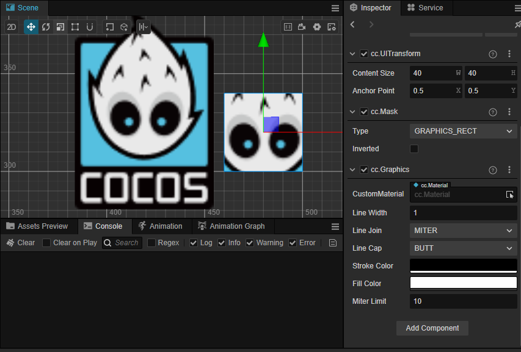
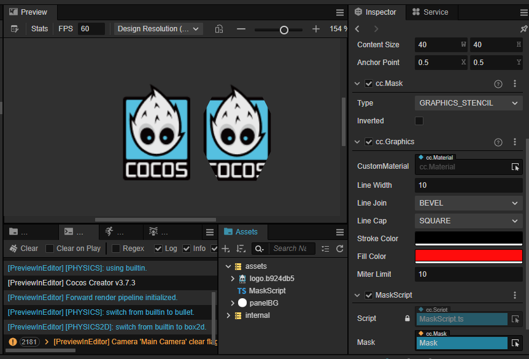
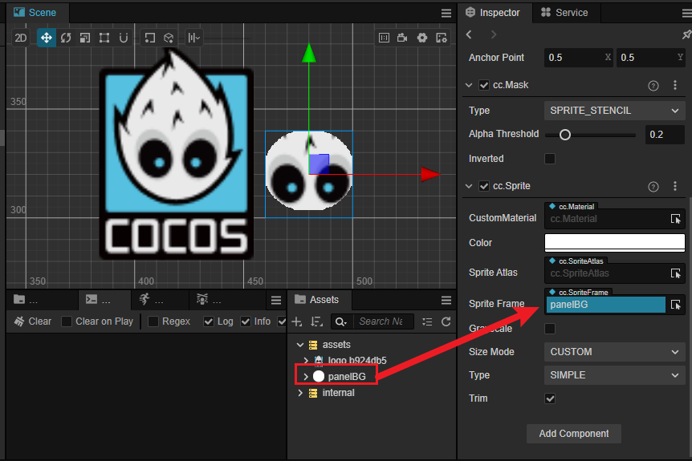

# Mask（遮罩）组件参考

Mask 用于规定子节点可渲染的范围，默认带有 Mask 组件的节点会使用该节点的约束框（也就是 **属性检查器** 中 Node 组件的 **ContentSize** 规定的范围）创建一个矩形渲染遮罩，该节点的所有子节点都会依据这个遮罩进行裁剪，遮罩范围外的将不会渲染。


点击 **属性检查器** 下面的 **添加组件** 按钮，然后从 **UI** 中选择 **Mask**，即可添加 Mask 组件到节点上。注意该组件不能添加到有其他渲染组件（如 **Sprite**、**Label** 等）的节点上。

遮罩的组件接口请参考 [Mask API](__APIDOC__/zh/class/Mask)。

关于使用可以参考范例 **Mask**（[GitHub](https://github.com/cocos/cocos-test-projects/tree/v3.7/assets/cases/ui/08.mask) | [Gitee](https://gitee.com/mirrors_cocos-creator/test-cases-3d/tree/v3.7/assets/cases/ui/08.mask)）。

## Mask 属性

| 属性  |   功能说明           |
| :------------- | :---------- |
| Type           | 遮罩类型。包括 **RECT**、**ELLIPSE**、**GRAPHICS_STENCIL**、**SPRITE_STENCIL** 四种类型。|
| Segments       | 椭圆遮罩的曲线细分数，只在遮罩类型设为 **ELLIPSE** 时生效 |
| Inverted       | 反向遮罩 |

添加 Mask 组件后，会自动添加 [Graphics](./graphics.md) 组件，请不要删除该组件。在 Type 为 **SPRITE_STENCIL** 时，Mask 组件会添加 Sprite 组件，该 Sprite 组件会为模板提供形状，同理请勿删除。

### Type

#### RECT 矩形遮罩



#### ELLIPSE 椭圆遮罩


可以在运行时通过代码设置：

```ts
const mask = this.getComponent(Mask);
mask.type = Mask.Type.ELLIPSE;
mask.segments = 32;
```

#### GRAPHICS_STENCIL 自定义图形遮罩



可以在运行时通过代码设置：

```ts
const g = this.mask.node.getComponent(Graphics);
//const g = this.mask.graphics;
g.lineWidth = 10;
g.fillColor.fromHEX('#ff0000');
g.moveTo(-40, 0);
g.lineTo(0, -80);
g.lineTo(40, 0);
g.lineTo(0, 80);
g.close();
g.stroke();
g.fill();
```

#### IMAGE_STENCIL 自定义图片遮罩



可以在运行时通过代码设置：

```ts
const mask = this.getComponent(Mask);
mask.type = Mask.Type.IMAGE_STENCIL;
mask.spriteFrame = this.spriteFrame;
mask.alphaThreshold = 0.1;
```

**注意**：

1. 节点添加了 Mask 组件之后，所有在该节点下的子节点，在渲染的时候都会受 Mask 影响。

2. **GRAPHICS_STENCIL** 类型在这里没有做任何引擎需要的事，只是放开了对 graphics 操控，用户可以使用 mask 组件里的 graphics 属性来绘制自定义图形，但是节点的点击事件还是根据节点的尺寸来计算。

3. **IMAGE_STENCIL** 类型默认需要一个图片资源，如果没有设置的话，相当于没有遮罩。
