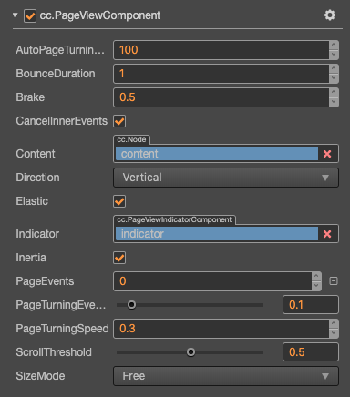

# PageView 组件参考

PageView 是一种页面视图容器.



点击 **属性检查器** 下面的 **添加组件** 按钮，然后选择 **UI/PageView** 即可添加 PageView 组件到节点上。

页面视图的脚本接口请参考 [PageView API](__APIDOC__/zh/class/PageView)。

关于使用可以参考范例 **PageView**（[GitHub](https://github.com/cocos/cocos-test-projects/tree/v3.6/assets/cases/ui/15.pageview) | [Gitee](https://gitee.com/mirrors_cocos-creator/test-cases-3d/tree/v3.6/assets/cases/ui/15.pageview)）。

## PageView 属性

| 属性                     | 功能说明 |
| :-------------           | :---------- |
| SizeMode                 | 页面视图中每个页面大小类型，目前有 Unified 和 Free 类型。<!--详情可参考 [SizeMove API](__APIDOC__/zh/#/docs/3.5/zh/ui/Class/PageView?id=sizemode) -->  |
| Content                  | 它是一个节点引用，用来创建 PageView 的可滚动内容 |
| Direction                | 页面视图滚动方向 |
| ScrollThreshold          | 滚动临界值，默认单位百分比，当拖拽超出该数值时，松开会自动滚动下一页，小于时则还原 |
| AutoPageTurningThreshold | 快速滑动翻页临界值，当用户快速滑动时，会根据滑动开始和结束的距离与时间计算出一个速度值，该值与此临界值相比较，如果大于临界值，则进行自动翻页 |
| Inertia                  | 否开启滚动惯性 |
| Brake                    | 开启惯性后，在用户停止触摸后滚动多快停止，0 表示永不停止，1 表示立刻停止 |
| Elastic                  | 布尔值，是否回弹 |
| Bounce Duration          | 浮点数，回弹所需要的时间。取值范围是 0-10 |
| Indicator                | 页面视图指示器组件 |
| PageTurningEventTiming   | 设置 PageView、PageTurning 事件的发送时机 |
| PageEvents               | 数组，滚动视图的事件回调函数 |
| CancelInnerEvents        | 布尔值，是否在滚动行为时取消子节点上注册的触摸事件 |

### PageViewIndicator 设置

PageViewIndicator 是可选的，该组件是用来显示页面的个数和标记当前显示在哪一页。

建立关联可以通过在 **层级管理器** 里面拖拽一个带有 PageViewIndicator 组件的节点到 PageView 的相应字段完成。

### PageView 事件


| 属性            | 功能说明 |
| :-------------  | :---------- |
| Target          | 带有脚本组件的节点 |
| Component       | 脚本组件名称 |
| Handler         | 指定一个回调函数，当 PageView 的事件发生的时候会调用此函数 |
| CustomEventData | 用户指定任意的字符串作为事件回调的最后一个参数传入 |

PageView 的事件回调有两个参数，第一个参数是 PageView 本身，第二个参数是 PageView 的事件类型。

## 详细说明

PageView 组件必须有指定的 content 节点才能起作用，content 中的每个子节点为一个单独页面，且每个页面的大小为 PageView 节点的大小，如果节点大小大于内容大小的话，可能会导致出现滚动不完整的现象。在 PageView 组件下有一个 view 节点对象，该对象结合 ScrollThreshold 决定了当前滑动的距离是否达到可以翻页的条件，操作效果分为以下两种：

- **缓慢滑动**：通过拖拽视图中的页面到达指定的 ScrollThreshold 数值（该数值是页面大小的百分比）以后松开会自动滑动到下一页。
- **快速滑动**：快速的向一个方向进行拖动，自动滑倒下一页，每次滑动最多只能一页。

<!-- 通常一个 PageView 的节点树如下图：

 -->

## 通过脚本代码添加回调

### 方法一

这种方法添加的事件回调和使用编辑器添加的事件回调是一样的，都是通过代码添加。首先需要构造一个 `EventHandler` 对象，然后设置好对应的 `target`、`component`、`handler` 和 `customEventData` 参数。

```ts
import { _decorator, Component, Event, Node, PageView, EventHandler } from 'cc';
const { ccclass, property } = _decorator;

@ccclass("example")
export class example extends Component {
    onLoad(){
        const pageChangedEventHandler = new EventHandler();
        pageChangedEventHandler.target = this.node; // 这个 node 节点是你的事件处理代码组件所属的节点
        pageChangedEventHandler.component = 'example'; // 这个是脚本类名
        pageChangedEventHandler.handler = 'callback';
        pageChangedEventHandler.customEventData = 'foobar';

        const page = this.node.getComponent(PageView);
        page.clickEvents.push(pageChangedEventHandler);
    }

    callback(event: Event, customEventData: string){
        // 这里 event 是一个 Touch Event 对象，你可以通过 event.target 取到事件的发送节点
        const node = event.target as Node;
        const pageview = node.getComponent(PageView);
        console.log(customEventData); // foobar
    }
}
```

### 方法二

通过 `pageView.node.on('page-turning', ...)` 的方式来添加

```ts
// 假设我们在一个组件的 onLoad 方法里面添加事件处理回调，在 callback 函数中进行事件处理:
import { _decorator, Component, Event, Node, PageView } from 'cc';
const { ccclass, property } = _decorator;

@ccclass("example")
export class example extends Component {
    onLoad(){
        this.pageView.node.on('page-turning', this.callback, this);
    }

    callback(pageView: PageView) {
        // 回调的参数是 pageView 组件
        // 另外，注意这种方式注册的事件，也无法传递 customEventData
    }
}
```
