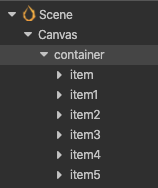
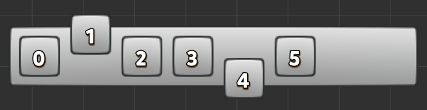
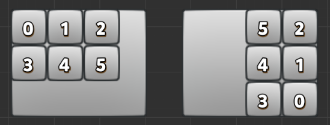

# 自动布局容器

Layout（自动布局）组件可以挂载在任何节点上，将节点变成一个有自动布局功能的容器。所谓自动布局容器，就是能够自动将子节点按照一定规律排列，并可以根据节点内容的约束框总和调整自身尺寸的容器型节点。

接下来说到的布局类型，节点结构都如下图：

## 布局类型

自动布局组件有几种基本的布局模式，可以通过 `Type` 属性进行设置，包括以下几种。

### 水平布局（Horizontal)

Layout `Type` 设为 `Horizontal` 时，所有子节点都会自动横向排列，组件默认会修改节点在 y 轴上的位置或高度，如果子节点需要放置在 Layout 节点的约束框高度范围之外，可以取消勾选 `AutoAlignment`（如上图）。

水平排序下容易出现内容超出容器的情况，可以根据需要采取如下措施：

  - 如果容器要自适应上内容的尺寸，可以通过设置 `ResizeMode` 为 `Container`，该模式会根据子节点的宽度（`Width`）总和设置 Layout 节点的宽度（下图左）。

  - 如果内容对象始终要保持在容器内，可以通过设置 `ResizeMode` 为 `Children`，该模式会将内容对象的尺寸限制在容器内（下图右）。

  - 如果需要子节点在 y 轴向上对齐，可以在子节点上添加 Widget 组件，并开启 Top 或 Bottom 的对齐模式。

#### 水平排列方向（Horizontal Direction）

在水平布局下，可以通过 `HorizontalDirection` 设置水平朝向。朝向分为 `LEFT_TO_RIGHT` 和 `RIGHT_TO_LEFT` 两种，前者会按照节点在 **层级管理器** 中显示顺序从左到右排列；后者会按照节点显示从右到左排列。

### 垂直布局（Vertical）

垂直布局的布局方式和排列方向跟 **水平布局** 几乎一致，只是方向上的不同，这里就不再赘述。

### 网格布局（Grid）

Layout `Type` 设为 `GRID` 会开始网格布局。网格布局会在固定容器大小内，根据 `HorizontalDirection` 和 `VerticalDirection` 组合决定布局起点，根据 `StartAxis` 属性决定布局方向。

#### 网格排列方向（Grid Direction）

Layout 排列子节点时，是以子节点在 **层级管理器** 中显示顺序为基准，加上开始点和 `StartAxis` 属性设置的排列方向来排列的。

- 开始轴向（Start Axis）
  - 可以设置 `HORIZONTAL` 或 `VERTICAL` 两种方向。前者会进行横向排列，后者是纵向排列。
- 开始点
  - 开始点是通过 `HorizontalDirection` 和 `VerticalDirection` 组合而成。
  - 假设 HorizontalDirection 为 `LEFT_TO_RIGHT`，VerticalDirection 为 `TOP_TO_BOTTOM`，则开始点是 **左上角**
  - 假设 HorizontalDirection 为 `RIGHT_TO_LEFT`，VerticalDirection 为 `BOTTOM_TO_TOP`，则开始点是 **右下角**

结合排列方向，举两个例子说明：

- 如果当前设置的 HorizontalDirection 为 `LEFT_TO_RIGHT`，VerticalDirection 为 `TOP_TO_BOTTOM`，StartAxis 为 `HORIZONTAL`，则是告知组件要的排序方式是从容器的 **左上角** 开始按水平方向排列（下图左）。

- 如果当前设置的 HorizontalDirection 为 `RIGHT_TO_LEFT`，VerticalDirection 为 `BOTTOM_TO_TOP`，StartAxis 为 `VERTICAL`，则是告知组件要的排序方式是从容器的 **右下角** 开始按垂直方向排列（下图右）。

  

Grid 排序也有可能出现内容超出容器的情况，可以参考上文中的 **水平布局**，通过调整 `ResizeMode` 属性解决。

关于 Layout 组件的属性的详细说明，请参考 [Layout 组件](../editor/layout.md) 文档。
