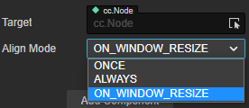

# 安卓大屏幕适配

Cocos Creator 目前已经可以适配大屏幕设备以及折叠屏。

对于大屏幕的安卓设备，我们建议的适配方案是：

- 对于 2D/UI 节点上的用于适配 Widget 组件的 Align Mode 设置Wie为 On_WINDOW_RESIZE 或 ALWAYS。

    

- 参考 [适用于大屏设备开发的响应式布局](https://developer.android.com/large-screens)。
