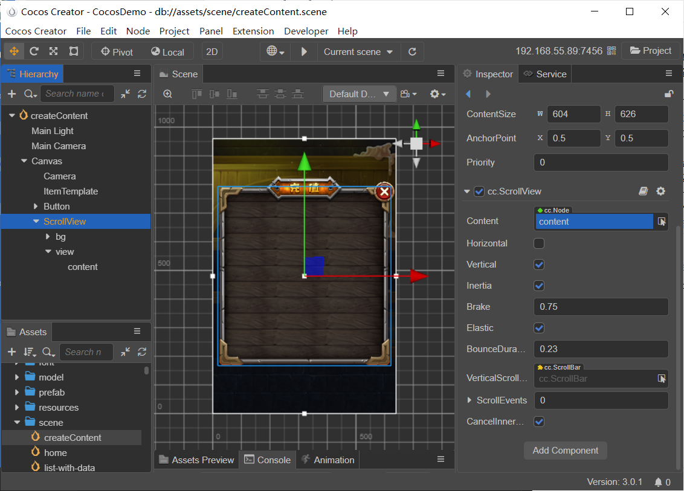
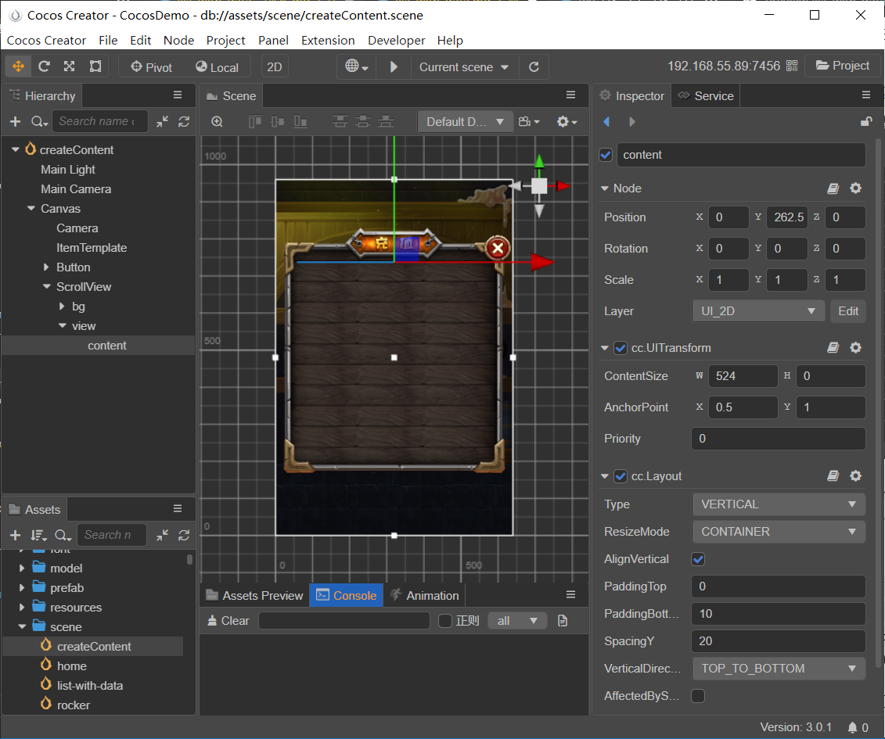
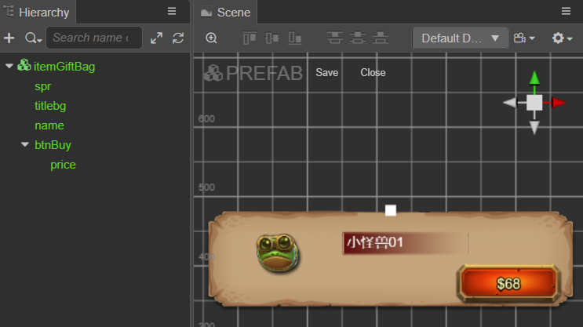
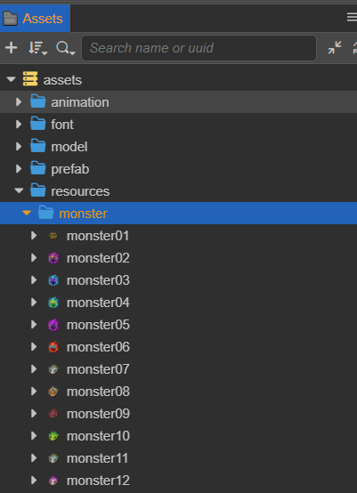
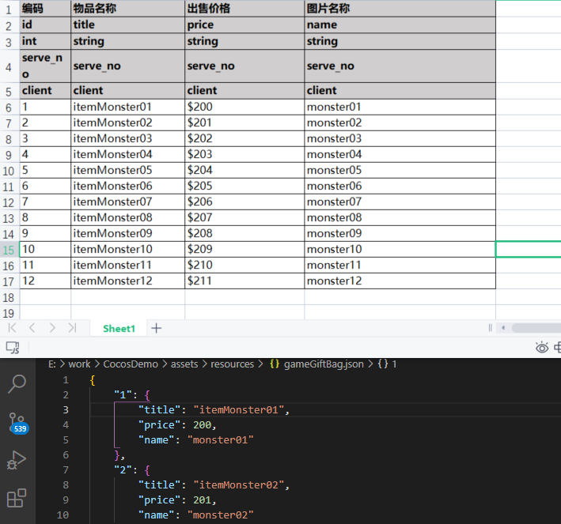
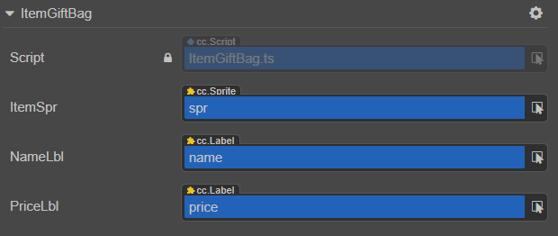

# 制作动态生成内容的列表

UI 界面只有静态页面内容是不够的，我们会遇到很多需要由一组数据动态生成多个元素组成的 UI 面板，比如选人界面、物品栏、选择关卡等等。

## 列表 UI 准备

以商品列表为例，我们要动态生成一个可滑动的商品列表。需要先通过Creator 编辑器设定好静态 UI 部分。



如上述图示，我们创建一个 [ScrollView 组件](../editor/scrollview.md)，将背景图片和按钮等 UI 放置到上图中的 `bg` 节点中。

接下来设置 **ScrollView** 组件下的 view 节点保持与父节点 ScrollView 节点的同样的大小。由于 view 节点上含有 Mask 组件，保障了可见区域的同步。



再接下来设置 **ScrollView** 组件的容器 content 节点，通过 **属性检查器** 下方的 **添加组件 -> UI -> Layout** 在节点上添加 [Layout 组件](../editor/layout.md)，并设置 **Layout** 组件的以下属性：

- `Type`：`VERTICAL`
- `Resize Mode`：`CONTAINER`
- `PaddingBottom`:10
- `SpacingY`:20

对 `content` 节点执行以下操作：

- **UITransform** 组件 `AnchorPoint` 属性设置为（0.5，1）
- **UITransform** 组件 `ContentSize` 属性中的 `Width` 值设置为与 view 节点的 `Width` 值同样的大小
- `Position` 属性中的 `Y` 值设置为 `view` 节点中 **UITransform 组件** `ContentSize` 属性中的 `Width` 值的一半大小

通过上述操作，可以在添加预制体商品到 `content` 节点中时，自动按照顺序排列。

### Prefab 模板 UI 准备

接下来我们还需要一个可以在运行时用来实例化每个物品的模板资源 —— [Prefab 预制](../../../asset/prefab.md)。预制体命名为 `itemGiftBag`，它的结构如下图所示：



`spr`、`name` 和 `price` 子节点用来显示商品图片、商品名称和商品价格。

### 商品图片准备

我们在 **resources/monster** 文件夹下放置一批小怪兽头像做为商品图片，



将资源命名为 **monster01 ~ monster12**。这样命名可以方便我们后续批量的 [动态加载资源](../../../scripting/load-assets.md)。

## 数据准备

我们要动态生成一个物品，大概需要这样的一组数据：

- 图标 id，我们可以在另一张资源表中建立图标 id 到对应 spriteFrame 的索引（在本次示例中我们直接使用图片名称）
- 物品名称
- 出售价格
- ...

在实际制作项目的过程中，我们经常使用 Excel、数据库等专业的系统来管理数据，将外部数据格式转化为 Cocos Creator 可以使用的 TypeScript 和 JSON 格式都非常容易。在本次示例中，我们提供一个 [Excel 转 Json](https://gitee.com/lixinjiang/excel-to-json) 的工具，将我们需要的数据，最终生成一个 Json 文件。



其中 `title`、`price` 和 `name` 就对应着商品名称、出售价格和图片名称。

## 列表 UI 脚本绑定

完成 UI 和基本数据的准备之后，就需要一个组件脚本来完成功能。新建一个 `ItemTemplate.ts` 脚本，并在场景中新建一个 ItemTemplate 节点将 `ItemTemplate.ts` 添加上去。该脚本内容如下：

```ts

// ItemTemplate.ts
import { _decorator, Component, Node, Prefab, instantiate, JsonAsset } from 'cc';
import { ItemGiftBag } from './ItemGiftBag';
const { ccclass, property } = _decorator;

/** 商品数据定义接口 */
export interface ItemGiftList {

    price: number;
    title: string;
    name: string;

}
@ccclass('ItemTemplate')
export class ItemTemplate extends Component {

    // ScrollView 的容器节点 content 
    @property(Node)
    itemContent: Node = null!;

    // 商品栏预制体
    @property(Prefab)
    itemGiftPre: Prefab = null!;

    // Json 脚本
    @property(JsonAsset)
    itemGiftJson: JsonAsset = null!;
    start() {
        this.initData();
    }

    initData() {
        const data: object = this.itemGiftJson.json!;
        const jsonLength: number = Object.keys(data).length;
        const str: string = JSON.stringify(data);
        const parse: Array<ItemGiftList> = JSON.parse(str);
        for (let i = 1; i <= jsonLength; i++) {

            let item: Node = instantiate(this.itemGiftPre);
            if (item) {
                item.parent = this.itemContent;
            }
        }
    }
}

```

上述脚本的前半部分导出了一个名为 `ItemGiftList` 的定义接口，定义了商品栏所需要的数据。

脚本的后半部分则为正常的组件声明方式，声明了 `itemContent`、`itemGiftPre` 和 `itemGiftJson` 组件。并在初始化的时候调用函数 `initData`。

在 `initData` 函数中，我们先将 Json 数据转换为数组，再根据数组的长度去依次生成对应数量的模板预制体 `itemGiftPre`。最后将生成的预制体的父节点设置为 `itemContent`。


当根据上图所示，将声明的组件一一拖拽绑定之后，我们在网页上调试即可以得到下图所示的效果：


通过上述 gif 图可以得知我们想要的效果已经大致出来了，但是还缺少了商品栏中的商品数据。

### 模板组件脚本绑定

接下来新建一个 `ItemGiftBag.ts` 的脚本，添加到之前制作的模板`itemGiftBag` 上。该脚本内容如下：

```ts

// ItemGiftBag.ts
import { _decorator, Component, Node, Sprite, Label, resources, SpriteFrame } from 'cc';
import { ItemGiftList } from './ItemTemplate';
const { ccclass, property } = _decorator;

@ccclass('ItemGiftBag')
export class ItemGiftBag extends Component {
    // 商品图片节点
    @property(Sprite)
    itemSpr: Sprite = null!;
    // 商品名称节点
    @property(Label)
    nameLbl: Label = null!;
    // 商品价格节点
    @property(Label)
    priceLbl: Label = null!;
 
}

```

接下来将对应的节点拖拽到该组件的各个属性上：



### 通过数据更新模板表现

接下来我们需要继续修改 `ItemGiftBag.ts`，为其添加接受数据后的逻辑。在上述脚本后面加入以下内容：

```ts
// ItemGiftBag.ts

init(data: ItemGiftList) {
    const str = 'monster/' + data.name + "/spriteFrame";
    resources.load(str, SpriteFrame, (err, res) => {
        this.itemSpr.spriteFrame = res;
    })
    this.nameLbl.string = data.title;
    this.priceLbl.string = '$' + data.price;
}

```

`init` 函数接受一个数据对象，并使用这个对象里的数据更新各个负责表现组件的相应属性，动态加载商品图片。关于动态加载的更多细节，可以参考 [动态加载资源](../../../scripting/load-assets.md)。

最后，在 `ItemTemplate` 脚本的 `initData` 函数中，在遍历生成预制体的同时，添加上对 `ItemGiftBag` 脚本中 `init` 函数的调用和数据赋值。最终 `initData` 函数如下所示：

```ts

// ItemTemplate.ts

initData(){
    const data: object = this.itemGiftJson.json!;
    const jsonLength: number = Object.keys(data).length;
    const str: string = JSON.stringify(data);
    const parse: Array<ItemGiftList> = JSON.parse(str);

    for (let i = 1; i <= jsonLength; i++) {

        let item: Node = instantiate(this.itemGiftPre);
        if (item) {
            let itemGiftScripts = item.getComponent(ItemGiftBag);
            itemGiftScripts?.init(parse[i]);
            item.parent = this.itemContent;
        }
    }
}
```

## 最终预览效果


