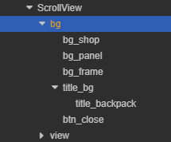
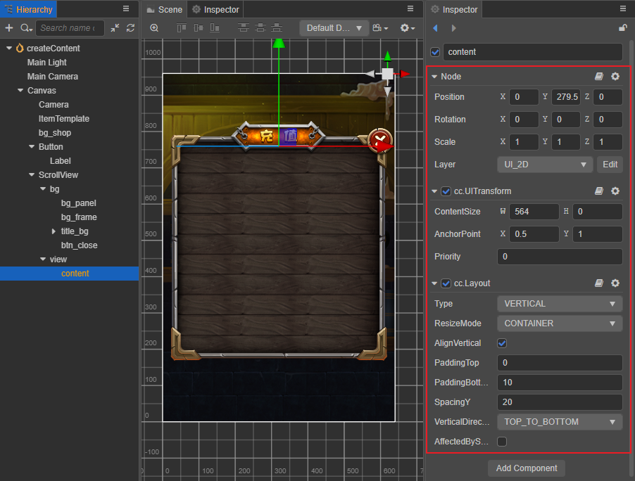
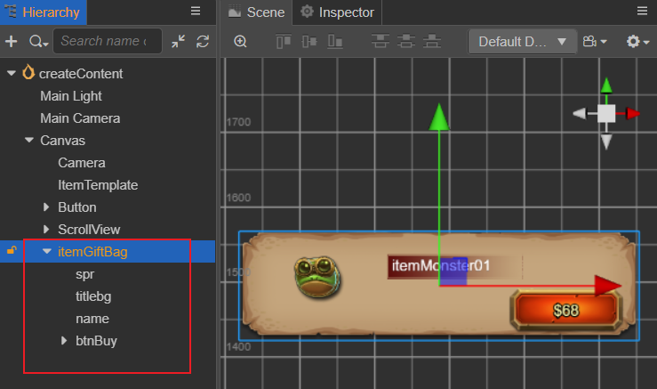
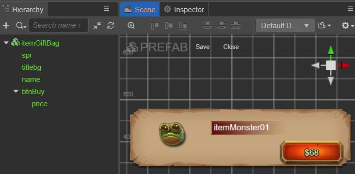
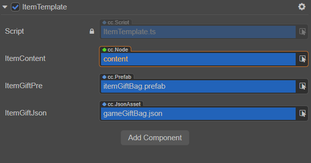

# 制作动态生成内容的列表

UI 界面只有静态页面内容是不够的，我们会遇到很多需要由一组数据动态生成多个元素组成的 UI 面板，比如选人界面、物品栏、选择关卡等等。

## 列表 UI 准备

以商品列表为例，我们要动态生成一个可滑动的商品列表。需要先通过 Creator 编辑器设定好静态 UI 部分。

首先，我们需要先创建一个空场景，点击上方工具栏中的 2D/3D 按钮，将 **场景编辑器** 切换为 2D 视图，然后搭建静态 UI 页面，如下图所示：


具体的操作步骤为：

1. 在 **层级管理器** 中创建一个 [ScrollView](../editor/scrollview.md) 节点，`ScrollView` 节点下自带的 `scrollBar` 节点和 `item` 节点我们这里不需要用到，可将其移除。
2. 在 `ScrollView` 节点下新建一个名为 `bg` 的空节点，再将背景图片和按钮等 UI 挂载到 bg 节点下，根据需要排列好，例如下图：

    

3. 设置 `ScrollView` 节点自带的 view 节点，将其 `ContentSize` 属性设为比父节点 `ScrollView` 节点的尺寸稍小。因为 `view` 节点上默认挂载了 **Mask** 组件，可以确保之后可见区域在滑动期间不会穿帮。
4. 设置 `view` 节点下的容器节点 `content`，通过以下设置可以在进行下一步骤添加预制体商品到 `content` 节点中时，将其自动按照顺序排列：

   - 将 **UITransform** 组件的 `AnchorPoint` 属性设置为 `（0.5，1）`
   - 将 **UITransform** 组件的 `ContentSize` 属性中 `Width` 的值设置为与父节点 `view` 节点的一致
   - 节点属性 `Position` 中的 `Y` 值设置为 为 `view` 节点中 **UITransform** 组件 `ContentSize` 属性中的 `Width` 值的一半大小
   - 挂载 **Layout** 组件，点击 属性检查器 下方的 **添加组件** -> **UI** -> **Layout** 即可，并设置 **Layout** 组件的以下属性：
       - `Type`：`VERTICAL`
       - `Resize Mode`：`CONTAINER`
       - `PaddingBottom`: `10`
       - `SpacingY`: `20`

    

通过上述操作，可以在添加预制体商品到 `content` 节点中时，自动按照顺序排列。

### Prefab 模板 UI 准备

接下来我们需要创建一个商品的 [Prefab 预制](../../../asset/prefab.md) 预制资源，作为在运行时实例化创建商品的模板。

在 **层级管理器** 创建一个 `Sprite` 节点，重命名为 `itemGiftBag`，然后根据需要制作商品 UI，例如：



其中 `spr`、`name` 和 `price` 子节点用来显示商品图片、商品名称和商品价格。

然后将 `itemGiftBag` 节点拖拽到 **资源管理器** 中即可创建一个同名预制资源。双击打开预制资源，可以看到结构如下：



### 商品图片准备

我们在 **resources/monster** 文件夹下放置一批小怪兽头像做为商品图片。

将资源命名为 **monster01 ~ monster12**。这样命名可以方便后续批量的 [动态加载资源](../../../scripting/load-assets.md)。


## 数据准备

要动态生成一个物品，大概需要这样的一组数据：

- 图标 id，我们可以在另一张资源表中建立图标 id 到对应 spriteFrame 的索引（在本次示例中先直接使用图片名称）
- 物品名称
- 出售价格
- ...

在实际制作项目的过程中，经常使用 Excel、数据库等专业的系统来管理数据，将外部数据格式转化为 Cocos Creator 可以使用的 TypeScript 和 JSON 格式都非常容易。在本次示例中，我们提供一个 [Excel 转 Json](https://gitee.com/lixinjiang/excel-to-json) 的工具，将我们需要的数据，最终生成一个 Json 文件。


其中 `title`、`price` 和 `name` 就对应着商品名称、出售价格和图片名称。

## 列表 UI 脚本绑定

完成 UI 和基本数据的准备之后，就需要一个组件脚本来完成功能。新建一个 `ItemTemplate.ts` 脚本，并在场景中新建一个 ItemTemplate 节点将 `ItemTemplate.ts` 添加上去。该脚本内容如下：

```ts

// ItemTemplate.ts
import { _decorator, Component, Node, Prefab, instantiate, JsonAsset } from 'cc';
import { ItemGiftBag } from './ItemGiftBag';
const { ccclass, property } = _decorator;

/** 商品数据定义接口 */
export interface ItemGiftList {
 
    title: string; // 商品名称
    price: number; // 商品价格
    name: string;  // 商品图片名称

}
@ccclass('ItemTemplate')
export class ItemTemplate extends Component {

    // ScrollView 的容器节点 content 
    @property(Node)
    itemContent: Node = null!;

    // 商品栏预制体
    @property(Prefab)
    itemGiftPre: Prefab = null!;

    // Json 脚本
    @property(JsonAsset)
    itemGiftJson: JsonAsset = null!;
    start() {
        this.initData();
    }

    initData() {
        const data: object = this.itemGiftJson.json!;
        const jsonLength: number = Object.keys(data).length;
        const str: string = JSON.stringify(data);
        const parse: Array<ItemGiftList> = JSON.parse(str);
        for (let i = 1; i <= jsonLength; i++) {

            let item: Node = instantiate(this.itemGiftPre);
            if (item) {
                item.parent = this.itemContent;
            }
        }
    }
}

```

在 `initData` 函数中，先将 Json 数据转换为数组，再根据数组的长度去依次生成对应数量的模板预制体 `itemGiftPre`。最后将生成的预制体的父节点设置为 `itemContent`。



当根据上图所示，将声明的组件一一拖拽绑定之后，在网页上调试即可以得到下图所示的效果：


通过上述 gif 图可以得知想要的效果已经大致出来了，但是还缺少了商品栏中的商品数据。

### 模板组件脚本绑定

接下来新建一个 `ItemGiftBag.ts` 的脚本，添加到之前制作的模板`itemGiftBag` 上。该脚本内容如下：

```ts

// ItemGiftBag.ts
import { _decorator, Component, Node, Sprite, Label, resources, SpriteFrame } from 'cc';
import { ItemGiftList } from './ItemTemplate';
const { ccclass, property } = _decorator;

@ccclass('ItemGiftBag')
export class ItemGiftBag extends Component {
    // 商品图片节点
    @property(Sprite)
    itemSpr: Sprite = null!;
    // 商品名称节点
    @property(Label)
    nameLbl: Label = null!;
    // 商品价格节点
    @property(Label)
    priceLbl: Label = null!;
 
}

```

接下来将对应的节点拖拽到该组件的各个属性上：


### 通过数据更新模板表现

接下来继续修改 `ItemGiftBag.ts`，为其添加接受数据后的逻辑。在上述脚本后面加入以下内容：

```ts
// ItemGiftBag.ts

init(data: ItemGiftList) {
    const str = 'monster/' + data.name + '/spriteFrame';
    resources.load(str, SpriteFrame, (err, res) => {
        this.itemSpr.spriteFrame = res;
    })
    this.nameLbl.string = data.title;
    this.priceLbl.string = '$' + data.price;
}

```

`init` 函数接受一个数据对象，并使用这个对象里的数据更新各个负责表现组件的相应属性，动态加载商品图片。关于动态加载的更多细节，可以参考 [动态加载资源](../../../scripting/load-assets.md)。

最后，在 `ItemTemplate` 脚本的 `initData` 函数中，在遍历生成预制体的同时，添加上对 `ItemGiftBag` 脚本中 `init` 函数的调用和数据赋值。最终 `initData` 函数如下所示：

```ts

// ItemTemplate.ts

initData(){
    const data: object = this.itemGiftJson.json!;
    const jsonLength: number = Object.keys(data).length;
    const str: string = JSON.stringify(data);
    const parse: Array<ItemGiftList> = JSON.parse(str);

    for (let i = 1; i <= jsonLength; i++) {

        let item: Node = instantiate(this.itemGiftPre);
        if (item) {
            let itemGiftScripts = item.getComponent(ItemGiftBag);
            itemGiftScripts?.init(parse[i]);
            item.parent = this.itemContent;
        }
    }
}
```

## 最终预览效果


