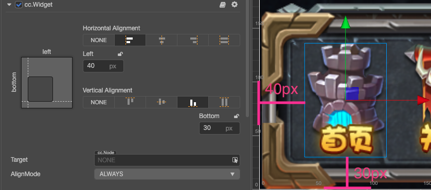
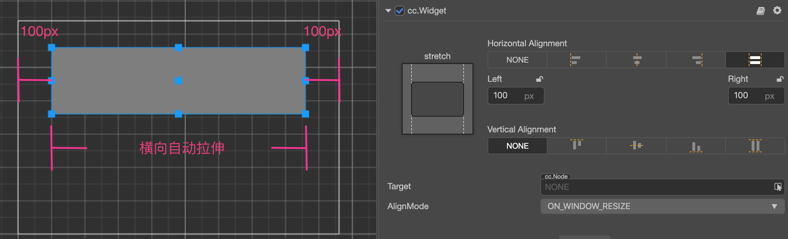
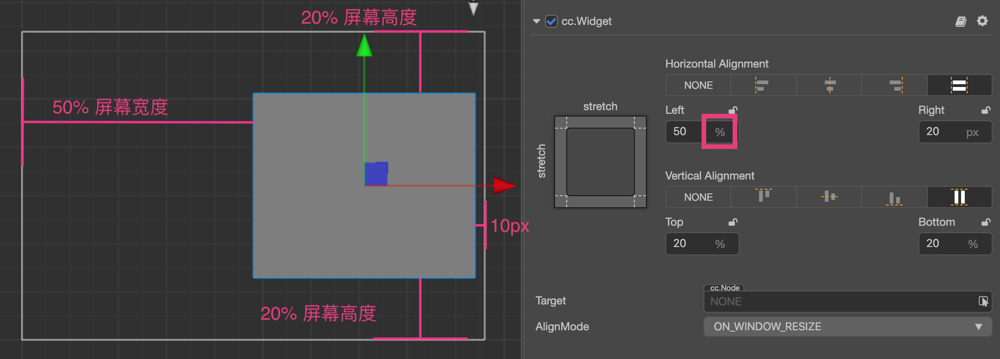

# 对齐策略

要实现完美的多分辨率适配效果，UI 元素按照设计分辨率中规定的位置呈现是不够的，当屏幕宽度和高度发生变化时，UI 元素要能够智能感知屏幕边界的位置，才能保证出现在屏幕可见范围内，并且分布在合适的位置。我们通过 **Widget（对齐挂件）** 来实现这种效果。

下面我们根据要对齐元素的类别来划分不同的对齐工作流：

## 需要贴边对齐的按钮和小元素

对于暂停菜单、游戏金币这一类面积较小的元素，通常只需要贴着屏幕边对齐就可以了。这时只要几个简单的步骤：

1. 在 **层级管理器** 中创建 2D 对象时会默认自动创建一个 Canvas 节点作为其父节点，这些元素节点都需要放在 Canvas 节点下
2. 在元素节点上添加 Widget 组件
3. 以对齐左下角为例，开启 `Left` 和 `Bottom` 的对齐。
4. 然后设置好节点和屏幕边缘的距离，下图中左边距设为 40px，下边距设为 30px。

    

这样设置好 Widget 组件后，不管实际屏幕分辨率是多少，这个节点元素都会保持在屏幕左下角，而且节点约束框左边和屏幕左边距离保持 40px，节点约束框下边和屏幕下边距离保持 30px。

> **注意**：Widget 组件提供的对齐距离是参照子节点和父节点相同方向的约束框边界的。比如上面例子里选择了 `Left` 对齐左边，那么子节点约束框左边和父节点，约束框左边的距离就是我们设置的 40px。其中父节点也就是 Canvas 节点，约束框永远等于屏幕大小，前提是在编辑器顶部菜单栏中的 **项目 -> 项目设置 -> 项目数据** 中只勾选 **适配屏幕宽度** 或者 **适配屏幕高度**。

## 嵌套对齐元素

上面介绍了对齐屏幕边缘的做法，由于 Widget 默认的对齐参照物是父节点，所以我们也可以添加不同的节点层级，并且让每一级节点都使用自动对齐的功能。

我们下面用一个简单的例子来说明，假设我们有这样的节点层级关系：

其中 `parent` 是一个面板，`button` 是一个按钮。我们可以分别为这两个节点添加 Widget 组件，并且分别设置对齐距离。

对于 `parent` 节点来说，对齐 `Canvas` 节点的左上角，距离都是 80px：

对于 `button` 节点来说，对齐 `parent` 节点的左上角，距离都是 50px：

依照这样的工作流程，就可以将 UI 元素按照显示区域或功能进行分组，并且不同级别的元素都可以按照设计进行对齐。

## 根据对齐需要自动缩放节点尺寸

以上我们展示的例子里，并没有同时对齐在同一轴向相反方向的两个边，如果我们要做一个占满整个屏幕宽度的面板，就可以同时勾选 `Left` 和 `Right` 对齐开关：

当同时勾选相反的两个方向的对齐开关时，Widget 就获得了根据对齐需要修改节点尺寸（`Size`）的能力，上图中我们勾选了左右两个方向并设置了边距，Widget 就会根据父节点的宽度来动态设置节点的 `Width` 属性，表现出来就是不管在多宽的屏幕上，我们的面板距离屏幕左右两边的距离永远保持 100px。

### 制作和屏幕大小保持一致的节点

利用自动缩放节点的特性，我们可以通过设置节点的 Widget 组件，使节点的尺寸和屏幕大小保持一致。

要制作这样的节点，首先要保证该节点的父节点尺寸能够保持和屏幕大小一致，Canvas 节点就是一个最好的选择。接下来按照下图的方式设置该节点的 Widget 组件：

就可以在运行时时刻保持该节点和 Canvas 节点的尺寸完全一致，也就是和屏幕大小一致。经过这样设置的节点，其子节点也可以使用同样的设置来传递屏幕实际尺寸。

> **注意**：若要实现该功能，则在编辑器顶部菜单栏中的 **项目 -> 项目设置 -> 项目数据** 中只勾选 **适配屏幕宽度** 或者 **适配屏幕高度**。

## 设置百分比对齐距离

Widget 组件上开启某个方向的对齐之后，除了指定以像素为单位的边距以外，我们还可以输入百分比数值（例如：通过 **单击** 方框内圈出的符号），这样 Widget 会以父节点相应轴向的宽度或高度乘以输入的百分比，计算出实际的边距值。

还是看看实际的例子，我们还是以一个直接放在 Canvas 下的子节点为例，我们希望这个节点面板保持在屏幕右侧，并且总是占据 60% 的屏幕总高度。那么按照下图所示设置 Widget 组件就可以实现这个效果：

Widget 在对齐方向开启时输入边距值时，可以按照需要混合像素单位和百分比单位的使用。比如左边需要对齐屏幕中心，则 `Left` 方向输入 `50%`，右边需要对齐屏幕边缘，则 `Right` 方向输入 `20px`，最后计算子节点位置和尺寸时，所有的边距都会先根据父节点的尺寸换算成像素距离，然后再进行摆放。

利用百分比对齐距离，我们可以制作出根据屏幕大小无限缩放的 UI 元素，发挥你的想象力，一套资源适配数千种机型不是问题！

## 运行时每帧更新对齐和优化策略

Widget 组件一般用于场景在目标设备上初始化时定位每个元素的位置，但一旦场景初始化完毕，很多时候我们就不需要 Widget 组件再进行对齐了。这里有个重要的属性 `alignOnce` 用于确保 Widget 组件只在初始化时执行对齐定位的逻辑，在运行时不再消耗时间来进行对齐。

若 **对齐模式**（`AlignMode`）选择 `ONCE`，且在组件初始化时执行过一次对齐定位，引擎就会自动将 Widget 组件的 `enabled` 属性设为 `false`，禁用 Widget 组件来关闭之后的每帧自动更新。

若需要在运行时变更定位，则需要手动将 **对齐模式** 设置为 `ALWAYS`，或者在运行时需要进行每帧更新对齐时，手动遍历需要对齐的 Widget，并将它们的 `enabled` 属性设为 `true`。

对于有很多 UI 元素的场景，确保 Widget 组件的 **AlignMode** 属性设置为 `ONCE`，可以大幅提高场景运行性能。

## 对齐组件对节点位置、尺寸的限制

通过 **Widget** 组件开启一个或多个对齐设置后，节点的位置（`position`）和尺寸（`width`、`height`）属性可能会被限制，不能通过 API 或动画系统自由修改。如果需要在运行时修改对齐节点的位置或尺寸，请参考 [Widget 组件参考：对节点位置、尺寸的限制](../editor/widget.md#%E5%AF%B9%E8%8A%82%E7%82%B9%E4%BD%8D%E7%BD%AE%E3%80%81%E5%B0%BA%E5%AF%B8%E7%9A%84%E9%99%90%E5%88%B6) 相关内容。
