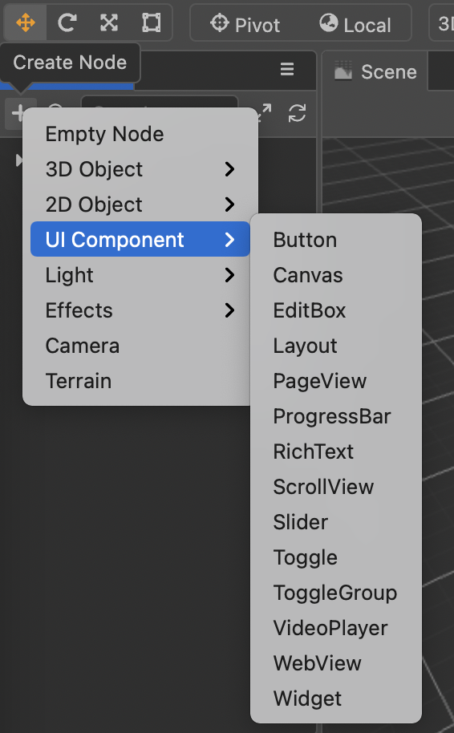

# UI 系统

本章节将详细介绍 Cocos Creator 中的 UI，涉及到以下几个部分：

- [UI 组件](components/index.md)
- [UI 制作策略](production-strategy/index.md)

## UI 介绍

用户界面（User Interface，简称 UI）是应用开发的必要交互部分，主要用于提供软件的人机交互、外观界面设计以及适配等。通过 UI 可以制作登录界面、购买界面、背包界面等应用所需界面。也可以通过 UI 监测用户操作行为，响应操作逻辑，比如游戏中的按钮、滑动条、滚动条等点击、拖动操作。

## 创建 Canvas

**所有的 UI 元素需要在 Canvas 节点下**，在 **层级管理器** 面板中点击左上方的 **+** 按钮，然后选择 **UI 组件 -> Canvas** 创建 Canvas 节点。通常，在制作 UI 时需要先确定当前设计的内容显示区域大小（设计分辨率）。可以在菜单栏的 **项目 -> 项目设置 -> 通用设置** 面板中设置，设置完成之后 Canvas 的尺寸会同步设计分辨率大小。这样就可以很方便的在编辑器上根据设计分辨率大小制作 UI。

>**注意**：在一个场景中可以存在多个 Canvas 节点，但是 Canvas 节点不应该嵌套在另一个 Canvas 节点或其子节点下。

## 创建 UI 元素

UI 元素获取的方式有两种，同样也是通过 **层级管理器** 面板中点击左上方的 **+** 按钮，选择 **2D 对象/UI 组件** 下的元素添加即可。

UI 组件间的渲染顺序采用的是广度排序方案，也就是 Canvas 节点下的子节点的排序就已经决定了之后的整个 [渲染排序](./production-strategy/priority.md)。

在一般的游戏开发中，必要的 UI 元素除了 Sprite（精灵图）、Label（文字）、Mask（遮罩）等基础 2D 渲染组件外，还有用于快速搭建界面的 Layout（布局）、Widget（对齐）等。其中 Sprite 和 Label 用于渲染图片和文字。Mask 主要用于限制显示内容，比较常用的地方是一些聊天框和背包等。Layout 主要用于排版，一般用于按钮单一排列，背包内道具整齐排列等。

最后一个较为重要的功能是 Widget，主要用于显示对齐。这里可能涉及到另外一个功能，那就是多分辨率适配，在我们设计完 UI 需要发布到不同平台时，势必会出现平台的实际设备分辨率和我们的设计分辨率不符的情况，这个时候为了适配不得不做一些取舍，比如头像框，是不能做缩放的，但是我们又希望它没有很大程度受设备影响，那么我们则需要为它添加上 Widget 组件，并且始终保证它对齐在我们的设计分辨率的左上方，具体参考：[对齐策略](production-strategy/widget-align.md) 和 [对齐](components/widget.md)。

当我们的界面制作完成之后，可能有人会发现，怎么发布 iPhone 7 和 iPhone X 的显示效果不一样？这个其实也是我们上面提到的设备分辨率的问题。在你以设计分辨率设计，最终以设备分辨率发布的时候，因为不同型号的手机设备分辨率可能不一致，这中间存在像素偏差的问题，因此，还需要做的一道转换工序那就是屏幕适配。
在菜单栏的 项目 -> 项目设置 -> 项目数据 页面中可以看到，还有两个选项是 适配屏幕宽度 / 适配屏幕高度，按照屏幕适配规则再结合 Widget 组件，就可以实现不同设备的轻松适配。具体适配规则可参考 [多分辨率适配方案](production-strategy/multi-resolution.md)。
