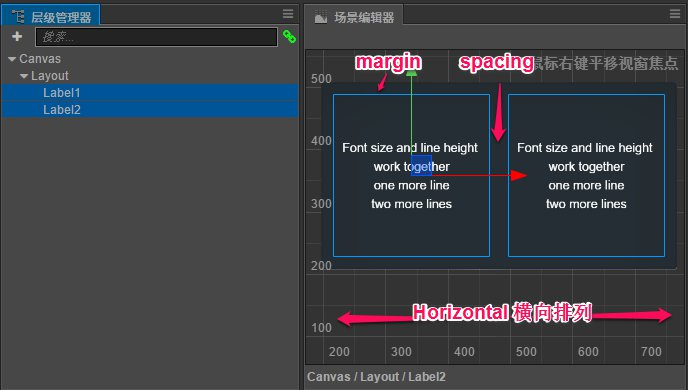
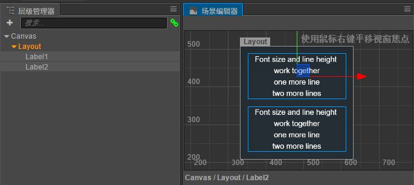

# 自动布局容器

Layout（自动布局）组件可以挂载在任何节点上，将节点变成一个有自动布局功能的容器。所谓自动布局容器，就是能够自动将子节点按照一定规律排列，并可以根据节点内容的约束框总和调整自身尺寸的容器型节点。

## 布局模式（Layout Type）

自动布局组件有几种基本的布局模式，可以通过 `Layout Type` 属性进行设置，包括以下几种。

### 水平布局（Horizontal)

`Layout Type` 设为 `Horizontal` 时，所有子节点都会自动横向排列，并根据子节点的宽度（`Width`）总和设置 Layout 节点的宽度。上图中 Layout 包括的两个 Label 节点就自动被横向排列。

水平布局模式下，Layout 组件不会干涉节点在 y 轴上的位置或高度属性，子节点甚至可以放置在 Layout 节点的约束框高度范围之外。如果需要子节点在 y 轴向上对齐，可以在子节点上添加 Widget 组件，并开启 Top 或 Bottom 的对齐模式。

### 垂直布局（Vertical）

`Layout Type` 设为 `Vertical` 时，所有子节点都会自动纵向排列，并根据子节点的高度（`Height`）总和设置 Layout 节点的高度。

垂直布局模式下，Layout 组件也不会修改节点在 x 轴的位置或宽度属性，子节点需要添加 Widget 并开启 Left 或 Right 对齐模式才能规整的排列。

## 节点排列方向

Layout 排列子节点时，是以子节点在 **层级管理器** 中显示顺序为基准，加上 `Vertical Direction` 或 `Horizontal Direction` 属性设置的排列方向来排列的。

### 水平排列方向（Horizontal Direction）

可以设置 `Left to Right` 或 `Right to Left` 两种方向，前者会按照节点在 **层级管理器** 中显示顺序从左到右排列；后者会按照节点显示从右到左排列。

### 垂直排列方向（Vertical Direction）

可以设置 `Top to Bottom` 或 `Bottom to Top` 两种方向。前者会按照节点在 **层级管理器** 中显示顺序从上到下排列；后者会按照节点显示从下到上排列。

## 其他布局模式还在持续添加中

我们会在下个版本的文档中更新这部分内容。

其他 Layout 组件的属性请查阅 [Layout 组件参考](../components/layout.md) 文档。