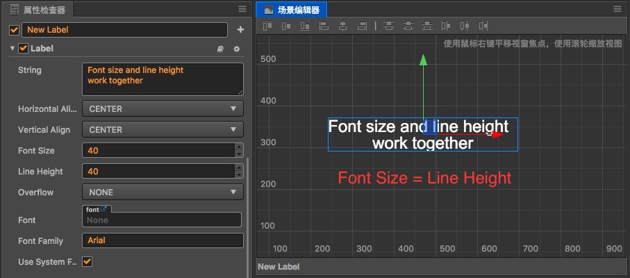
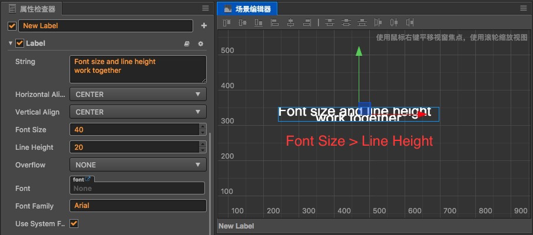
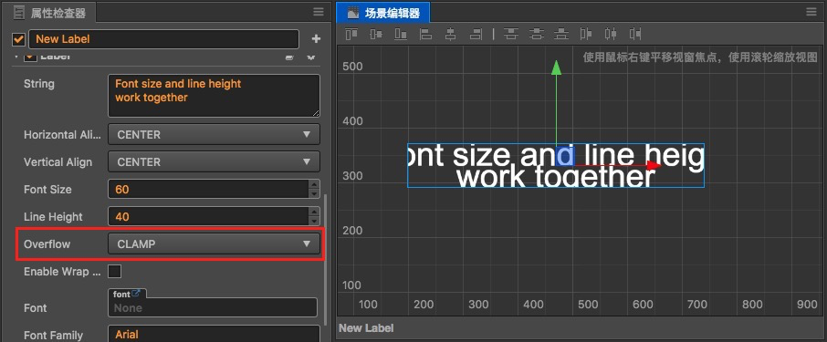
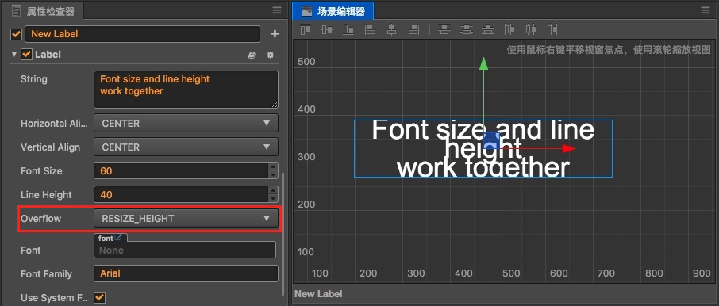
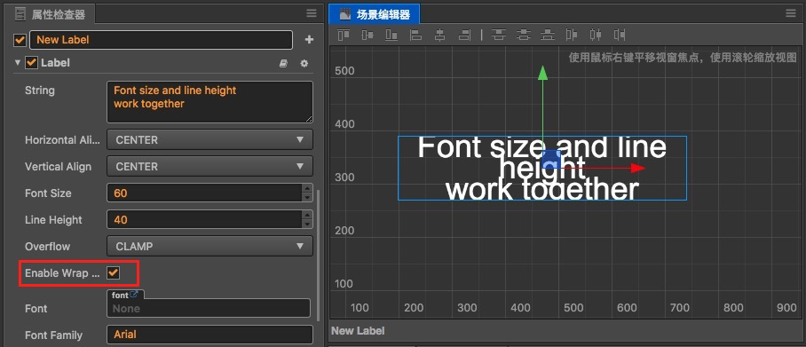
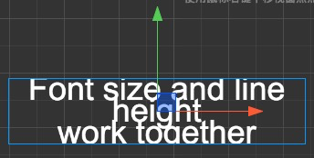

# 文字排版

**文字组件（Label）** 是核心渲染组件之一，您需要了解如何设置文字的排版，才能在 UI 系统进行多分辨率适配和对齐设置时显示完美的效果。

## 文字在约束框中对齐

和其他渲染组件一样，Label 组件的排版也是基于节点尺寸（`Size`），也就是约束框（Bounding Box）所规定的范围。约束框可参考 [场景编辑器](../getting-started/basics/editor-panels/scene.md#%E8%8A%82%E7%82%B9%E7%9A%84%E7%BA%A6%E6%9D%9F%E6%A1%86)。

上图所示就是 Label 渲染的文字在蓝色约束框内显示的效果。Label 中以下的属性决定了文字在约束框中显示的位置：

- `Horizontal Align`（水平对齐）：文字在约束框中水平方向的对齐准线，可以从 Left、Right、Center 三种位置中选择。
- `Vertical Align`（垂直对齐）：文字在约束框中垂直方向的对齐准线，可以从 Top、Bottom、Center 三种位置中选择。

  

上图中水平方向对齐位置设置为 `Right`，垂直方向的对齐位置设为了 `Bottom`，可以看到文字出现在约束框的底部且靠右对齐。开发者可以将以上两个属性修改为其他组合，文字会根据设置出现在蓝色约束框内相应的位置。

## 文字尺寸和行高

`Font Size`（文字尺寸）决定了文字的显示大小，单位是 Point（也称作“磅”），是大多数图像制作和文字处理软件中通用的字体大小单位。对于动态字体来说，`Font Size` 可以无损放大，但位图字体在将 `Font Size` 设置为超过字体标定的字号大小时，显示会变得越来越模糊。

`Line Height`（行高）决定了文字在多行显示时每行文字占据的空间高度，单位同样是 Point。多行文字显示可以通过两种方式实现：

- 在 `String` 属性中输入文字时，手动输入回车或换行符
- 开启 `Enable Wrap Text`（换行）属性，下文会详细介绍

文字尺寸和行高的关系：

- 如果 `Font Size` 和 `Line Height` 设为相同数值，文字正好占据一行大部分的空间高度。

  

- 如果 `Font Size` 小于 `Line Height`，多行文字之间间隔会加大

  

- 如果 `Font Size` 大于 `Line Height`，多行文字之间间隔会缩小，甚至出现文字相互重叠的情况。

  

## 排版模式（Overflow）

**Overflow（排版模式）** 属性，决定了文字内容增加时，如何在约束框的范围内排布。共有 **NONE**、**CLAMP**、**SHRINK**、**RESIZE_HEIGHT** 四种模式，而只有在后面三种模式下才能通过编辑器左上角的 **矩形变换工具** 或者修改 **属性检查器** 中的 **Size** 大小或者添加 **Widget 组件** 来调整约束框的大小。

### 截断（Clamp）

截断模式下，文字首先按照对齐模式和尺寸的要求进行渲染，而超出约束框的部分会被隐藏（截断）。

### 自动缩小（Shrink）

自动缩小模式下，如果文字按照原定尺寸渲染会超出约束框时，会自动缩小文字尺寸以显示全部文字。

**注意**：自动缩小模式不会放大文字来适应约束框。

### 自动适应高度（Resize Height）

自动适应高度模式会保证文字的约束框贴合文字的高度，不管文字有多少行。这个模式非常适合显示内容量不固定的大段文字，配合 [ScrollView 组件](../components/scrollview.md) 可以在任意 UI 区域中显示无限量的文字内容。

## 自动换行（Enable Wrap Text）

Label 组件中的 `Enable Wrap Text`（自动换行）属性，可以切换文字的自动换行开关。在自动换行开启的状态下，不需要在输入文字时手动输入回车或换行符，文字也会根据约束框的宽度自动换行。

**注意**：自动换行属性只有在文字排版模式的 **截断（Clamp）** 和 **自动缩小（Shrink）** 这两种模式下才有。自动适应高度（Resize Height）模式下，自动换行属性是强制开启的。

### 截断（Clamp）模式自动换行

截断模式开启自动换行后，会优先在约束框允许的范围内换行排列文字，如果换行之后仍无法显示全部文字时才发生截断。

以下两幅图都是在 `Clamp` + `Enable Wrap Text` 开启情况下的，区别在于文字约束框的宽度不同：

    

在约束框宽度从左图变化到右图的过程中，文字将不断调整换行，最后由于约束框高度不足而产生了截断显示。

### 自动缩小（Shrink）模式自动换行

和截断模式类似，自动缩小模式下文字超出约束框宽度时也会优先试图换行，在约束框宽度和长度都已经完全排满的情况下才会自动缩小文字以适应约束框。

### 中文自动换行

中文自动换行的行为和英文不同，英文是以单词为单位进行换行的，必须有空格才能作为换行调整的最小单位。中文是以字为单位进行换行，每个字都可以单独调整换行。

## 文字节点的锚点 

文字节点的锚点和文字在约束框中的对齐模式是需要区分的两个概念。在需要靠文字内容将约束框撑大的排版模式中（如 `Resize Height`），要正确设置锚点位置，才能让约束框向我们期望的方向调整。

例如，如果希望文字约束框向下扩展，需要将锚点（`Anchor`）的 `y` 属性设为 `1`。如下图所示：

## 文字配合对齐挂件（Widget）

在 Label 组件所在节点上添加一个 **Widget（对齐挂件）** 组件，就可以让文字节点相对于父节点进行各式各样的排版。

上图中我们在背景节点上添加了两个 Label 子节点，分别为它们添加 Widget 组件后，设置左边文字 Widget 的 `Right` 属性为 `50%`，右边文字 Widget 的 `Left` 属性为 `60%`，就可以实现图中所示的多列布局式文字。

而且通过 Widget 上设置边距，加上文字本身的排版模式，可以让我们在不需要具体微调文字约束框大小的情况下轻松实现灵活美观的文字排版。

## 查看组件参考

关于 Label 组件的属性，也可以查阅 [Label 组件参考](../components/label.md) 文档。
