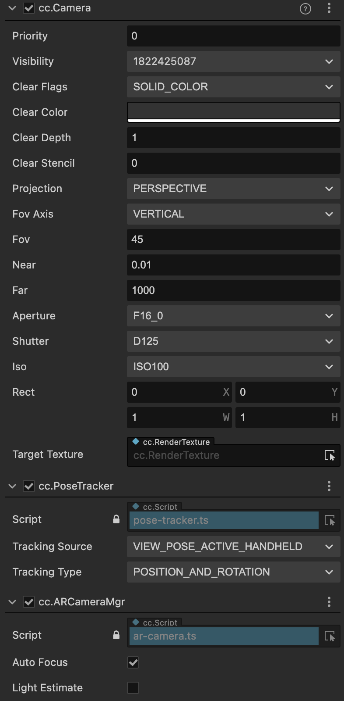

# AR 相机

和头戴显示器一样，场景中为了能够抽象表式移动端设备带有 AR 能力的摄像机，XR 插件使用 AR Camera 组件封装一系列属性来映射物理设备的摄像头 AR 功能。

AR Camera 对象包含三种必要的组件：cc.Camera、cc.PoseTracker和cc.ARCameraMgr。

cc.Camera 是 Cocos Creator 引擎提供的传统的摄像机组件，为了保证良好的体验，推荐将缓冲清除标志位（Clear Flags）设置为 SOLID_COLOR，近裁剪面（Near Plane）设置为0.01。更多相机参数介绍请查阅 [相机组件](../../editor/components/camera-component.md#相机组件) 介绍。

cc.PoseTracker 用于将物理设备的位姿信息同步至 AR Camera，保证摄像机能够正确渲染虚拟内容并和视频流叠加，与 XR HMD 不同，适配移动端的手持设备时 Tracking Type 要选择VIEW_POSE_ACTIVE_HANDHELD。

cc.ARCameraMgr 是用于管理AR摄像机功能的组件，详细属性介绍请参考设备映射组件 > ARCameraMgr。

注：光照估计目前只能在 ARCore、AREngine 平台上生效。
