# AR 交互

AR 交互主要由 cc.ScreenTouchInteractor 组件驱动，该组件将触摸事件转换为点击、拖拽和捏合等手势，交互器将这些手势传递给可以交互的虚拟交互物，完成手势对应触发的行为。

## 手势交互

AR 手势交互器组件将屏幕触摸转换为手势。Cocos Creator 的输入系统将手势信号传递给交互物，然后交互物响应手势事件发生变换行为。交互物能发生交互行为的前提是必须绑定  **cc.Selectable** 组件，关于此组件的属性描述详见交互组件 [Selectable](component.md#Selectable)。

想要使用屏幕手势交互器，在层级管理器中右键创建 **XR -> Screen Touch Interactor** 。

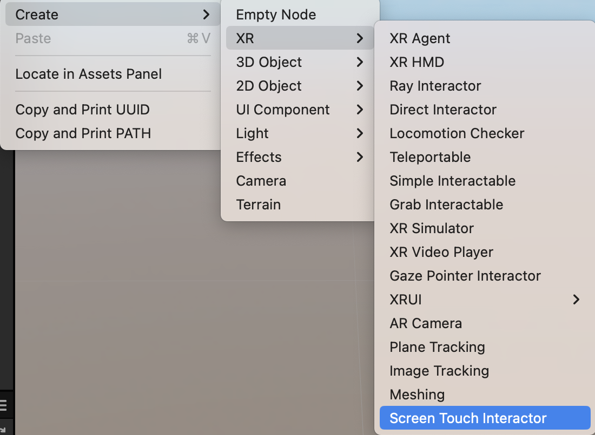

随意创建一个 3D 物体（以 Cube 为例）。

修改 Cube 的 Scale 属性为（0.1，0.1，0.1）既实际大小为 1000cm³ ，修改 Position 属性为（0，-0.1，-0.5）即位于空间远点处 50cm 远且靠下10cm的位置，并添加组件 **XR > Interaction -> Selectable**。

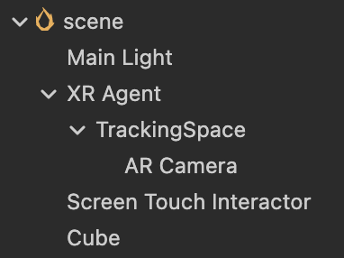

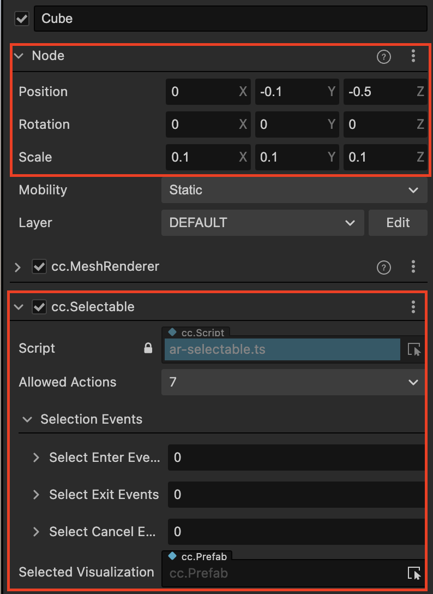

下面创建选中效果，在资源文件夹中创建一个预置体，命名为 Selected Visualizer。

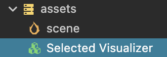

在预置体根节点下创建一个同样的 Cube 对象，Scale 大小设置为基于父节点的 1.2 倍。

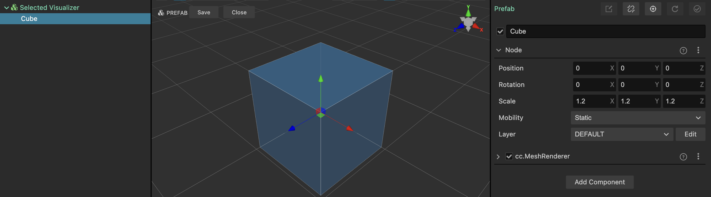

创建一个新的材质，突出表现选中态的效果。

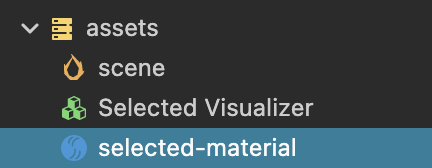

调整材质效果，建议 Effect 选择 builtin-unlit，Technique 选择 1-transparent。

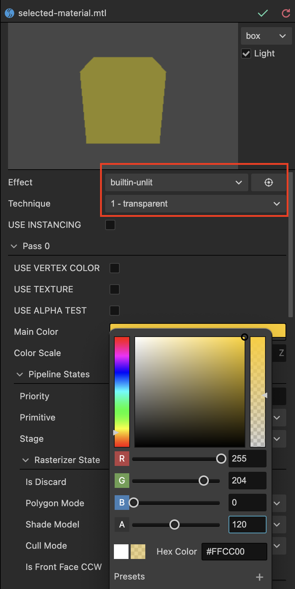

材质创建完毕后，应用到预置体中 Cube 的 cc.MeshRenderer 中，即可完成选中效果的创建。

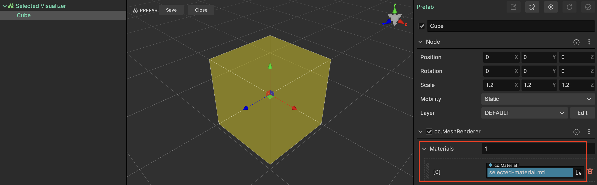

最后，将预置体应用到 cc.Selectable 的 Selected Visualization 属性中。

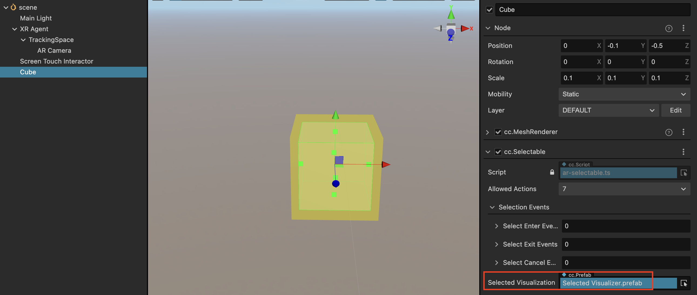

运行时效果如下，可以结合手势来移动、旋转和放缩虚拟物体。

## 放置

使用屏幕交互器时，会启用设备 AR Hit Test 能力，根据屏幕触碰位置坐标转换到摄像机使用 Ray Cast 与 AR Plane 发生碰撞计算，来获取碰撞点的位置，最终在平面的此坐标上放置虚拟对象。能够被放置的预置体对象必须要挂载**[cc.Placeable](component.md#Placeable)**组件。

以上述场景中制作的 Selectable 对象为例，以下对其赋予被放置交互能力。

选中场景中的 Cube 对象，为其添加组件 **XR -> Interaction -> Placeable**。

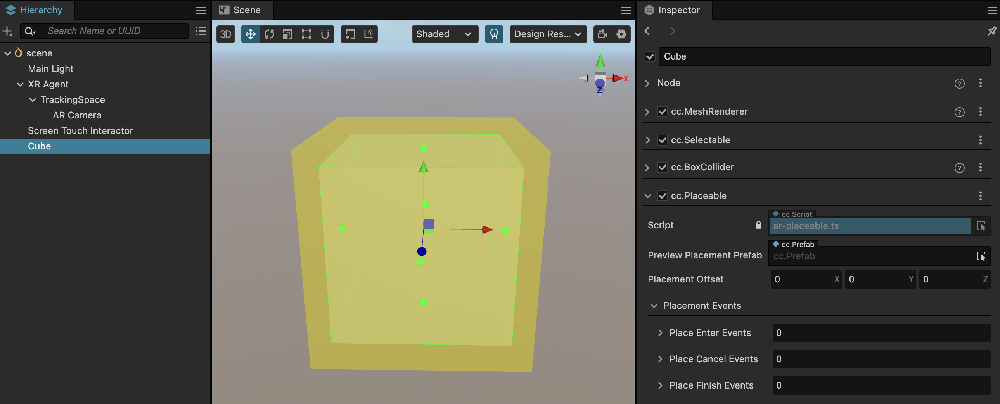

将此场景节点拖入资源管理器生成一份预置体，并删除场景中的此 Cube 对象。

将刚生成的Cube预置体引用到 **Screen Touch Interactor -> Place Action > Placement Prefab** 属性中，**Calculation Mode** 选择 **AR_HIT_DETECTION**。

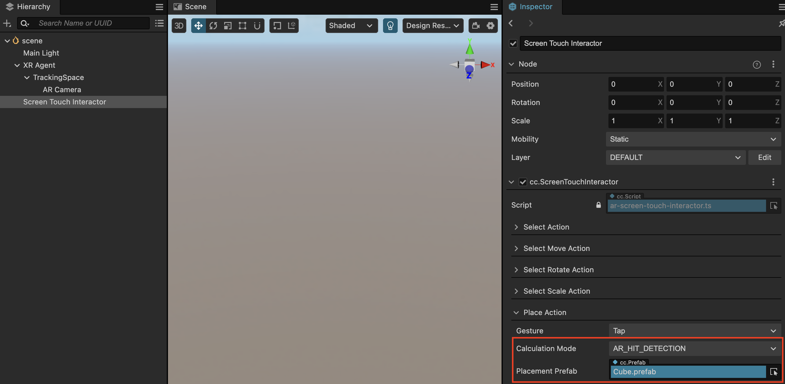

放置对象的位置计算需要依赖于 AR Plane，所以还需创建一个 Plane Tracking 节点来请求设备激活 AR SDK 的平面识别能力。在编辑器的层级管理器中右键 **创建 > XR > Plane Tracking**，创建平面代理节点。

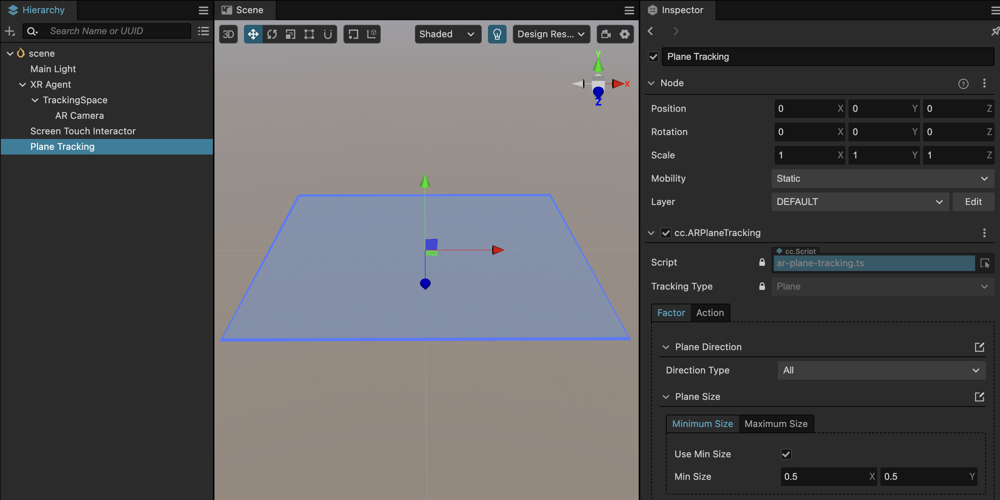

所有工作都完成后，即可打包发布，在运行时查看放置效果。

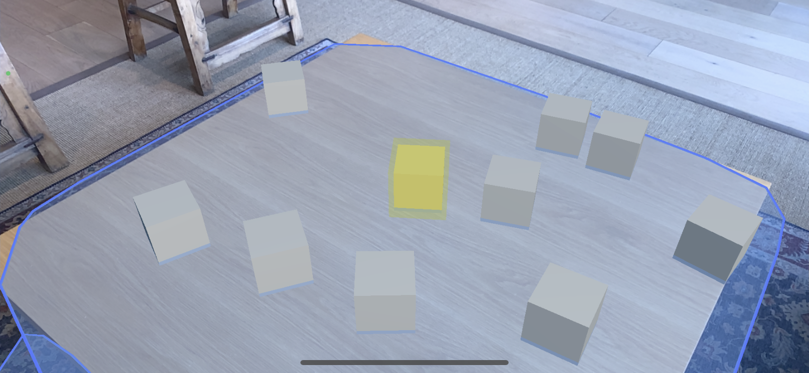
