# AR 自动化行为编辑

AR 场景中，虚拟物体与现实实体间总是存在未知的依赖关系，如果能够清晰方便的描述现实实体的条件特征并针对此种条件执行匹配的行为，可以很大程度上简化开发者处理复杂的 AR 功能特性而专注于编写项目核心逻辑。Cocos CreatorXR 提供了 AR 自动化行为编辑组件，将常用的物理特征和逻辑行为抽象成元素供开发者自由搭配，图形化的操作极大程度降低了 AR 应用的开发成本和开发门槛。

每种特性的自动化行为编辑组件都有其独特的特征库和行为库，以下介绍了当前版本支持自动化行为的所有 AR 特性：

## 平面追踪

在编辑器的层级管理器中右键 **创建 -> XR -> Plane Tracking**，创建平面代理节点，此节点可用于描述物理世界中的某一个平面实体。

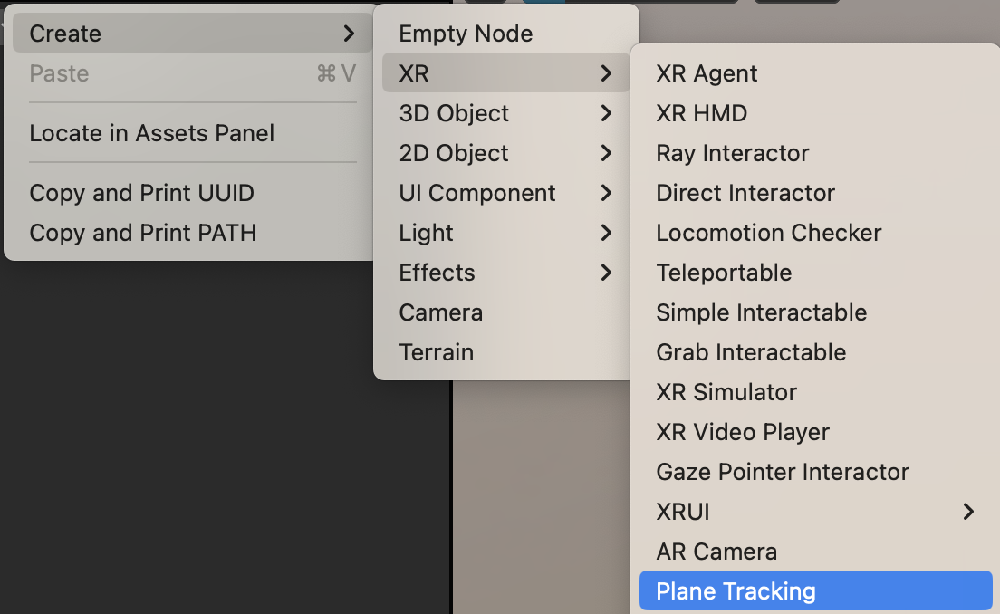

选中创建好的 Plane Tracking 节点，在属性检查器中可以看到默认添加好的 cc.ARPlaneTracking，选择 Factor 或 Action 页签可以查看当前已有的特征或行为项。点击 Add Factor 或 Add Action 可以添加特征库/行为库中其他的新项。

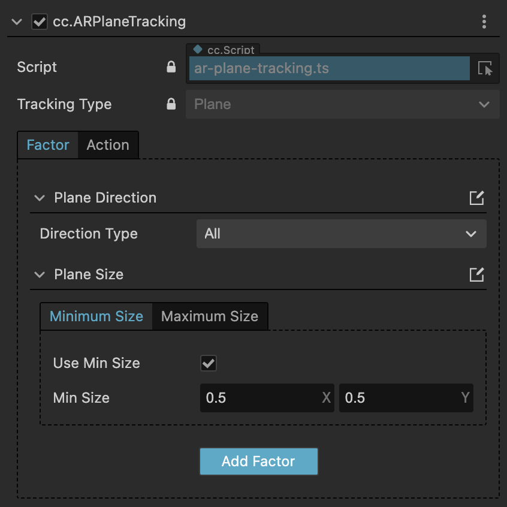

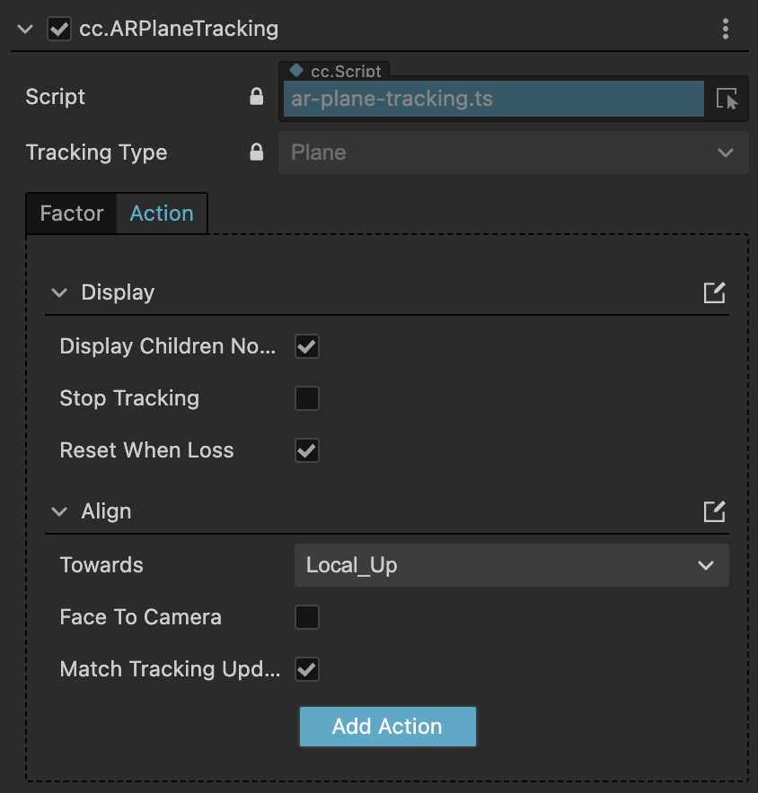

在创建好的 Plane Tracking 节点下拖入需要展示的虚拟物体，调整为合适的大小比例。在 Action 中添加 Display 行为项（默认已经添加），即可在运行时识别到满足条件的平面后展示出虚拟物体。

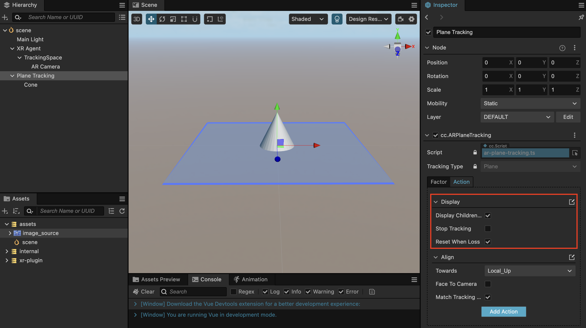

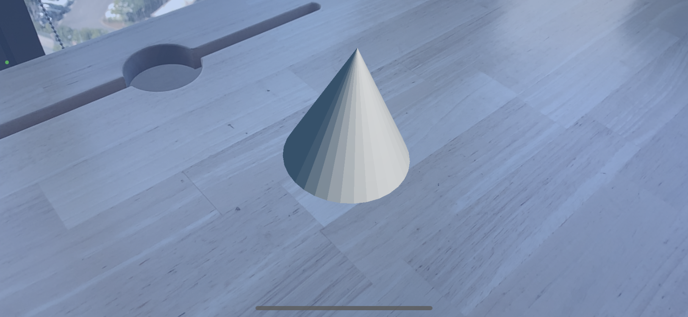

## **图像追踪**

图像追踪允许您在运行时使用设备 AR 能力识别出 2D 图像资源。

在编辑器的层级列表中右键 **创建 -> XR -> Image Tracking**，创建图像代理节点，此节点可用于描述物理世界中的某一个图像实体。

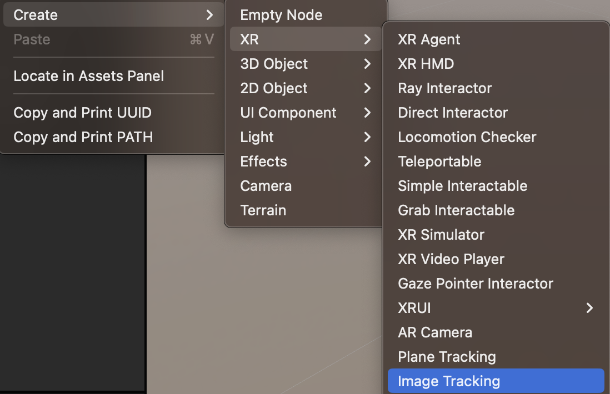

选中创建好的 Plane Tracking 节点，在属性检查器中可以看到默认添加好的 cc.ARImageTracking，在 Factor 页签的 Image Source 属性中新增一个图像资源。

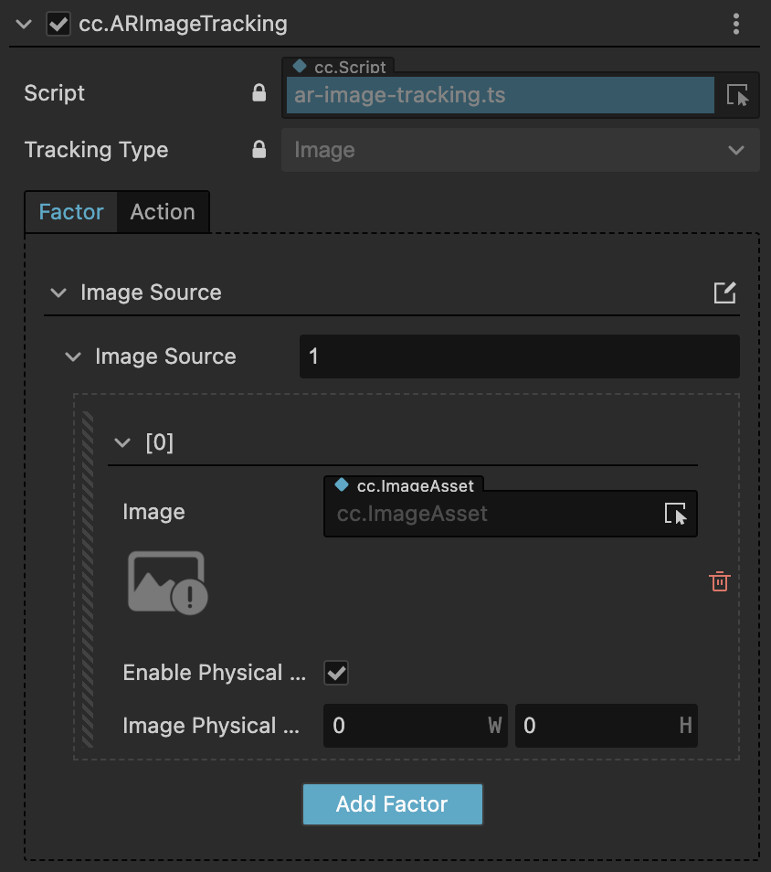

在 Image 属性中拖入或直接选择资源管理器中的图片资源，在编辑器场景中可以看到当前引用的图像，设置图像的默认的物理尺寸。

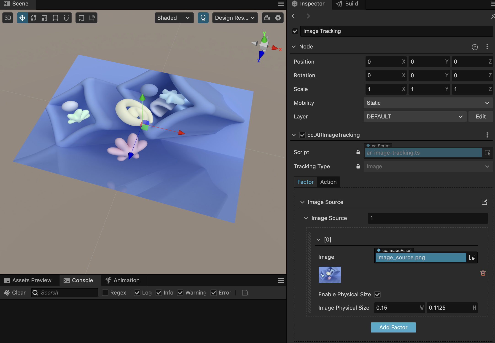

在创建好的 Image Tracking 节点下拖入需要展示的虚拟物体，调整为合适的大小比例。在 Action 中添加 Display 行为项（默认已经添加），即可在运行时识别到图像后展示出虚拟物体。

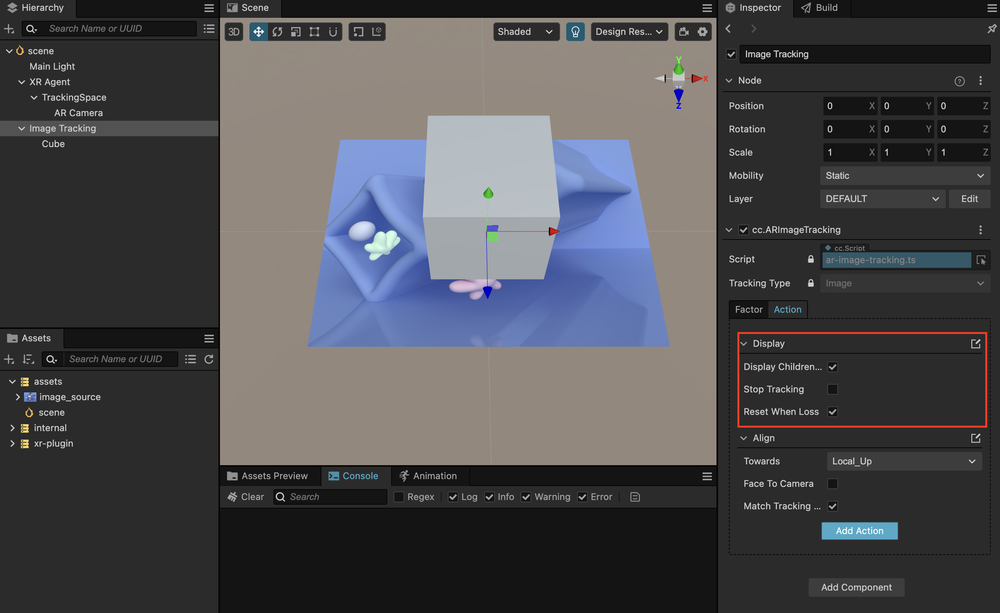

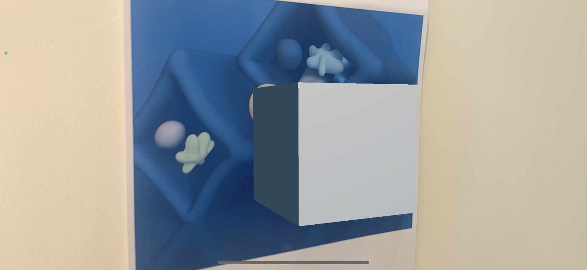

## **网格化（实验性）**

目前网格化特性只对 iOS 平台中具有深度场景重建能力的设备上生效（带有 LiDAR 扫描仪的 iPhone/iPad Pro 系列），网格化允许您根据现实环境创建 3D 网格。

在编辑器的层级列表中右键 **创建 -> XR -> Meshing**，创建网格化代理节点。

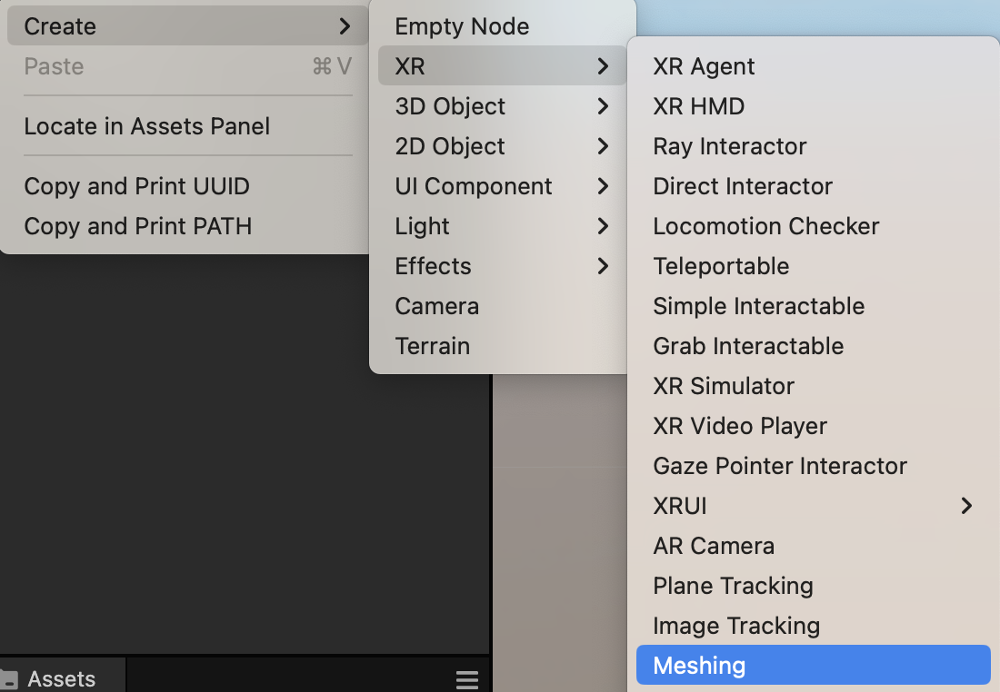

在 cc.ARMeshing 的 Mesh Visualizer 属性中选择需要展示的网格效果。

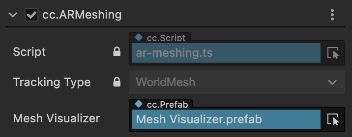

即可直接在运行时将现实环境的表面网格化。

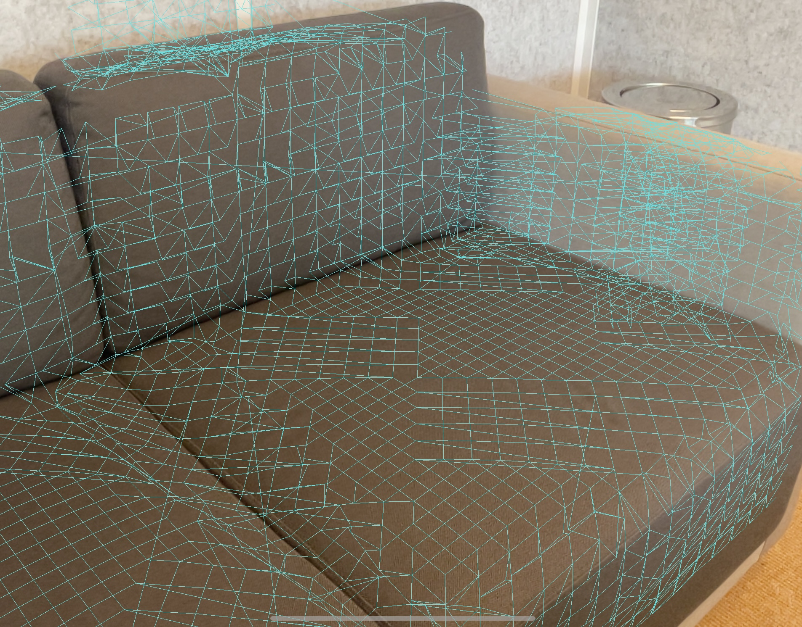

## 特征库和行为库

当前可以添加特征和行为如下：

### 特征库

| 特征项          | 特征属性             | 描述                                                         |
| --------------- | -------------------- | ------------------------------------------------------------ |
| Plane Direction |                      | 设置此平面需要满足给定的朝向。平面可以选择指定的朝向(水平，垂直或其他)。 |
| Plane Size      |                      | 设置此平面必须匹配给定的尺寸。设置时可以选择限制平面的最小/最大尺寸范围。 |
| Image Source    | Image                | 设置图像追踪所依赖的图像资源。                               |
|                 | Enable Physical Size | 开启后，识别到图像资源后，将默认以此物理尺寸作为现实图像的尺寸，而无需根据深度特征计算图像大小，可以加快识别的速度。 |
|                 | ImagePhysicalSize    | 标定图像的物理尺寸限制(米为单位)。当改动宽或高任意一项数值时，另一项都会根据像素比自动计算数值。 |

### 行为库

| 行为项          | 行为属性              | 描述                                                         |
| --------------- | --------------------- | ------------------------------------------------------------ |
| Display         |                       | 如果自动化行为编辑组件的所有特征与真实世界实体匹配成功，则激活子对象;否则禁用子对象。 |
|                 | Display Children Node | 开启后，默认展示 Tracking 节点下的子节点对象。                 |
|                 | Stop Tracking         | 满足当前节点的条件设定时，关闭此节点的AR追踪。               |
|                 | Reset When Loss       | 追踪丢失时，子节点行为是否重置。                             |
| Align           |                       | 该代理节点的位置与真实世界实体的位置的对齐关系。             |
|                 | Towards               | 子物体摆放朝向。如果设置为 Local_Up，则直接使用子物体的姿态。 如果设置为 World_Up，子物体 Y 轴将始终与世界坐标上方向对齐。 |
|                 | Face to Camera        | 开启后，子物体Z轴朝向 AR Camera 的方向。                       |
|                 | MatchTrackingUpdate   | 当此节点匹配的真实世界数据更新时，布局和对齐效果也跟随刷新。 |
| Surface Overlay |                       | 满足条件后用指定的预置体覆盖原来的可视化效果。               |
|                 | Surface Offset        | 设置覆盖在平面上的表面位置的偏移值。                         |
|                 | Replace Visualizer    | 创建后关闭并取代追踪可视化的效果。                           |
| Adaptive Scale  |                       | 根据匹配的 AR 对象的边界来放缩子物体。                         |
|                 | Max Scale             | 比例调整的最大上限。                                         |
|                 | Match Tracking Update | Scale 的行为是否跟随追踪而不断刷新。                          |
| Track Event     |                       | 在跟踪特征匹配期间调用的事件集。                             |
|                 | on Track Success      | 追踪成功时调用的事件。                                       |
|                 | on Track Refresh      | 追踪信息刷新时调用的事件。                                   |
|                 | on Track Loss         | 追踪丢失时调用的事件。                                       |
|                 | on Track Timeout      | 追踪超时时调用的事件。可以设置保持追踪检查的时间，此时间范围内没有成功匹配追踪数据会触发追踪失败的事件。 |
