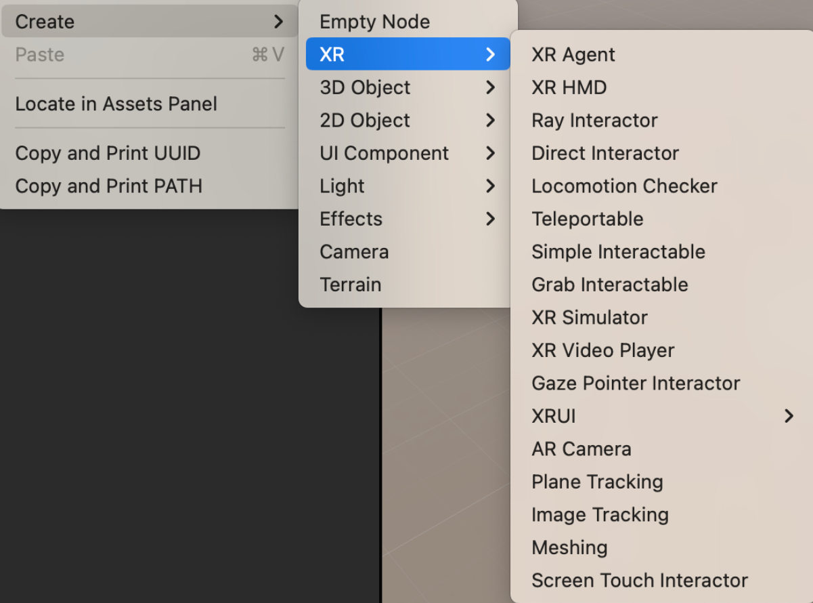
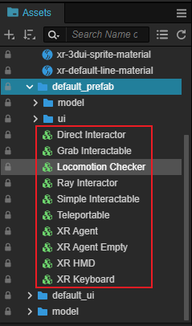
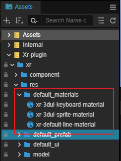
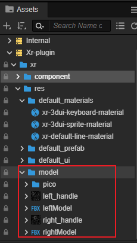

# 内置资源与预制体

在 Cocos Creator 扩展管理器中 **开启XR扩展** 之后就可以允许在编辑器中使用传统创建对象的方式创建 XR 对象。

在 层级管理器 右键选择 **创建 -> XR**，右侧会出现当前可以创建的所有 XR 预制体。选择想要实例化生成的对象即可在场景中创建出来。

|名称|说明|包含组件|
| ---------------------------------------------- | --------------------------------------------------- | ----------------------------------- |
| XR Agent                | 现实世界主角相关的信息在虚拟场景中的代理节点，同时具有用于控制虚拟世界中 XR 主角的生命周期的功能。 | TrackingOrigin                                               |
| XR HMD                  | 头戴显示器设备在虚拟世界中的抽象节点，基于 Camera 对象进行改造生成，用于同步现实世界中头戴显示器的输入信号并将引擎渲染结果输出至设备。 | Camera AudioSource HMDCtrl PoseTracker TargetEye |
| AR Camera               | 抽象表式移动端设备带有 AR 能力的摄像机，用于来映射物理设备的摄像头 AR 功能。 | Camera PoseTracker ARCameraMgr                     |
| Ray Interactor          | 用于进行远距离交互的射线交互器，包含对 XR 设备手柄控制器的 I/O 映射以及射线交互功能。 | PoseTracker XRController RayInteractor Line   |
| Direct Interactor       | 用于进行近距离直接交互的交互器，同时也包含了对 XR 设备手柄控制器的 I/O 映射以及交互功能 | PoseTracker XRController DirectInteractor          |
| Gaze Pointer Interactor | 用于进行凝视点交互的交互器，跟随头动，按凝视时间来触发交互行为 | UITransform RenderRoot2D XRGazeInteractor          |
| Screen Touch Interactor | 适用于手持移动端设备的屏幕手势交互起，将屏幕手势转化为交互行为同场景中的对象进行交互。 | ScreenTouchInteractor                                        |
| Locomotion Checker      | 运动检查器，充当所有虚拟运动驱动访问 XR Agent 的仲裁者，可以保证固定时间内对唯一的运动状态的维持。 | LocomotionChecker                                            |
| Teleportable            | 支持与交互器发生传送交互行为的交互物，可以传送 XR Agent 到此对象相关的一个位置。 | Teleportable InteractableEvents                         |
| Simple Interactable     | 简易的交互物对象，用户可以在此对象上自定义扩展任意的交互行为 | InteractableEvents                                           |
| Grab Interactable       | 支持与交互器发生抓取行为的交互物。                           | RigidBody GrabInteractable InteractableEvents      |
| XR Simulator            | 用于预览XR内容，提供Web端、无线串流两种方式。                | XRInteractiveSimulator                                       |
| XR Video Player         | XR视频播放器，支持在空间中播放窗口化、180 度、360 度模式的视频。 | XRVideoPlayer XRVideoController XRVideoCaption     |
| XRUI                    | 可在空间中渲染和交互的 3D UI。                                | RaycastChecker RenderRoot2D BoxCollider            |
| Plane Tracking          | 为应用赋能平面识别能力，在运行时使用设备 AR 能力识别出物理世界中的平面特征数据，并可以将这些平面数据可视化显示在应用程序中。 | ARPlaneTracking                                              |
| Image Tracking          | 为应用赋能图像识别能力，在运行时使用设备 AR 能力识别出 2D 图像资源。 | ARImageTracking                                              |
| Meshing                 | 为应用赋能环境重构能力，根据现实环境创建 3D 网格。           | ARMeshing                                                    |

### 内置资源

开启 XR 的扩展后，在内置资源数据库（xr-plugin）中会新增 XR 预制体、材质和模型等资源，可供用户直接使用。具体位置如下图所示。

#### 预制体资源

#### 材质资源

#### 模型资源

