# XR组件

Cocos CreatorXR 通过组件的组合封装为实体赋能，实体根据其不同特性又被不同的功能系统所管理。所以编辑器中所有 XR 相关的功能底层都是由封装好的特殊 XR 组件驱动的。

Cocos CreatorXR 的功能组件主要由 5 部分构成：

- [设备映射](#设备映射组件)
- [交互组件](#交互组件)
- [交互限制组件](#交互限制组件)
- [虚拟移动组件](#虚拟移动组件)
- [XR UI](#xr-ui)

开启了 xr-plugin 扩展之后，想要给场景中的对象添加 XR 相关的功能组件可以在 **属性检查器** 中点击 **添加组件** 按钮，在出现的组件列表中找到 **XR** 分类，选择 XR 分类下的想要添加的 XR 组件类别再找到类别下的对应组件即可。

## 设备映射组件

此类组件主要用以同步现实世界中物理设备和虚拟世界中的代理节点之间的 I/O 信息。确保在用户在 XR 设备的使用和虚拟世界中的反馈一致。

主要包括以下组件：

### TrackingOrigin

追踪原点代理组件。

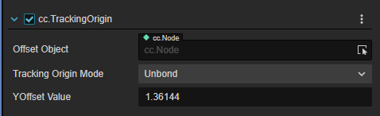

| 属性                 | 说明                                                         |
| -------------------- | ------------------------------------------------------------ |
| Offset Object        | 指定需要竖直偏移的对象，如果选择的对象还有子对象，则偏移的效果是选中对象及其所有子对象进行纵向偏移。 |
| Tracking Origin Mode | 追踪的偏移方式。选择 Unbond 和 Device 时，下方出现 YOffsetValue，可手动输入数据；选择 Floor 时 YoffsetValue 隐藏。如果选择为 Floor，且设备开启了安全边界，则以设备离地面高度作为当前视角高度（暂时只支持 quest2）；如果选择为 Device，则偏移的高度为输入的高度。 |
| YOffset Value        | 设备数值偏移量。手动输入偏移的值，米为单位，默认为 1.36144m。如果为固定值，则 OffsetObject 选中的对象 Transform 属性的 Y 值为当前填入的值。 |

### HMDCtrl

HMD（Head Mounted Display）头戴显示设备控制器，可以认为所有具备双目立体绘图能力的 XR 眼镜设备都属于 HMD 的大范畴，因此此组件定义了 XR 眼镜的图像渲染输出相关参数。

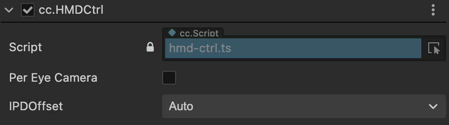

| 属性           | 说明                                                         |
| -------------- | ------------------------------------------------------------ |
| Per Eye Camera | 开启单眼显示功能；勾选 PerEyeCamera 后下方出现 Sync With Main Camera 选项；XR HMD 下的两个子节点 LeftEye 和 RightEye 由隐藏变为显示 |
| IPDOffset      | 调整瞳间距。下拉列表中选择 Manual 时下方出现 OffsetValue 输入框；在 PerEyeCamera 开启的情况下，调整 Manual 的参数可让 LeftEye 和 RightEye 的 TransForm 属性 X 值变化（变化的值为 ±IPDOffset/2） |

### PoseTracker

位姿追踪组件。

| 属性            | 说明                                                         |
| --------------- | ------------------------------------------------------------ |
| Tracking Source | 选择需要追踪的设备源                                         |
| Tracking Type   | 追踪模式。选择 POSITION_AND_ROTATION 时追踪设备的平移 + 旋转；选择 POSITION 时只追踪平移的量；选择 ROTATION 时只追踪旋转的量。 |

### TargetEye

指定接受渲染相机的组件。

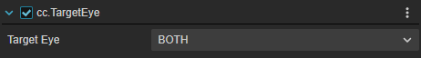

| 属性       | 说明                                                         |
| ---------- | ------------------------------------------------------------ |
| Target Eye | 指定渲染的目镜。Both 为左右眼都显示，left 为左眼，right 为右眼。 |

### XRController

控制器抽象组件。

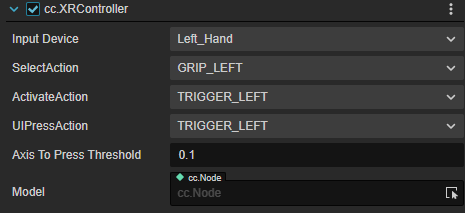

| 属性                 | 说明                                     |
| -------------------- | ---------------------------------------- |
| InputDevice          | 绑定输入手柄设备。                       |
| SelectAction         | 将 Select 行为映射到手柄的对应实体按键   |
| ActivateAction       | 将 Activate 行为映射到手柄的对应实体按键 |
| UIPressAction        | 将交互 UI 行为映射到手柄的对应实体按键   |
| AxisToPressThreshold | 行为触发时的阈值                         |
| Model                | 用于指定手柄的模型对象。                 |

### ARCameraMgr

移动端手持设备摄像头AR属性

| 属性                     | 说明                                                         |
| ------------------------ | ------------------------------------------------------------ |
| Auto Focus               | 开启或关闭相机自动对焦功能。关闭时，使用固定对焦模式。自动对焦功能是否可用取决于设备相机。 |
| Light Estimate（实验性） | 开启后，运行时估计环境光各项属性并实时调整场景光照，让虚拟物体具有与真实场景相同的光照效果（光照一致性）。 |

注：v1.2.0以上的版本光照估计支持两种模式：Basic和HDR。

若需要启用Basic模式，需要将场景中Skybox的Envmap属性设置为LDR。

若需要启用HDR模式，需要将场景中Skybox的Envmap属性设置为HDR。

*当前iOS平台仅支持Basic模式。

## 交互组件

一次交互操作需要有两种对象协调完成：交互主体和被交互物，对应的交互组件由此也分为两类：Interactor（交互器）和 Interactable（可交互对象）。

### RayInteractor

射线交互器组件。

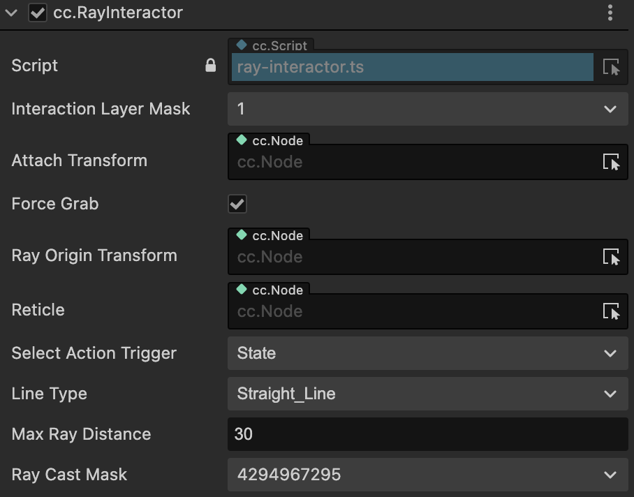

| 属性                     | 说明                                                         |
| ------------------------ | ------------------------------------------------------------ |
| AttachTransform          | 用此 AttachTransform 的位置作为抓取的物体最终落到的位置，如果为空就用当前 Interactor 的位置 |
| ForceGrab                | 远距离抓起；开启时被抓对象吸附到 Attach Transform、关闭后抓取挂载在交互点的位置 |
| RayOriginTransform       | 可以改变发出 Ray 的起始位置，为空就默认是当前 Interactor 的位置 |
| LineType                 | 改变射线检测和射线样式；StraightLine 是直线；Projectile Line 是抛物线；Bezier Line 是贝塞尔曲线 |
| MaxRayDistance           | 射线交互可以触发的最远距离                                   |
| ReferenceNode            | LineType为ProjectileLine和BezierLine时出现此项。用曲线的参考系来定义地平面和向上向量。如果在启动时没有设置，它将尝试找到XR Agent，如果没有引用，它将默认使用全局的上向量和原点。 |
| Velocity                 | LineType为ProjectileLine时出现此项。初始速度。增加这个值将使曲线延伸的更远。 |
| Acceleration             | LineType为ProjectileLine时出现此项。重力加速度。             |
| Additional Ground Height | LineType为ProjectileLine时出现此项。在地平面以下的额外高度，射线超过地平线会继续向下投射。增加这个值将使终点的位置高度下降。 |
| Additional Flight Time   | LineType为ProjectileLine时出现此项。在落地后的额外飞行时间，射线超过地平线会继续向下投射。增加这个值将使投射的飞行时间延长。 |
| End Point Distance       | LineType为BezierLine时出现此项。增加这个值的距离会使曲线的末端离起始点更远。 |
| End Point Height         | LineType为BezierLine时出现此项。降低这个值将使曲线的末端相对于起点下降得更低。 |
| Control Point Distance   | LineType为BezierLine时出现此项。增加这个值将使曲线的峰值离起点更远。 |
| Control Point Height     | LineType为BezierLine时出现此项。增加这个值将使曲线的峰值相对于起点更高。 |
| Sample Frequency         | LineType为ProjectileLine和BezierLine时出现此项。用于近似曲线路径的采样点的数目。数目越多近似效果越好，但性能越低。 |
| RaycastMask              | 只能和此 Layer 类型的交互物发生交互。                        |
| SelectActionTrigger      | Select 行为触发机制，详情见交互功能介绍。                    |

> **注意**：抛物线和贝塞尔曲线的功能需要扩展版本 **>= v1.1.0**，编辑器版本 **>= 3.7.1**。

### DirectInteractor

直接交互器组件。

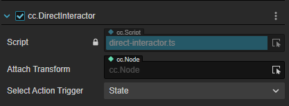

| 属性                | 说明                                                         |
| ------------------- | ------------------------------------------------------------ |
| AttachTransform     | 用此 AttachTransform 的位置作为抓取的物体最终落到的位置，如果为空就用当前 Interactor 的位置。 |
| SelectActionTrigger | Select 行为触发机制，详情见交互功能介绍。                    |

### XRGazeInteractor

凝视交互器，如果没有手柄或者其他控制器的话，可以用 HMD 的中心点凝视交互物（UI），凝视一段时间后出发交互行为。

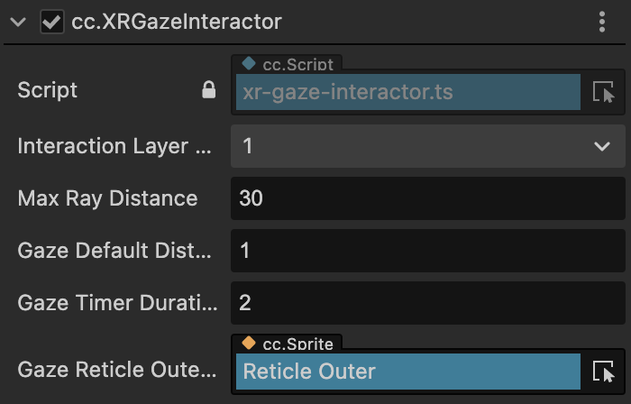

| 属性                    | 说明                         |
| ----------------------- | ---------------------------- |
| Gaze Pointer Offset     | 凝视点竖直方向偏移（单位米） |
| Max Ray Distance        | 射线最远投射距离（单位米）   |
| Gaze Default Distance   | 凝视点UI默认距离（单位米）   |
| Gaze Timer Duration     | 凝视交互触发时间（单位秒）   |
| Gaze Reticle Outer Ring | 凝视点外环UI                 |

> **注意**：凝视交互器功能需要扩展版本 **>=v1.1.0**，编辑器版本 **>=3.7.1**。

### **ScreenTouchInteractor**

屏幕手势交互器

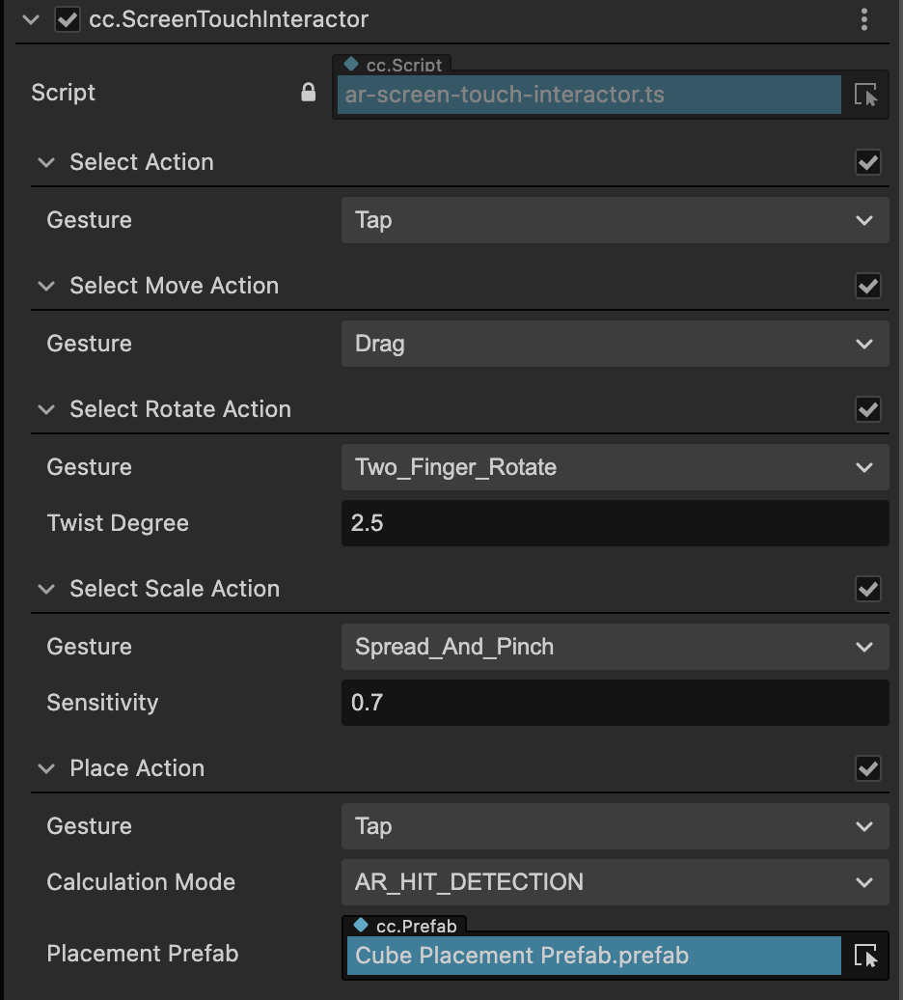

| 行为          | 属性              | 说明                                                         |
| ------------- | ----------------- | ------------------------------------------------------------ |
| Select Action |                   | 选择行为相关配置，可控制是否启用。                           |
|               | Gesture           | 允许用户操作虚拟物体的可选收拾类型。                         |
|               | Double Tap Gap    | Gesture选择为DoubleTap时出现此项，当两次点击的时间间隔小于此值时，判定为双击。 |
|               | HoldTouchDuration | Gesture选择为HoldTouch时出现此项，当触碰屏幕时间大于此值时，判定为长按 |
| Move Action   |                   | 移动行为相关配置，必须开启Select Action，可控制是否启用。    |
|               | Gesture           | 绑定移动行为的手势                                           |
| RotateAction  |                   | 旋转行为相关配置，必须开启Select Action，可控制是否启用。    |
|               | Gesture           | 绑定旋转行为的手势                                           |
|               | Drag Degree       | Gesture选择为2FingersDrag时出现此项，双指拖动速率。          |
|               | Twist Degree      | Gesture选择为2FingersRotate时出现此项，双指旋转速率。        |
| Scale Action  |                   | 放缩行为相关配置，必须开启Select Action，可控制是否启用。    |
|               | Gesture           | 绑定放缩行为的手势                                           |
|               | Sensitivity       | 放缩的灵敏度                                                 |
| Place Action  |                   | 放置行为相关配置，可控制是否启用。                           |
|               | Gesture           | 绑定放置行为的手势                                           |
|               | Calculation Mode  | 放置虚拟物体时，用于计算命中点位置的方法。有三种模式： AR_HIT_DETECTION：使用AR Hit Test功能进行命中检测，将物体放置在命中点的位置。 SPATIAL_DISTANCE：基于屏幕交互器前方的固定距离来放置内容。 COLLISION_DETECTION：基于射线的碰撞检测返回碰撞结果，将物体放置在碰撞点的位置。 |
|               | Distance          | Calculation Mode选择为SPATIAL DISTANCE时出现此项，设置交互物摆放位置与交互器的距离。 |
|               | Avoid Occlusion   | Calculation Mode选择为SPATIAL DISTANCE时出现此项，设置交互物摆放时是否受距离内的遮挡物影响摆放结果。开启时忽略遮挡，将交互物放置在固定位置；关闭时，若距离内出现遮挡物则会将交互物放置在遮挡处。 |
|               | Located Prefab    | Calculation Mode选择为SPATIAL DISTANCE时出现此项，用于定位虚拟物体的摆放位置。 |
|               | Placement Prefab  | 引用挂载Placeable组件的预置体。                              |

> **注意**：
>
> - 屏幕手势交互器功能需要扩展版本 **>=v1.1.0**，编辑器版本 **>=3.7.1**。各手势行为开关控制功能需要扩展版本 **>=v1.2.0**。
> - WebXR平台暂时不支持接受双指手势输入。

### GrabInteractable

可抓取交互对象组件。

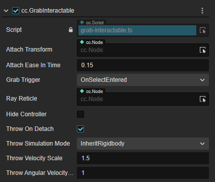

| 属性                      | 说明                                                         |
| ------------------------- | ------------------------------------------------------------ |
| AttachTransform           | 用此 AttachTransform 的位置作为触碰点的位置，如果为空就用当前 node 的位置 |
| AttachEaseInTime          | 对象被抓取到 AttachTransform 位置过程的时间（在该时间内，被抓取对象会有一个拖尾的效果，持续时间越久效果越不明显） |
| GrabTrigger               | 两种方式用于触发抓取：当 Select 的行为触发时/当 Activate 行为触发时 |
| RayReticle                | 当交互器与此交互物发生交互碰撞计算时，在碰撞点会显示此属性所引用的对象 |
| HideController            | 开启时，此物体被抓取后会隐藏 XR Controller 所引用的 Model    |
| ThrowOnDetach             | 开启后，允许模拟抛物的动作。                                 |
| ThrowSimulationMode       | 选择为 InheritRigidbody 时，物体抛出时继承刚体的速度；选择为 CurveComputation 时，出现下列两项ThrowSmoothingDuration、ThrowSmoothingCurve，允许自定义抛出速度的计算 |
| ThrowSmoothingDuration    | 速度计算的采样时间段。使用此值作为采样区间，用于计算物体被抛出前的速度的加权平均值，作为物体抛出时的初速度 |
| ThrowSmoothingCurve       | 速度采样曲线。根据绘制的曲线进行抛出时初速度的加权平均值计算 |
| ThrowVelocityScale        | 初速度的权重系数。权重越大，抛物瞬时速度所乘的系数也越大，在继承或者加权计算出的初速度基础上乘以一个系数 |
| ThrowAngularVelocityScale | 初角速度的权重系数。权重越大，抛物瞬时角速度所乘的系数也越大，在继承或者加权计算出的初始角速度基础上乘以一个系数 |

### Teleportable

可传送对象组件。

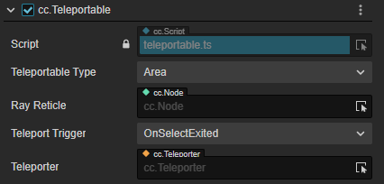

| 属性                 | 说明                                                         |
| -------------------- | ------------------------------------------------------------ |
| TeleportableType     | 传送点的类型。选择为 Area 时，传送到射线与传送区域交互点的位置；选择为 Anchor 时，不受射线与传送区域的交互点的限制，之间传送到区域的固定位置。 |
| Teleport Anchor Node | TeleportableType 选择为 Anchor 时出现此项，用于标定传送的落点。此项为空时传送到传送区域的默认中心区域；此项引用了其他对象就传送到引用的对象的位置 |
| RayReticle           | 当交互器与此交互物发生交互碰撞计算时，在碰撞点会显示此属性所引用的对象 |
| TeleportTrigger      | 触发传送行为的事件：OnSelectExited 表示 Select 行为结束的时刻（按钮抬起）执行传送；OnSelectEntered 表示Select触发的时刻（按钮按下） |
| Teleporter           | 指定需要被传送的主体（一般为XR Agent），主体需挂载 Teleporter |

### Selectable

挂载此组件的对象可以被选中，且可以在选中状态下发生位移、旋转或放缩行为。

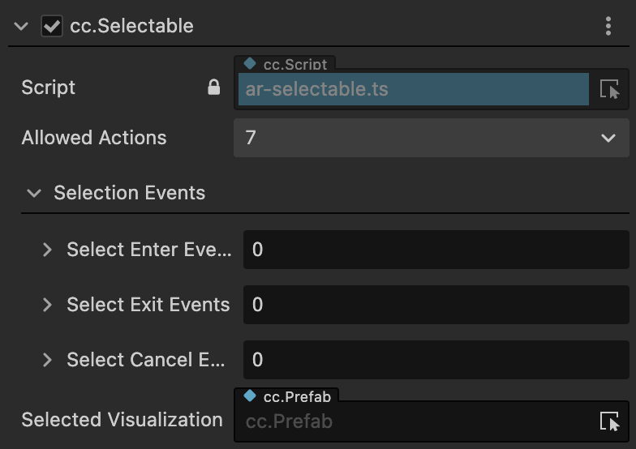

| 属性                   | 说明                                         |
| ---------------------- | -------------------------------------------- |
| Allowed Actions        | 选择此对象后允许进行的操作。                 |
| Selection Events       | 选择行为的回调，它将在特定事件发生时被触发。 |
| Selected Visualization | 对象被选中时将激活的可视化效果。             |

> **注意**：选择交互功能需要扩展版本 **>=v1.1.0**，编辑器版本 **>=3.7.1**。

### Placeable

挂载此组件的对象可以使用某种方式放置于空间、AR Plane 或 AR Mesh 上。

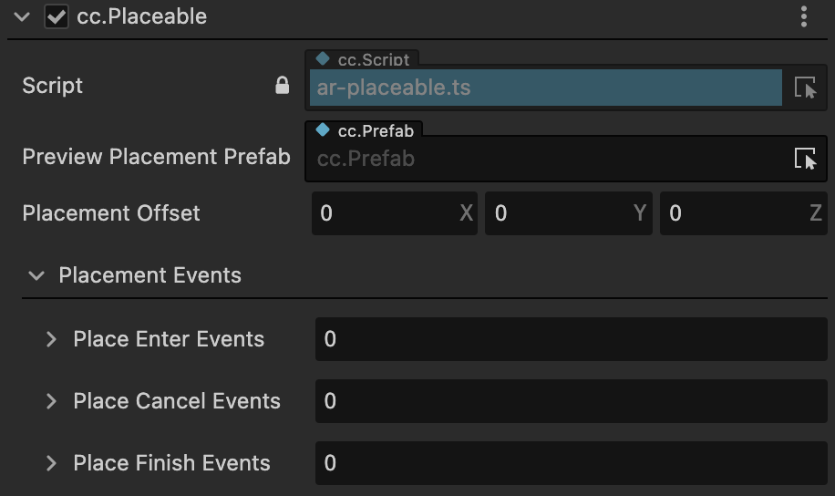

| 属性                     | 说明                                         |
| ------------------------ | -------------------------------------------- |
| Preview Placement Prefab | 在放置物生成之前要放置的预放置对象。         |
| Placement Offset         | 偏移由交互器放置的预制件的位置。             |
| Placement Events         | 放置行为的回调，它将在特定事件发生时被触发。 |

> **注意**：放置交互功能需要扩展版本 **>=v1.1.0**，编辑器版本 **>=3.7.1**。

### 事件

在项目开发过程中用户会遇到很多依赖于 XR 组件的信号来触发的逻辑。为了方便用户专注于逻辑开发而不用关心两者之间的通知关系，Cocos CreatorXR 基于传统的事件系统在一部分常被事件依赖的交互组件中封装好了一部分事件信号，用户只需要在特定的信号上绑定一系列想要触发的对象和方法即可。

#### 事件信号

事件信号分为以下三种：

- Hover：指的是 XR 的输入设备的射线覆盖到物体上时触发
- Select：当在输入设备上按下 Select 映射的按键时触发
- Active：当在输入设备上按下 Active 映射的按键时触发

其交互行为描述如下：

| 交互行为 | 事件信号         | 说明                  |
| -------- | ---------------- | --------------------- |
| Hover    | OnHoverEntered   | Hover 行为执行的时刻  |
|          | OnHoverExited    | Hover 行为退出的时刻  |
|          | OnHoverCanceled  | Hover 行为取消的时刻  |
| Select   | OnSelectEntered  | Select 行为执行的时刻 |
|          | OnSelectExited   | Select 行为退出的时刻 |
|          | OnSelectCanceled | Select 行为取消的时刻 |
| Active   | OnActivated      | 激活的时刻            |
|          | OnDeactivated    | 取消激活的时刻        |

这些事件信号，可以在下列组件中选择，用于处理特定情形下的输入状态。

#### 交互事件组件

交互组件分为：

- InteractorEvents：交互器事件组件。
- InteractableEvents：可交互对象事件组件。

其属性描述如下：

#### InteractorEvents

| 属性             | 说明                                     |
| ---------------- | ---------------------------------------- |
| AudioEvents      | 开启后可以绑定事件触发时播放的音频       |
| HapticEvents     | 开启后可以绑定事件触发时控制器的震动反馈 |
| InteractorEvents | 开启后可以绑定任意回调函数               |

##### Audio Events：

Audio Events 可以根据 **事件信号** 选择不同类型的事件触发，触发后可以播放特定的音频。

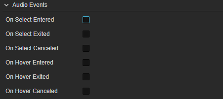

选中 **事件信号** 右侧的单选框可启用/禁用该事件信号，启用后可以通过 AudioClip 属性右侧的下拉菜单选择不同的音频资源。

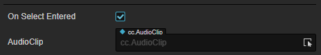

##### Haptic Events:

> **注意**：此事件要求扩展版本 **>=v1.1.0**，编辑器版本 **>=3.7.1**

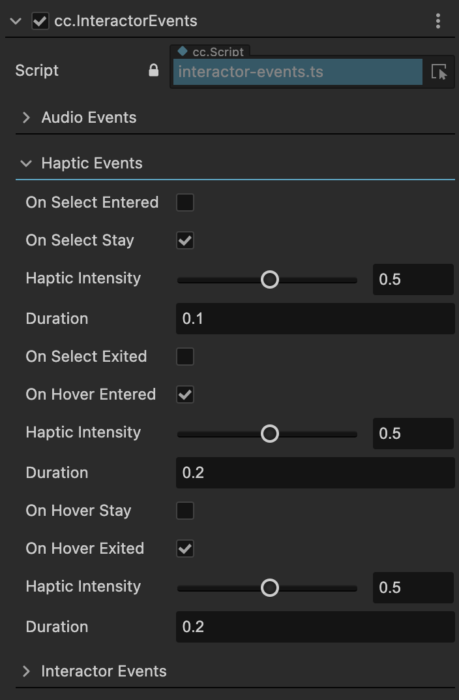

选中 **事件信号** 右侧的单选框后，可以调整控制器的震动反馈，通过震动可以给与用户更真实的触感反馈。

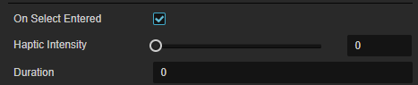

Haptic Intensity：震动的灵敏度 [0,1]

Duration：持续的时长

##### Interactor Events：

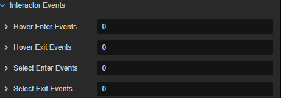

在右侧的输入框内，输入任意整数值，可在 Interactor Events 数组内添加元素。

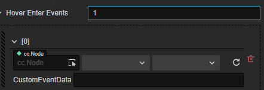

添加完成后，可对事件回调进行配置：

- Node：回调接收节点
- 组件：回调组件
- 方法：回调方法
- CustomEventData：自定义事件的数据，这些数据会被当做回调方法的参数，传入到上述的回调方法中。

#### InteractableEvents

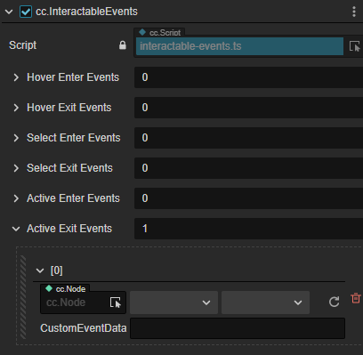

## 交互限制组件

对于挂载了 Selectable 组件的交互物，可以使用交互限制组件限制他的交互效果。

### MinMaxScaleConstrain

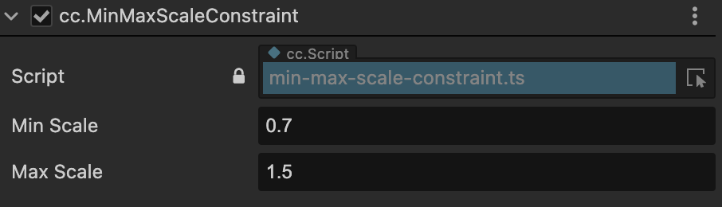

| 属性      | 说明                     |
| --------- | ------------------------ |
| Min Scale | 可被缩小的最小尺寸比例。 |
| Max Scale | 可被放大的最大尺寸比例。 |

### RotationAxisConstrain

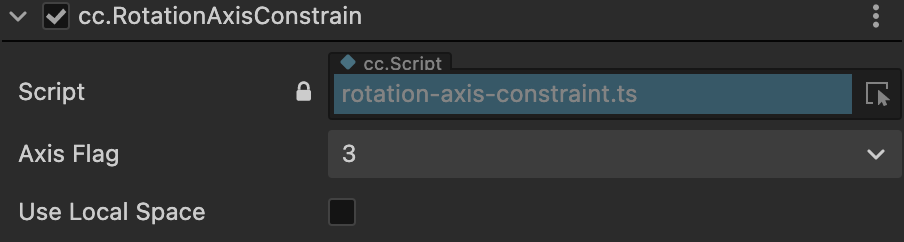

| 属性            | 说明                                                         |
| --------------- | ------------------------------------------------------------ |
| Axis Flag       | 限制交互物只能按所选旋转轴进行旋转。屏幕交互器最多只能控制双轴（x,y）旋转。 |
| Use Local Space | 是否按本地坐标轴进行旋转。默认关闭，以世界坐标轴做旋转。     |

## 虚拟移动组件

在绝大多数的 VR 项目中，用户会用第一人称的角色视角在虚拟场景中进行移动。这种移动行为一般不会依赖于用户在真实空间的移动反馈，因为位姿的追踪会受到现实世界物理空间的限制。因此我们需要一种类似传统 3D 游戏中那种利用接受控制器输入信号的方式来驱动移动行为的组件，称之为虚拟移动组件（Locomotion Component）。

### LocomotionChecker

运动检查器。

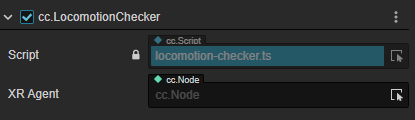

| 属性     | 说明                                                         |
| -------- | ------------------------------------------------------------ |
| XR Agent | 指定需要进行运动的XR Agent（或其他对象）。添加该组件时，默认绑定遍历当前场景得到的第一个挂载了 TrackingOrigin 的节点，通常是 XR Agent；用户也可以自行指定需要进行 locomotion 操作的对象 |

### Teleporter

传送驱动组件。

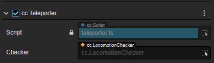

| 属性    | 说明                                                         |
| ------- | ------------------------------------------------------------ |
| Checker | 添加该组件时，默认绑定遍历当前场景得到的第一个挂载 Locomotion Checker 组件的节点 用户也可以自己拖入需要指定的 Locomotion Checker |

### SharpTurner

瞬间转向驱动。

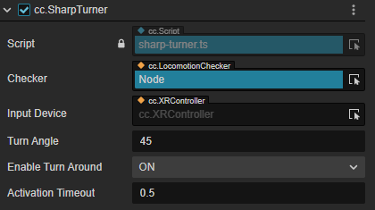

| 属性              | 说明                                                         |
| ----------------- | ------------------------------------------------------------ |
| Checker           | 添加该组件时，默认绑定遍历当前场景得到的第一个挂载 Locomotion Checker 组件的节点 用户也可以自己拖入需要指定的 Locomotion Checker |
| InputDevice       | 绑定挂载了 XRController 的控制器对象                           |
| TurnAngle         | 转动角度                                                     |
| EnableTurnAround  | 开启后按下摇杆允许旋转180°（点击摇杆的按钮）                 |
| ActivationTimeout | 执行连续的转弯时需要等待的时间                               |

### ContinuousTurner

连续转弯驱动。

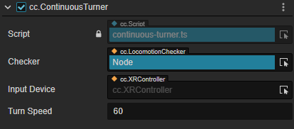

| 属性         | 说明                                                         |
| ------------ | ------------------------------------------------------------ |
| Checker      | 添加该组件时，默认绑定遍历当前场景得到的第一个挂载 Locomotion Checker 组件的节点 用户也可以自己拖入需要指定的 Locomotion Checker |
| InputDevice  | 绑定挂载了 XRController 的控制器对象                           |
| InputControl | 绑定接受输入的摇杆                                           |
| TurnSpeed    | 转动的角速度                                                 |

#### ContinuousMover

平移运动驱动。

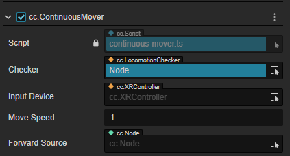

| 属性          | 说明                                                         |
| ------------- | ------------------------------------------------------------ |
| Checker       | 添加该组件时，默认绑定遍历当前场景得到的第一个挂载 Locomotion Checker 组件的节点 用户也可以自己拖入需要指定的 Locomotion Checker |
| InputDevice   | 绑定挂载了 XRController 的控制器对象                           |
| InputControl  | 绑定接受输入的摇杆                                           |
| MoveSpeed     | 移动速度                                                     |
| ForwardSource | 选择一个物体，用该物体节点的朝向作为移动的正方向             |

## XR UI

传统的生成 UI 控件的方式都是把 UI 画在画布（Canvas）上，而画布本身不具有深度信息(位置属性不可更改)，导致了画布是贴在屏幕上的，只有与屏幕进行交互才能反馈作用于 UI 控件。由于 XR 设备的摄像头是两个目镜，不支持交互，这明显不满足于 XR 项目的需求。所以我们需要将 UI 的交互方式改为在空间中用交互器进行交互，因此需要将 UI 控件剥离出画布而能够单独存在于空间中，具有完整的位置属性并具有碰撞检测功能。

XR UI 是基于 2D UI 扩展而来，关于如何使用 2D/UI 组件可参考 2D 对象概述。

### 新建 UI

在 **层级管理器 -> 创建 -> XR -> XRUI** 可以添加 XRUI。

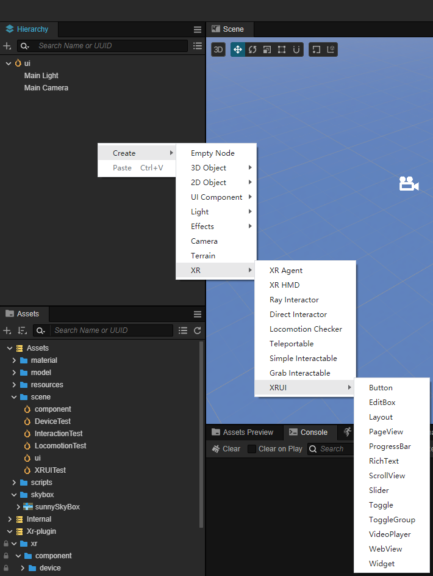

相比于传统的 UI 控件，XR UI 会新增一些组件用于计算碰撞检测以触发交互，如图示，RaycastChecker 和 BoxCollider 可使其能够接收 XR 输入：相比于传统的 UI 控件，XR UI 会新增一些组件用于计算碰撞检测以触发交互，如图示，RaycastChecker 和 BoxCollider 可使其能够接收 XR 输入：

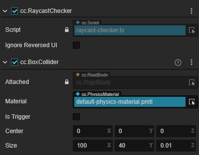

注意：对于 3D 空间上的 UI，其根节点上需要 RenderRoot2D 组件才可以正常渲染。

#### 存量 UI 转换

如 UI 已制作完成，也参考下面的步骤将原本的 2D Canvas 下的 UI，转化为 XR 的 UI。

##### 方法一：

在 **层级管理器** 右键创建一个空节点（如命名为 UIRoot，下文均使用 UIRoot），为节点添加组件 **RenderRoot2D** 组件，同时节点会自动添加 **UITransform** 组件：

将原有的 2D UI 控件分离出 Canvas，移动至 UIRoot 层级下。修改 Button 位置和 Layer 属性。同时将 Button 及其子节点的 Layer 属性，都修改为和 Camera 的 Layer 属性一致（此处均为DEFAULT）。

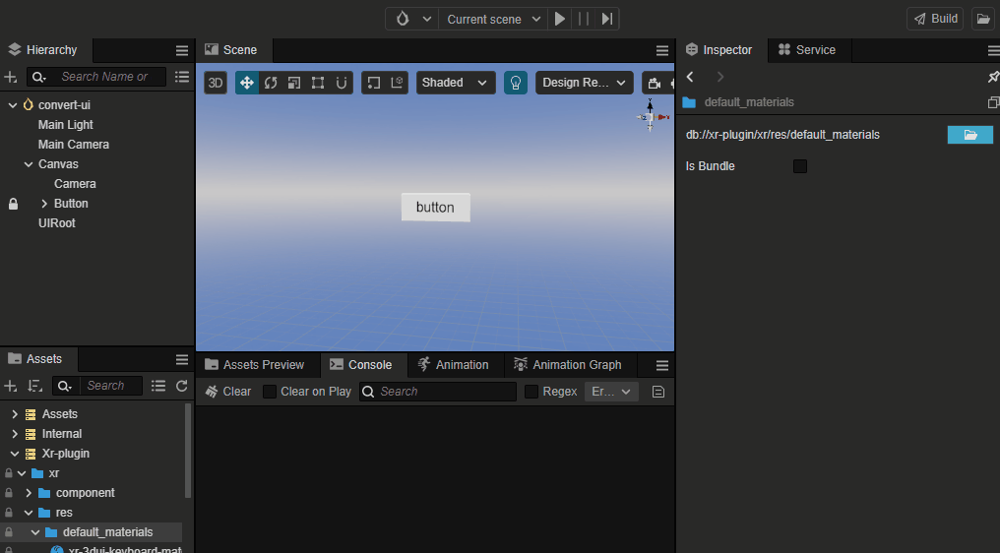

给 Button 及其子节点添加材质。在 资源管理器 中点击 **xr-plugin -> xr -> res -> default_materials**，选择 **xr-3dui-sprite-material** 拖拽至 Sprite 组件的 CustomMaterial 属性中。

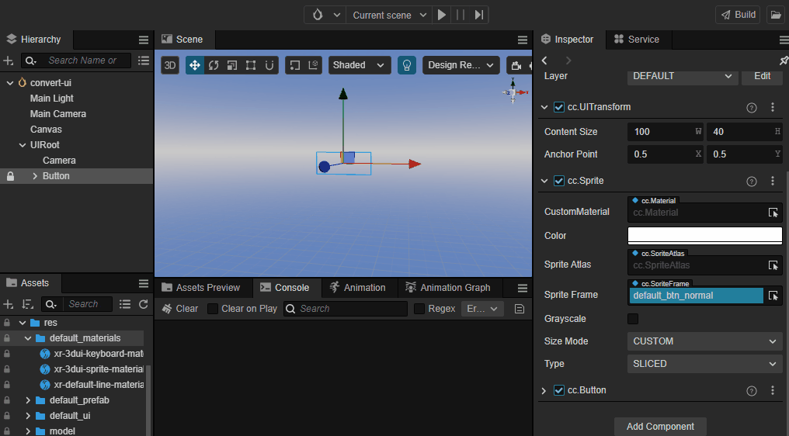

给 Button 添加射线交互组件 RaycastChecker。点击 Button 节点，在 **属性检查器** 下方，点击 添加组件按钮，选择 **XR -> UI -> RaycastChecker**。

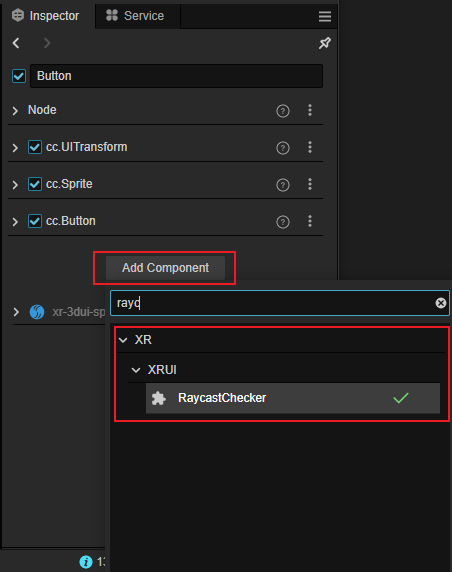

在 **属性检查器** 中出现 RaycastChecker 组件和 BoxCollider 组件，且 BoxCollider 组件的 Size 属性的 xy 值与节点的 UITransfrom 的 Content Size 值一致，如下图：（此处可以将 BoxCollider 替换为其他所需 3D 碰撞体，能够贴合 UI 组件即可）。

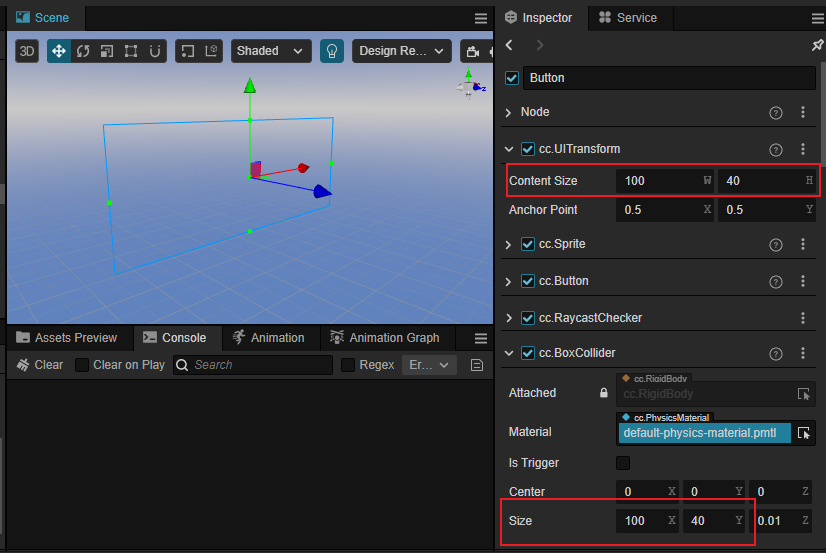

移动 Button 节点至场景中指定位置，调整 Rotation 和 Scale 的值以满足设计需求。

添加完所有 UI 组件后，删除旧有的 Canvas 节点。

到此为止，存量 UI 到 XR UI 的转化就完成了。

##### 方法二：

**v1.1.0** 版本新增一键转换为 XR UI 功能。

在场景下右键传统 2DUI，菜单中会出现 2DUI 转为 XRUI 选项

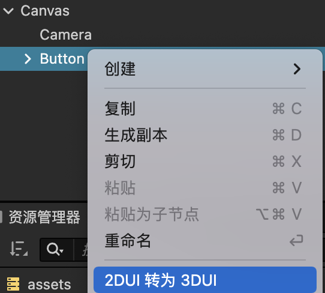

转换成功后UI节点会自动添加以下三个组件，并可以调节其 cc.Node 中的空间属性。

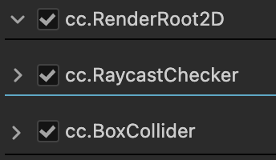

> **注意**：已经为 XRUI 的 UI 不能出现转为 XRUI

### 虚拟键盘（XR Keyborad）

添加一个 EditBox 的 XR UI，同时给 EditBox 添加一个子节点，命名为 KeyboardRoot （命名随意），同时调整 KeyboardRoot 的位置信息（根据需求进行调整即可，可将 XR Keyboard 临时放在节点下进行调整）。

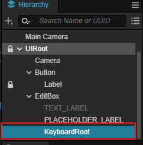

创建 XR Keyboard 对象：在资源管理器中点击 xr-plugin-> xr -> res -> default_prefab，选择 XR Keyboard 拖拽至场景中。

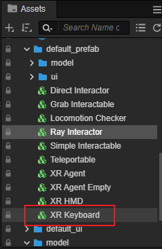

为 EditBox 节点添加 XRKeyboardInputField 组件，同时绑定 SuspendTransform 和 XRKeyboard，将节点拖拽进去。

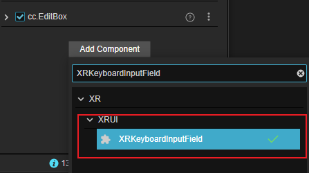

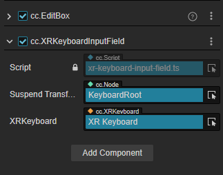

### 射线材质

使用射线与 XR UI 进行交互时，需要给射线绑定材质 xr-default-line-material。位置在 **资源管理器 -> xr-plugin -> xr -> res -> default_materials**。

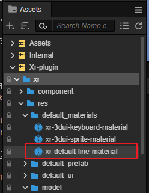

