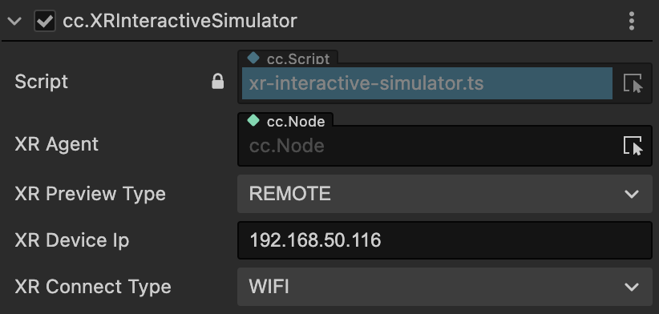
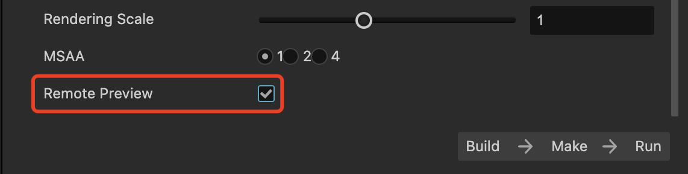
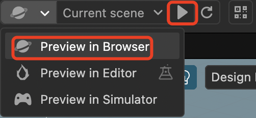

# 预览

为了方便开发者在项目开发过程中实时调试，快速验证一些传统的功能逻辑来提高开发效率，Cocos CreatorXR 基于 Cocos Creator 的 Web Preview 功能开发了适用于 XR 项目的预览功能。

## 操作说明

在 xr-plugin 的资源库中找到 XR Simulator，将其拖拽至场景中。

在编辑器的预览选项中选择浏览器预览，并点击运行。

运行后即可在浏览器中进行模拟预览。

键盘 WASD 来控制角色整体（HMD + 手柄）进行前左后右移动，QE 控制整体上升和下降。

键盘 Latin 部分的数字键 123 功能分别为：1.鼠标键盘的控制对象切换至 XR Agent （角色自身）此时前后左右上下作用于整体角色，鼠标滑动控制 HMD（Camera）转动，射线发出位置位于 HMD 中央，空格键用于触发click（点击），按住空格拖动鼠标触发drag（点击）；2 和 3 将鼠标和键盘的控制对象切换至左/右手柄，此时前后左右上下作用于单独的左/右手柄，射线从手柄位置发出，空格键用于触发click（点击），按住空格拖动鼠标触发drag（拖动）。

长按 B 键重置手柄位置。

控制手柄移动时，正前方向向量始终和 XR Agent 的前向保持一致。

## XR 设备无线串流调试

v1.1.0 版本的预览组件新增无线串流模式，内容验证是项目开发过程中极其耗时的一环，由于 XR 设备的终端独立性和串流工具的封闭性，使得在编辑器中针对 XR 设备的项目比传统移动端/PC 端项目的内容调试验证更为困难。为此，Cocos CreatorXR v1.1.0 推出了无线串流调试功能，开发者可以直接在 Web 浏览器中预览XR项目并同步所有来自 XR 设备的信号，正确渲染实时画面并反馈各种控制器信号触发逻辑，无需打包应用至设备即可快速完整地体验所有XR项目内容。

将 XR Preview Type 选择为 REMOTE 模式，XR Connect Type 选择为 WIFI 模式，将电脑和设备处于同一 WIFI 下。

填写 XR 设备网络 IP 到 XR Device IP 属性中。

在构建面板中勾选 Remote Preview，打包项目至XR一体机。

项目预览方式选择浏览器预览。

编辑器中点击运行进行浏览器预览，同时设备运行打包好的 APK。

> **注意**：无线串流调试功能需要扩展版本 **>=v1.1.0**，编辑器版本 **>=3.7.1**。
