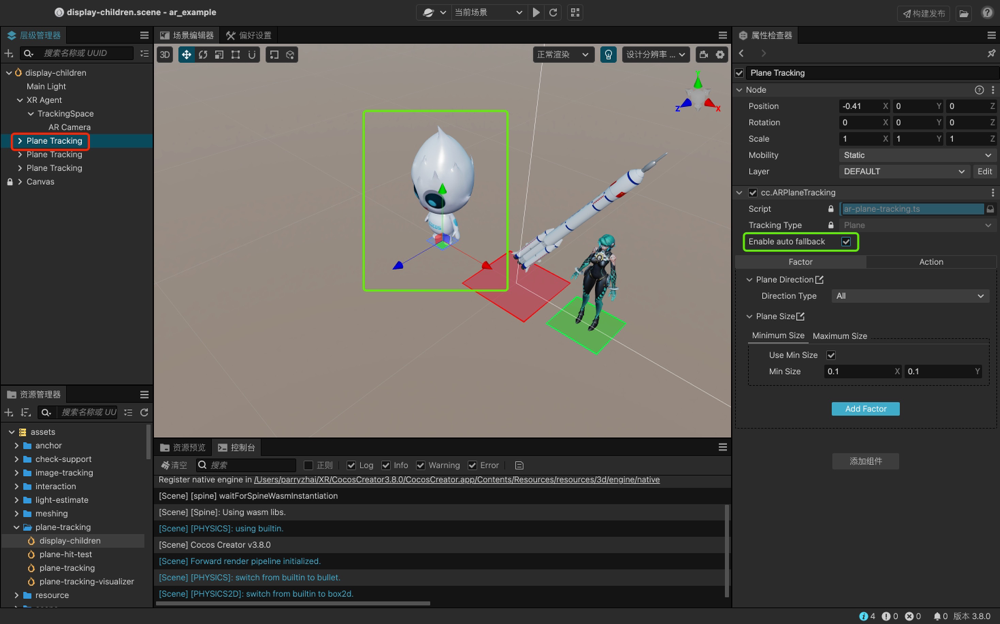
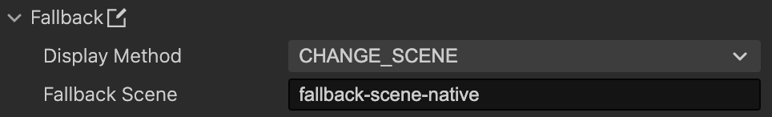
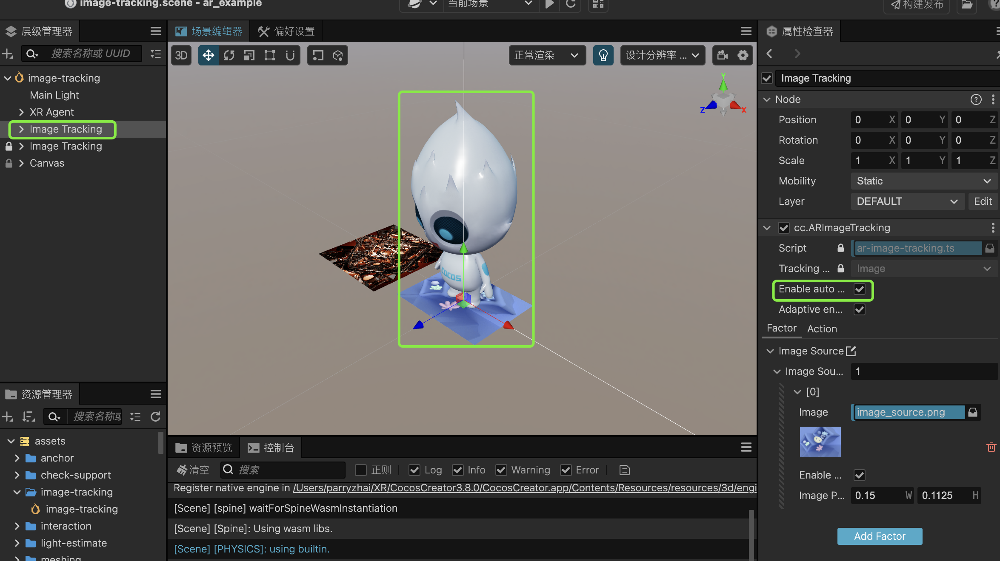
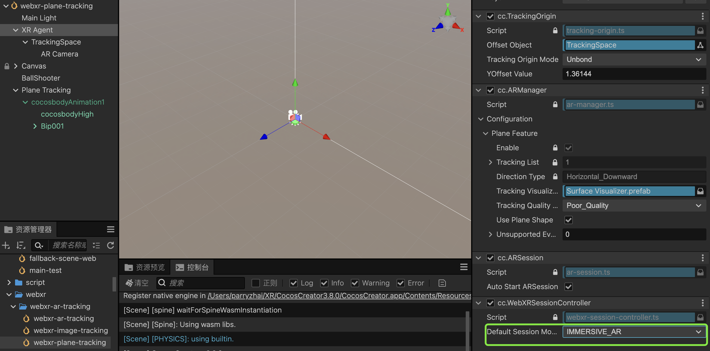
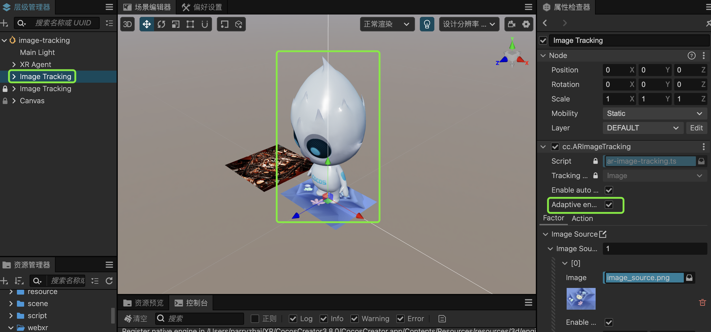

# XR降级

为了解决市面上部分安卓手机不支持AR功能以及WebXR浏览器和设备覆盖率不高的问题，Cocos CreatorXR提供了一系列解决方案：

1. 移动设备原生端：引擎内部通过集成设备Sensor数据、相机视频流数据和 **OpenCV** 的图像识别库，来降级原生AR SDK的平面和图像追踪能力的表现效果。
2. Web端：引擎内部通过集成浏览器API和 **MindAR** 图像追踪算法库，来降级WebXR的平面和图像追踪能力的表现效果。

这些方案允许AR应用在不带有AR SDK或不支持WebXR的设备上使用，但是表现效果会有所降低。

想了解设备是否支持AR，移动设备原生AR SDK支持情况的相关内容请参考[各平台 AR SDK 的设备支持情况](ar-sdk-summary.md)；WebXR支持情况的相关内容请参考[ WebXR 的浏览器支持情况](../project-deploy/webxr-proj-pub.md#选择可用的设备和浏览器)。

## 降级功能说明

### 原生端

#### 平台

Android

#### 系统

OS版本在Android8.0及以上

#### 平面追踪特性降级

1. 开启特性降级功能：选择一个Plane Tracking节点，开启cc.ARPlaneTracking下的Enable auto fallback。

   

2. 添加降级行为效果：在cc.ARPlaneTracking下的Action中新增一个Fallback的行为。

   

3. 编辑降级效果：

   设置Display Method为**Z_AXIS_TO_CAMERA**时，Plane Tracking下的子物体按Z轴朝向摄像机的方向进行摆放；

   设置Display Method为**Y_AXIS_TO_CAMERA**时，Plane Tracking下的子物体按Y轴朝向摄像机的方向进行摆放；

   **Distance**控制子物体摆放位置和相机的距离。

   设置Display Method为**CHANGE_SCENE**时，Fallback Scene选项填写想要进行跳转的场景名称，即可在运行时直接跳转至此场景。

   

#### 图像追踪特性降级

1. 开启特性在原生端降级功能：选择一个Image Tracking节点，开启cc.ARImageTracking下的**Enable auto fallback in Native**。这里的由于原生端与Web端所采用的降级方案不同，所以需要单独控制两者的降级功能开关。

   

2. 添加降级行为效果：同理，在cc.ARImageTracking下的Action中新增一个Fallback的行为。

3. 编辑降级效果：

   设置Display Method为**Z_AXIS_TO_CAMERA**时，Plane Tracking下的子物体按Z轴朝向摄像机的方向进行摆放；

   设置Display Method为**Y_AXIS_TO_CAMERA**时，Plane Tracking下的子物体按Y轴朝向摄像机的方向进行摆放；

   **Distance**控制子物体摆放位置和相机的距离。

   设置Display Method为**CHANGE_SCENE**时，Fallback Scene选项填写想要进行跳转的场景名称，即可在运行时直接跳转至此场景。

### Web端

#### 平台

Android、iOS

#### 平面追踪特性降级

1. 调整降级场景中的session模式：将XR Agent节点的cc.WebXRSessionController中的Default Session Mode改为IMMERSIVE_AR。

   

2. 同上开启特性降级功能：选择一个Plane Tracking节点，开启cc.ARPlaneTracking下的Enable auto fallback。

3. 同上在Action中新增Fallback行为。

#### 图像追踪特性降级

1. 同上，调整降级场景中的session模式：将XR Agent节点的cc.WebXRSessionController中的Default Session Mode改为IMMERSIVE_AR。

2. 开启Web端的降级方案：选择场景中的Image Tracking节点，开启cc.WebXRSessionController组件中的**Adaptive enable 3rd AR Library in Web**。

   

3. 此时无需添加Fallback的Action，在Web端即可正常运行图像追踪场景，并达到与WebXR同样追踪效果。

## 提醒

- 除Web端的图像追踪以外，其他特性只能同步设备的传感器数据做3轴旋转追踪。
- 由于降级方案采用了第三方库和设备自身的传感器来支持，稳定性低于正常AR功能。
- Web端部分设备需要用户主动触发用户行为后才能访问设备权限。
- Web端图像追踪降级方案使用了第三方提供的图像特征转换工具，构建后的包体大小会有一定量增长。
