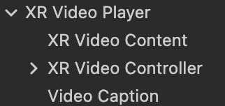

# XR 视频播放器

XR 头戴设备相较于传统的显示器拥有更为多样化的视频展示方式，结合设备自身的多轴向定位特性和双屏渲染画面，可以满足用户在3D场景中浏览全景视频或动态材质的需要。Cocos CreatorXR v1.1.0提供了通用化的 XR 视频播放器，针对 XR 设备优化了视频渲染管线并支持切换展示窗口、180度、360度多风格的视频。同时，播放器还提供了交互功能辅助您进行播放控制，您只需要添加或替换视频资源即可完成简易的视频播放功能的内容开发，简化创作步骤，降低开发门槛。

创建视频播放器，请在层级管理器右键 **创建 -> XR -> XR Video Player**。

其节点中包含的核心组件如下：

## XR Video Player

### cc.XRVideoPlayer

用于调整视频的各项属性

| 属性               | 说明                                                         |
| ------------------ | ------------------------------------------------------------ |
| Source Type        | 视频来源：REMOTE 表示远程视频 URL，LOCAL 表示本地视频地址       |
| Remote URL         | Source Type 为 REMOTE 时出现此项，远程视频的 URL                 |
| Clip               | Source Type 为 LOCAL 时出现此项，本地视频剪辑                   |
| Play On Awake      | 视频加载后是否自动开始播放                                   |
| Playback Rate      | 视频播放时的速率，范围：[0.0,2.5]                                    |
| Volume             | 视频的音量 [0.0,1.0]                                       |
| Mute               | 是否静音。静音时音量设置为0，取消静音时恢复原来的音量。      |
| Loop               | 视频是否应在结束时再次播放                                   |
| Keep Aspect Ratio  | 是否保持视频自身的宽高比（使用竖屏视频查看效果）             |
| Shape              | 视频样式。                                                   |
| Content            | 关联带有 MeshRenderer 组件的 VideoContent 作为视频材质渲染对象。 |
| Video Player Event | 视频播放回调函数，该回调函数会在特定情况被触发，比如播放中、暂停、停止和播放完毕。 |

## XR Video Controller

### cc.XRVideoController

用于关联UI和视频功能。

| 属性                  | 说明                                        |
| --------------------- | ------------------------------------------- |
| Player                | 关联指定的 VideoPlayer，用于控制其播放功能。 |
| HMD Control           | 绑定头戴显示器的控制器对象节点。            |
| Left Hand Controller  | 绑定左手柄的控制器对象节点。                |
| Right Hand Controller | 绑定右手柄的控制器对象节点。                |
| Play Pause            | 播放/暂停 UI。                               |
| Progress Bar          | 进度条 UI。                                  |
| Fast Forward          | 快进按钮 UI。                                |
| Rewind                | 快退按钮 UI。                                |
| Video Shape UI        | 视频样式 UI。                                |
| Player Back Rate Bar  | 倍速 UI。                                    |
| Volume UI             | 音量调节 UI。                                |

## Video Caption

### cc.XRVideoCaption

用于解析字幕文件，目前只支持解析 .srt 类型的字幕文件。

| 属性                | 说明                                                         |
| ------------------- | ------------------------------------------------------------ |
| Caption Source Type | 字幕来源：REMOTE 表示 URL 里的文件并解析字幕，LOCAL 表示本地字幕文件。 |
| Remote URL          | Source Type为 REMOTE 时出现此项，字幕文件的 URL                 |
| Caption File        | Source Type为 LOCAL 时出现此项，本地字幕文件                   |
| Video Player        | 关联指定的 VideoPlayer，将字幕按时间同步于此视频。            |
