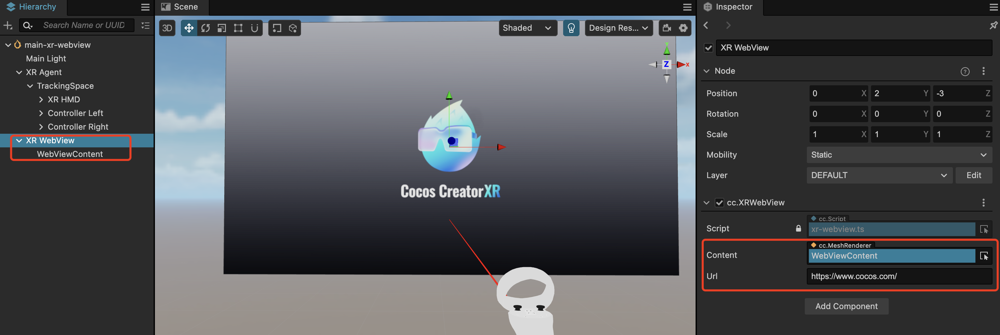
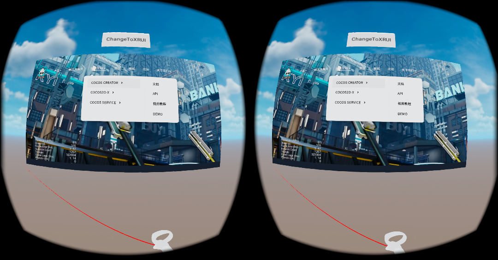

# XR 网页浏览器

在XR中，网页浏览器可以让用户在虚拟现实环境中访问和浏览网页。用户可以设备控制器与网页界面进行交互，如选择链接、滚动页面等等操作，以增强用户的沉浸感和体验。

## XR 网页浏览器功能

| 属性    | 描述                                     |
| ------- | ---------------------------------------- |
| Content | 指定用于渲染网页内容的MeshRenderer对象。 |
| Url     | 网页链接。                               |

## 使用 XR 网页浏览器

层级管理器右键 **创建 > XR > XR Webview**。

默认创建一个带有 cc.MeshRenderer 组件的节点作为子节点 Webview Content。

构建发布应用即可看到网页内容。

注：

- 使用网页浏览器功能需要扩展版本 **>=1.2.0**，编辑器版本 **>=3.7.3**。

- Vulkan目前不支持视频播放器。