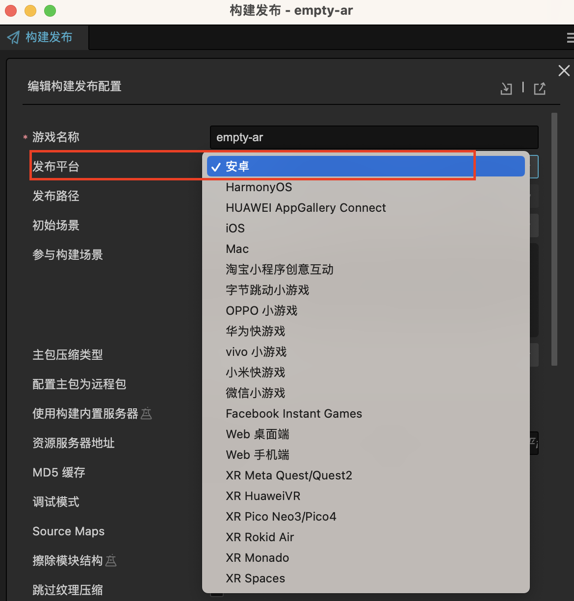
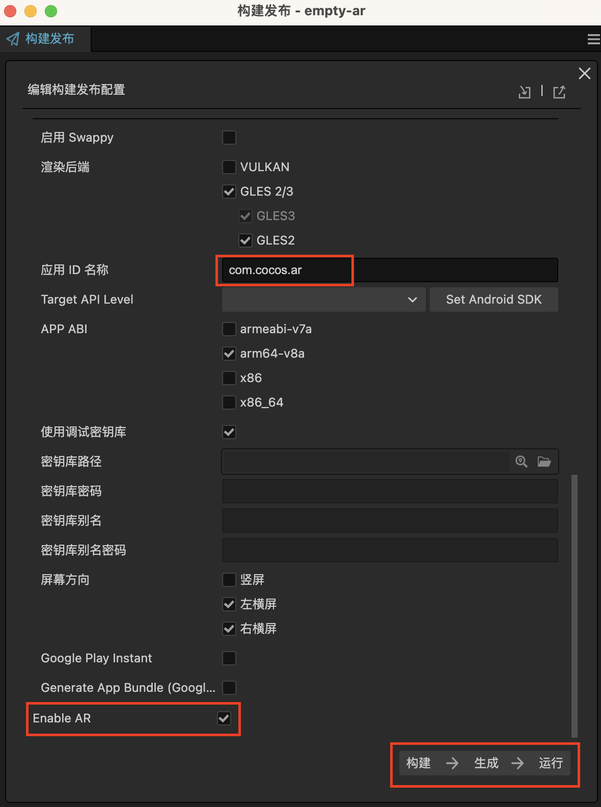
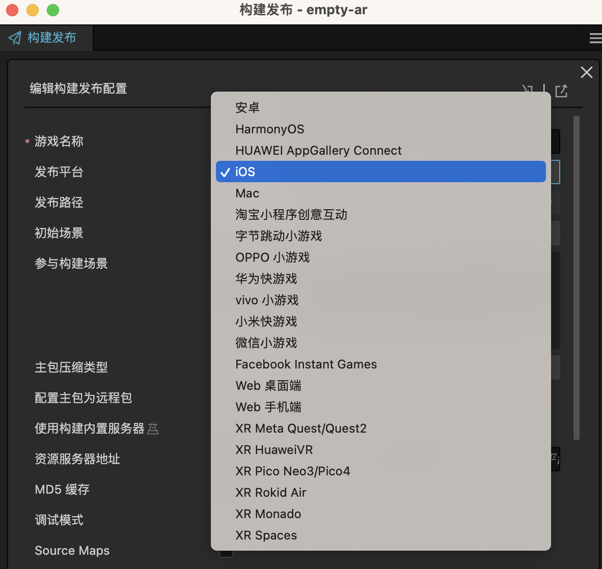
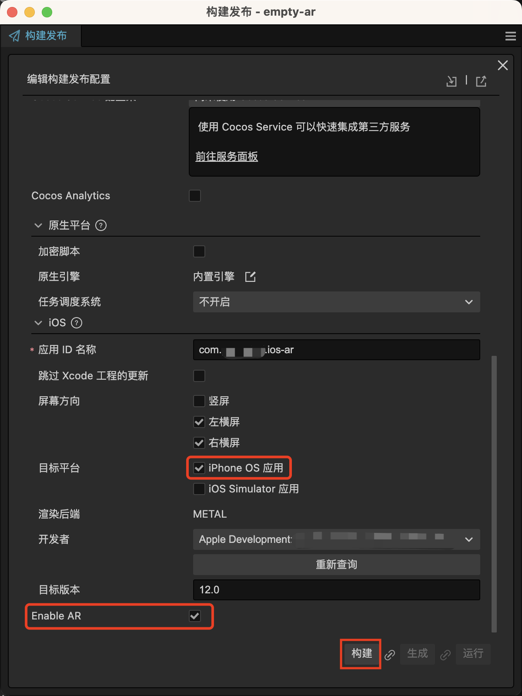
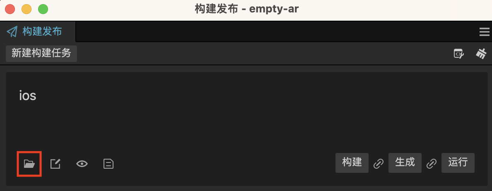
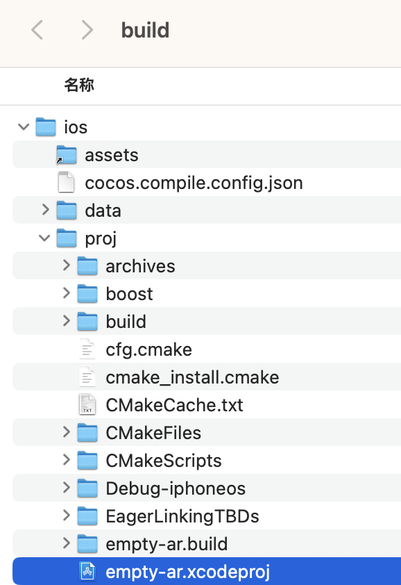
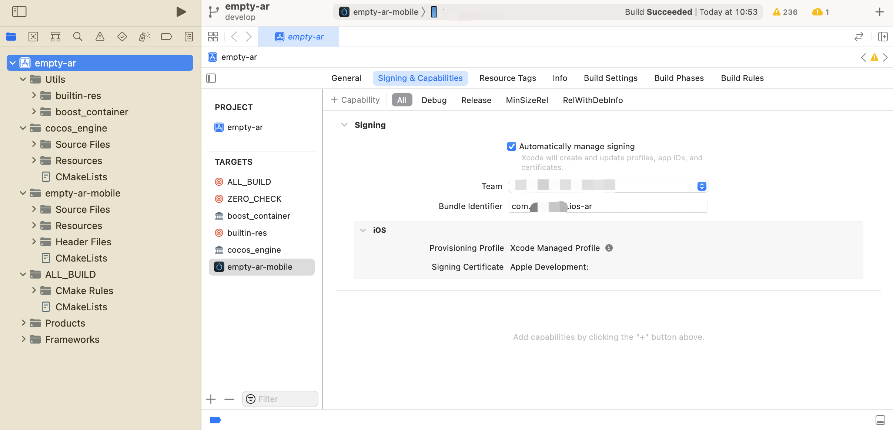
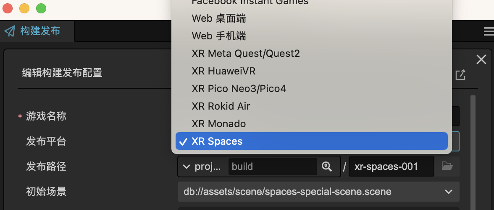

# AR 项目构建与发布

完成 AR 应用的项目设置并完成项目开发之后，即可打包 AR 应用。点击**菜单栏 -> 项目 -> 构建发布**。

## ARCore、AREngine

针对于安卓和华为平台的手机发布 AR 应用，新建构建任务，平台选择 **安卓**。

填写应用 ID 并勾选 **Enable AR**，连接好移动端设备后点击 **构建** -> **生成** -> **运行** 即可一键发布 AR 应用。

> **注意**：安卓平台 AR 应用的渲染后端不支持 VULKAN。

## ARKit

iOS发布需要的各项配置属性请参考 [iOS 平台构建选项](../../editor/publish/native-options.md#iOS 平台构建选项)，需要在 Xcode 中配置好开发者账户。

针对于 iOS 平台发布 AR 应用，新建构建任务，平台选择 **iOS**。

应用 ID 名称第二节建议使用 Xcode 配置的同名开发者账户名，目标平台选择 **iPhone OS应用**，勾选 **Enable AR**。

点击构建，生成 Xcode 工程。

> **注意**：目前 Cocos Creator 对 iOS 应用暂时只支持构建工程，编译和运行需要转移至 Xcode 中进行。

构建完成后，找到生成的 xcodeproj 文件，使用 Xcode 打开，配置好签名和开发者团队连接好设备点击运行即可。

## Spaces

针对于高通 Spaces 平台的设备发布 AR 应用，新建构建任务，平台选择 **XR Spaces**。

填写好应用 ID，连接好 Spaces 设备（如果是分体式设备请连接移动端）后点击 **构建 -> 生成 ->运行** 即可一键发布 AR 应用。
