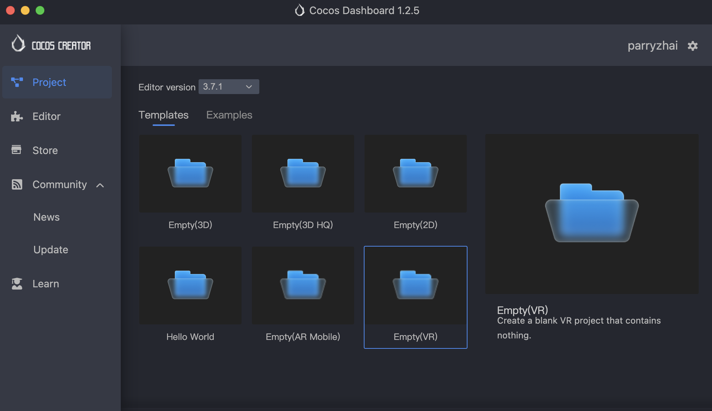
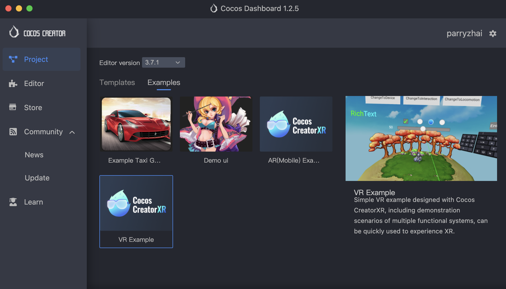

# VR 项目创建

Cocos CreatorXR 支持用户使用以下几种方式快速创建 VR 项目。

> **注意**：创建 XR 项目时务必保证编辑器版本 >= 3.6.1。

使用模板新建 VR 项目：在 Cocos Dashboard 中新建项目时，选择 v3.6.1 及以上的编辑器（若需要体验完整功能，引擎请选择v3.7.1及以上的版本），选择 Empty(VR) 模板创建。

使用案例体验学习创建 VR 项目：在 Cocos Dashboard 中新建项目，选择 v3.6.1 及以上的编辑器（若需要体验完整功能，引擎请选择v3.7.1及以上的版本），选择 VR 案例创建。

基于空项目或已有项目添加 XR 扩展：在 Dashboard 中的商场页面搜索 xr-plugin 下载安装并应用至项目或在 Cocos Creator 中的 **扩展** -> **商城** 中下载安装扩展至项目（不推荐安装到全局），扩展下载与安装请参考 [Cocos Creator扩展与安装教程](../../editor/extension/install)。
