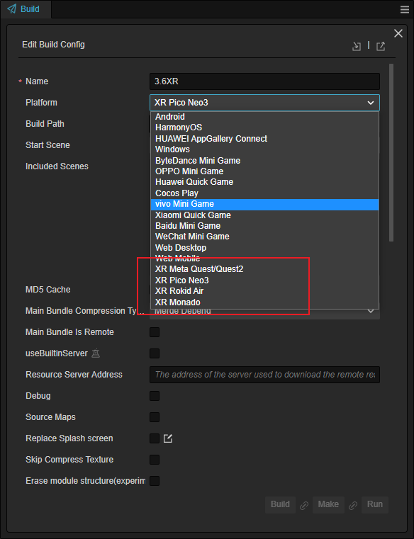
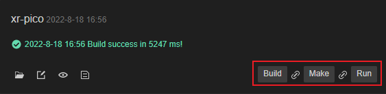

# VR 项目构建与发布

当项目开发完成后，需要将项目打包到对应的平台上，在菜单栏中选中 **项目** -> **构建发布** 打开构建发布面板，通过 **发布平台** 属性下的下拉框中选择目标平台：

#### 属性

构建通用属性可以参考：[构建选项介绍](../../editor/publish/build-panel.md)。

目前支持的 VR 设备都采用了安卓系统，开发者需搭建对应的开发环境，详情可参考 [安装配置原生开发环境](../../editor/publish/setup-native-development.md)。

#### 构建

之后在构建任务中根据需要选择 **构建**、**生成** 或 **运行** 即可。

#### 发布

生成应用程序以后，可以通过 adb 命令或设备的传输文件功能将应用程序传输到目标设备上，之后运行则可以完成整个构建和发布过程。
