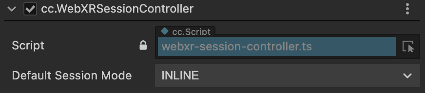
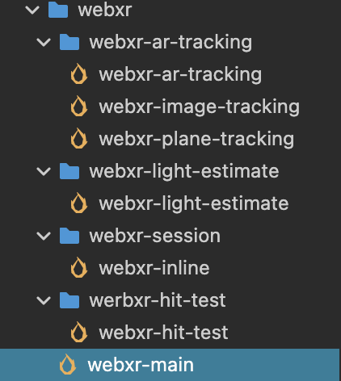

# WebXR 项目配置

WebXR 项目的创建和普通XR项目创建流程保持一致。

若需要创建沉浸式虚拟现实（VR）体验的工程，可以参考 [VR 项目创建](vr-proj-deploy.md)。

若需要创建沉浸式增强现实（AR）体验的工程，可以参考 [AR 项目创建](ar-proj-deploy.md)。

部署完毕之后需要为 **XR Agent** 节点添加 **cc.WebXRSessionController** 组件，组件位置为：**XR > Device > WebXRSessionController**。

根据需要选择默认 Session Mode：

- IMMERSIVE_AR：Session 将独占访问沉浸式 XR 设备，渲染的内容将与现实世界的环境混合在一起。
- IMMERSIVE_VR：Session 对场景的渲染不会被被覆盖或融入现实环境。
- INLINE：3D 内容输出在标准 HTML 文档的元素上下文中内联显示，而不会占据整个视觉空间。inline session 既可以在单目渲染的设备呈现，也可以在双目立体渲染的设备中呈现；而且不关心设备是否可进行位姿追踪。inline session 不需要特殊的设备，在任何提供 WebXR API支持的 [用户代理](https://developer.mozilla.org/en-US/docs/Glossary/User_agent) 上都可以使用。

## WebXR 案例

Dashboard 中的两个案例都提供了专用于 WebXR 的场景。

VR案例的 WebXR 主场景为 webxr-main，启动时务必将此场景设为启动场景。

AR （移动端）案例的 WebXR 主场景为 webxr-main，启动时务必将此场景设为启动场景，其他场景如下所示。

