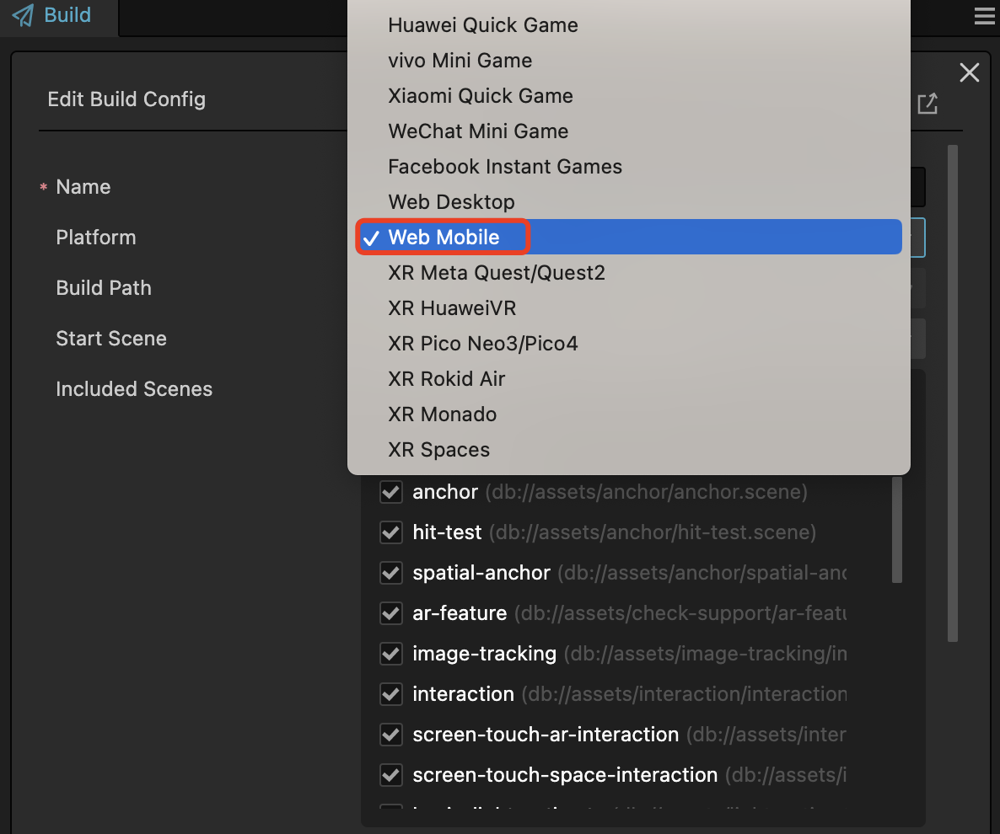
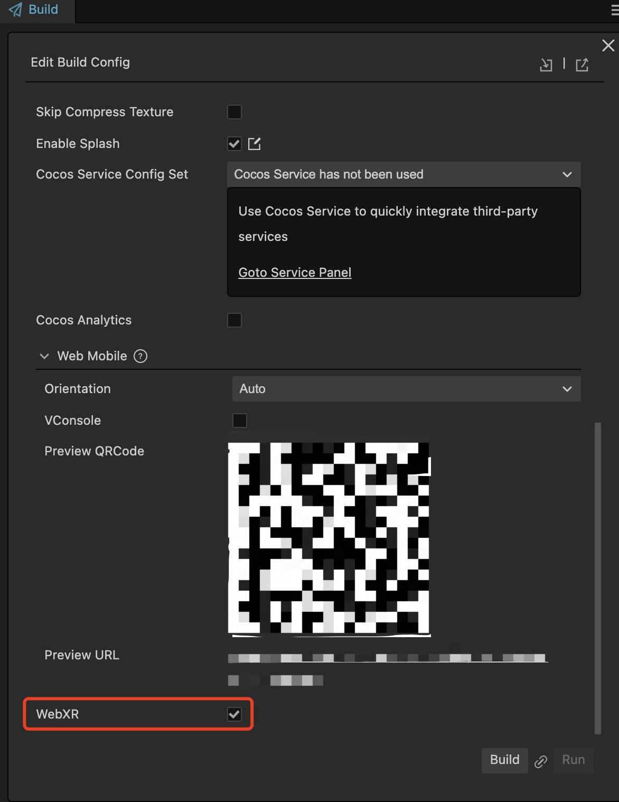
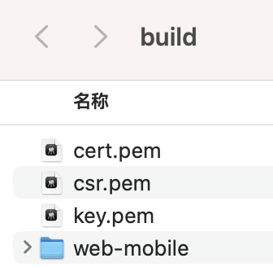
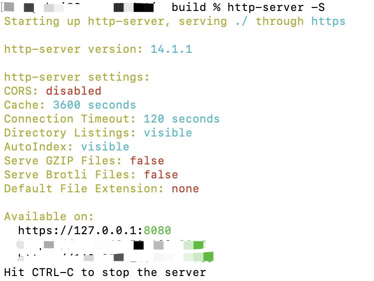

# WebXR 项目构建与发布

完成 WebXR 应用的 [项目设置](webxr-proj-deploy.md) 并完成项目开发之后，即可打包 WebXR 应用。点击 **菜单栏 -> 项目 -> 构建发布**。

## 配置 WebXR 构建属性

构建平台选择 **Web 移动端**。

开启构建面板最后一个属性 **WebXR**。

点击构建即可。

## 配置 https 环境

WebXR 所使用的用于提供 Web 资源的服务必须使用 [安全上下文(secure context)](https://developer.mozilla.org/en-US/docs/Web/Security/Secure_Contexts)。

而启动 https 的域名的服务一般需要配置 .pem（证书文件）。

由于当前版本暂时不支持启动内置 https 服务器，需要用户手动启动。

将 .pem 存放至构建文件夹的根目录。

在命令终端的此目录下输入：**https-server -S** 。启动 https 服务即可。

## 选择可用的设备和浏览器

支持 ARCore 的设备请参考 [ARCore官方文档](https://developers.google.com/ar/devices)。

支持 WebXR 的浏览器请参考 [这里](https://developer.mozilla.org/en-US/docs/Web/API/WebXR_Device_API#browser_compatibility)。

## 打开浏览器的webxr能力

使用 Chrome 浏览器访问 WebXR 应用前需要确认浏览器 webxr 的功能是否开启。

访问 **[chrome://flags](chrome://flags)** ，将 **webxr incubations** 改为 **Enable**。

