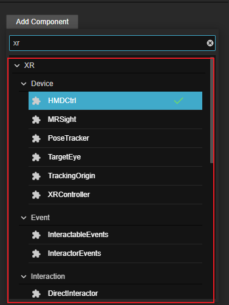

# XR 组件
和传统的ECS模式一样，CocosXR也是通过组件的组合封装为实体赋能，实体根据其不同特性又被不同的功能系统所管理。所以编辑器中所有XR相关的功能底层都是由封装好的特殊XR组件驱动的。
Cocos XR的功能组件主要由5部分构成：
- [设备映射](device-mapping.md)
- [交互组件](interaction.md)
- [事件系统](events.md)
- [虚拟移动组件](locomotion.md)
- [XR UI](xrui.md)

开启了xr-plugin扩展之后，想要给场景中的对象添加XR相关的功能组件可以在**属性检查器**中点击**添加组件**按钮，在出现的组件列表中找到**XR**分类，选择XR分类下的想要添加的XR组件类别再找到类别下的对应组件即可。
