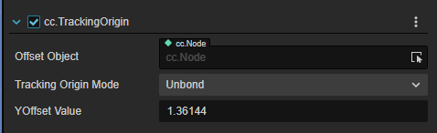
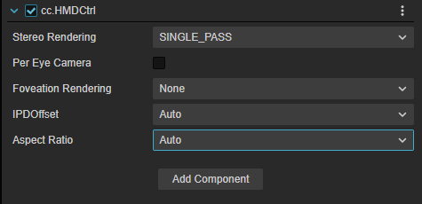
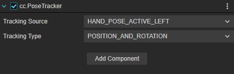
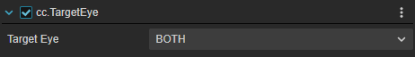

# 设备映射组件

此类组件主要用以同步现实世界中物理设备和虚拟世界中的代理节点之间的 I/O 信息。确保在用户在 XR 设备的使用和虚拟世界中的反馈一致。

主要包括以下组件：

## TrackingOrigin

| 属性 | 说明 |
| :--- | :--- |
| **Offset Object**        | 指定需要竖直偏移的对象，如果选择的对象还有子对象，则偏移的效果是选中对象及其所有子对象进行纵向偏移。 |
| **Tracking Origin Mode** | 追踪的偏移方式。选择 Unbond 和 Device 时，下方出现 YOffsetValue，可手动输入数据；选择 Floor 时YoffsetValue 隐藏。如果选择为 Floor，且设备开启了安全边界，则以设备离地面高度作为当前视角高度（暂时只支持 quest2 ）；如果选择为Device，则偏移的高度为输入的高度。 |
| **YOffset Value**        | 设备数值偏移量。手动输入偏移的值，米为单位，默认为1.36144m。如果为固定值，则OffsetObject选中的对象Transform属性的Y值为当前填入的值。 |

## HMDCtrl

HMD（Head Mounted Display）头戴显示设备控制器。该组件抽象了头戴设备的渲染相关的参数。

| 属性 | 说明 |
| :--- | :--- |
| **Stereo Render** |  |
| **Per Eye Camera** | 开启单眼显示功能；勾选 PerEyeCamera 后下方出现 Sync With Main Camera 选项；XR HMD 下的两个子节点 LeftEye 和 RightEye 由隐藏变为显示 |
| **Sync With Main Camera** | 同步主摄像头参数；设置为 on 时，XR HMD 下的两个子节点 LeftEye 和 RightEye 的 camera，会进行一次同步 XR HMD 的 camera 属性 |
| **IPDOffset** | 调整瞳间距。下拉列表中选择 Manual 时下方出现 OffsetValue 输入框；在 PerEyeCamera 开启的情况下，调整 Manual 的参数可让 LeftEye 和 RightEye 的 TransForm 属性 X 值变化（变化的值为 ±IPDOffset/2） |
| **Aspect Ratio** |  |

## PoseTracker

| 属性 | 说明 |
| :--- | :--- |
| **Tracking Source** | 选择需要追踪的设备源 |
| **Tracking Type**   | 追踪模式。选择 POSITION_AND_ROTATION 时追踪设备的平移 + 旋转；选择 POSITION 时只追踪平移的量；选择 ROTATION 时只追踪旋转的量。 |

## TargetEye

渲染目镜组件

| 属性 | 说明 |
| :--- | :--- |
| **Target Eye** | 指定渲染的目镜。Both 为左右眼都显示，left 为左眼，right 为右眼。|

## XRController

XRController 用于模拟手柄的组件。

| 属性 | 说明 |
| :--- | :--- |
| **InputDevice**           | 绑定输入手柄设备。|
| **SelectAction**          | 将 Select 行为映射到手柄的对应实体按键 |
| **ActivateAction**        | 将 Activate 行为映射到手柄的对应实体按键 |
| **UIPressAction**         | 将交互 UI 行为映射到手柄的对应实体按键 |
| **AxisToPressThreshold**  | 行为触发时的阈值 |
| **Model**                 | 用于指定手柄的模型对象。|

<!-- ## 组件介绍

| 组件名称 | 属性名称 | 属性说明 |
| :--- | :--- | :--- |
| cc.TrackingOrigin     | Offset Object | 指定需要竖直偏移的对象，如果选择的对象还有子对象，则偏移的效果是选中对象及其所有子对象进行纵向偏移。                       |
| Tracking Origin Mode  | 追踪的偏移方式。选择Unbond和Device时，下方出现YOffsetValue，可手动输入数据；选择Floor时YoffsetValue隐藏。如果选择为Floor，且设备开启了安全边界，则以设备离地面高度作为当前视角高度（暂时只支持quest2）；如果选择为Device，则偏移的高度为输入的高度。 |
| YOffset Value         | 设备数值偏移量。手动输入偏移的值，米为单位，默认为1.36144m。如果为固定值，则OffsetObject选中的对象Transform属性的Y值为当前填入的值。                                                                                                                 |
| cc.HMDCtrl            | Per Eye Camera | 开启单眼显示功能；勾选PerEyeCamera后下方出现Sync With Main Camera选项；XR HMD下的两个子节点LeftEye和RightEye由隐藏变为显示 |
| Sync With Main Camera | 同步主摄像头参数；设置为on时，XR HMD下的两个子节点LeftEye和RightEye的camera，会进行一次同步XR HMD的camera属性 |
| IPDOffset             | 调整瞳间距。下拉列表中选择Manual时下方出现OffsetValue输入框；在PerEyeCamera开启的情况下，调整Manual的参数可让LeftEye和RightEye的TransForm属性X值变化（变化的值为±IPDOffset/2） |
| cc.PoseTracker        | Tracking Source | 选择需要追踪的设备源                                                                                                       |
| Tracking Type         | 追踪模式。选择POSITION_AND_ROTATION时追踪设备的平移+旋转；选择POSITION时只追踪平移的量；选择ROTATION时只追踪旋转的量。 |
| cc.TargetEye          | Target Eye | 指定渲染的目镜。Both为左右眼都显示，left为左眼，right为右眼。                                                              |
| cc.XRController       | InputDevice | 绑定输入手柄设备。                                                                                                         |
| SelectAction          | 将Select行为映射到手柄的对应实体按键 |
| ActivateAction        | 将Activate行为映射到手柄的对应实体按键 |
| UIPressAction         | 将交互UI行为映射到手柄的对应实体按键 |
| AxisToPressThreshold  | 行为触发时的阈值 |
| Model                 | 用于指定手柄的模型对象。                                                                                                                                                                                                                             | -->
