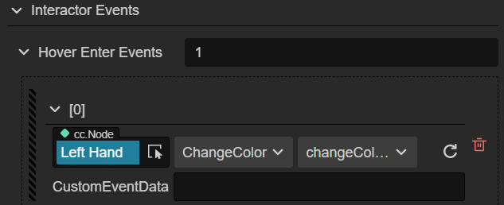
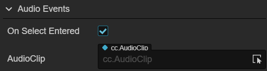
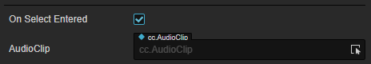
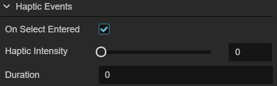
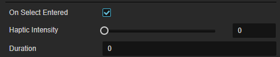
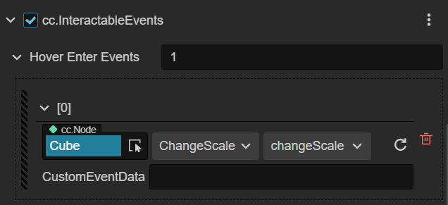

# 事件

在项目开发过程中用户会遇到很多依赖于 XR 组件的信号来触发的逻辑。为了方便用户专注于逻辑开发而不用关心两者之间的通知关系，Cocos CreatorXR 基于传统的事件系统在一部分常被事件依赖的交互组件中封装好了一部分事件信号，用户只需要在特定的信号上绑定一系列想要触发的对象和方法即可。

## 事件信号

事件信号分为以下三种：

- **Hover**：指的是 XR 的输入设备的射线覆盖到物体上时触发
- **Select**：当在输入设备上按下 Select 映射的按键时触发
- **Active**：当在输入设备上按下 Active 映射的按键时触发

其交互行为描述如下：

| 交互行为 | 事件信号         | 说明                  |
| :------- | :--------------- | :-------------------- |
| Hover    | OnHoverEntered   | Hover 行为执行的时刻   |
|          | OnHoverExited    | Hover 行为退出的时刻   |
|          | OnHoverCanceled  | Hover 行为取消的时刻   |
| Select   | OnSelectEntered  | Select 行为执行的时刻  |
|          | OnSelectExited   | Select 行为退出的时刻 |
|          | OnSelectCanceled | Select 行为取消的时刻 |
| Active   | OnActivated      | 激活的时刻            |
|          | OnDeactivated    | 取消激活的时刻        |

这些事件信号，可以在下列组件中选择，用于处理特定情形下的输入状态。

## 交互事件组件

交互组件分为：

- **InteractorEvents**：交互器事件组件。
- **InteractableEvents**：可交互对象事件组件。

其属性描述如下：

## InteractorEvents

| 属性 | 说明 |
| :--- | :--- |
| AudioEvents      | 开启后可以绑定事件触发时播放的音频 |
| HapticEvents     | 开启后可以绑定事件触发时控制器的震动反馈  |
| InteractorEvents | 开启后可以绑定任意回调函数|

- **Audio Events**：

    Audio Events 可以根据 **事件信号** 选择不同类型的事件触发，触发后可以播放特定的音频。

     

    选中 **事件信号** 右侧的单选框可启用/禁用该事件信号，启用后可以通过 **AudioClip** 属性右侧的下拉菜单选择不同的音频资源。

     

- **Haptic Events**：

    

    选中 **事件信号** 右侧的单选框后，可以调整控制器的震动反馈，通过震动可以给与用户更真实的触感反馈。

    

    - **Haptic Intensity**：震动的灵敏度 [0,1]
    - **Duration**：持续的时长

- **Interactor Events**：

    

    在右侧的输入框内，输入任意整数值，可在 **Interactor Events** 数组内添加元素。

    

    添加完成后，可对事件回调进行配置：

    - **Node**：回调接收节点
    - **组件**：回调组件
    - **方法**：回调方法
    - **CustomEventData**：自定义事件的数据，这些数据会被当做回调方法的参数，传入到上述的回调方法中。

## InteractableEvents

该组件的事件使用方式和 **InteractorEvents** 组件的 **Interactor Events** 属性类似，也可以通过在右侧输入框修改整数值的方式修改事件的数组的长度，并配置响应的回调。
