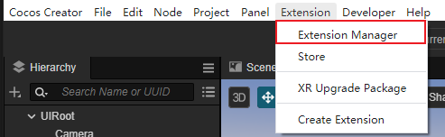

# Cocos XR 扩展
Cocos XR的所支持的预置、功能组件、内容打包和发布的依赖全部是基于扩展来进行开启关闭的。

点击**工具栏**上的**扩展**按钮，在下拉列表中选择**扩展管理器**。

在项目或者全局分类下找到带有xr-前缀的扩展，将需要的扩展开启。

## 扩展介绍

名称|说明
:--|:--
xr-plugin|开启所有XR相关的预制体、扩展功能和功能组件，XR相关的[预制体](prefab.md)和[组件](component.md)介绍请前往查看相关页面。
xr-meta|开启支持XR内容发布至Meta Quest/Quest2设备的功能。
xr-pico|开启支持XR内容发布至Pico Neo3设备的功能。
xr-rokid|开启支持XR内容发布至Rokid Air设备的功能。
xr-monado|开启支持XR内容发布至移动端Monado平台的功能。
xr-update-engine|XR升级包。

开启支持发布对应平台功能的扩展之后，在构建界面的发布平台下拉选项中出现设备选项，具体操作详见[构建与发布](build.md)。
