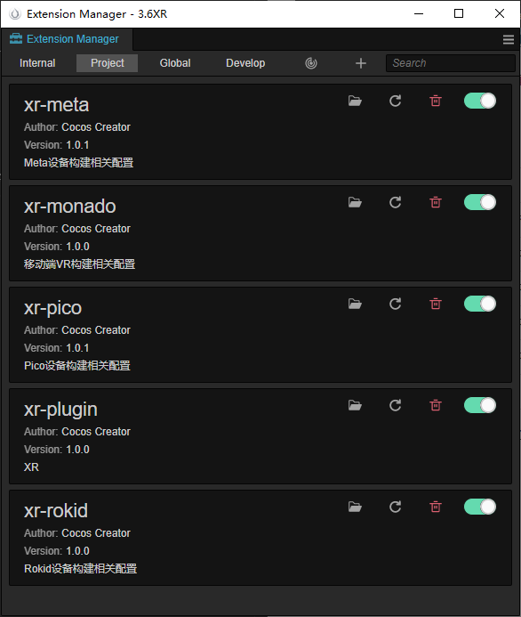

# 扩展安装

Cocos CreatorXR 的所支持的预置、功能组件、内容打包和发布的依赖全部是基于扩展来进行开启/关闭的。

Cocos CreatorXR 的安装方式和普通的扩展一致，将对应的插件安装到指定的位置（如要作为项目扩展，可安装到项目内的 extension 目录）点击 **工具栏** 上的 **扩展** 按钮，在下拉列表中选择 **扩展管理器** 即可安装。

安装扩展的详情请参考：[安装与分享](../../editor/extension/install.md)。

## 扩展介绍

在项目或者全局分类下找到带有 xr- 前缀的扩展，将需要的扩展开启。

| 名称             | 说明 |
| :--- | :---|
| xr-plugin        | 开启所有 XR 相关的 [预制体](prefab.md) 和 [组件](component.md)。   必须开启这些扩展才可以正常开发，如果禁用，则相关组件无法使用 |
| xr-meta          | 开启支持 XR 内容发布至 [Meta Quest/Quest2 设备](https://store.facebook.com/quest/) 的功能。可选 |
| xr-pico          | 开启支持 XR 内容发布至 [Pico Neo3 设备](https://www.pico-interactive.com/cn/neo3/) 的功能。可选 |
| xr-rokid         | 开启支持 XR 内容发布至 [Rokid Air 设备](https://air.rokid.com/) 的功能。可选 |
| xr-monado        | 开启支持 XR 内容发布至移动端 [Monado 平台](https://monado.dev/) 的功能。可选 |
| xr-huaweivr | 开启支持 XR 内容发布至HuaweiVR Glass的功能。可选 |

开启支持发布对应平台功能的扩展之后，在构建界面的发布平台下拉选项中出现设备选项，具体操作详见 [构建与发布](build.md)。
