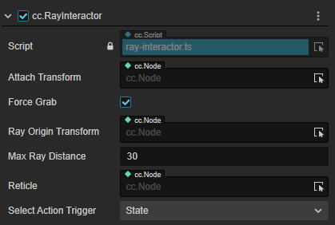
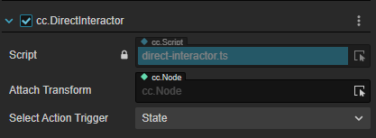
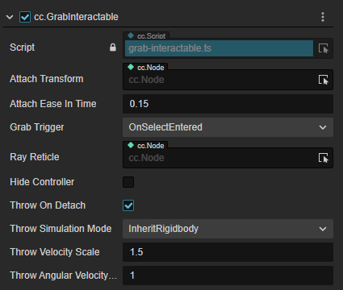
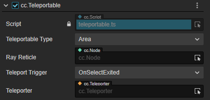

# 交互组件

一次交互操作需要有两种对象协调完成：交互主体和被交互物，对应的交互组件由此也分为两类：Interactor（交互器）和 Interactable（可交互对象）。

## RayInteractor

射线交互器组件。

| 属性                | 说明 |
| :------------------ | :------------------ |
| AttachTransform     | 用此 AttachTransform 的位置作为抓取的物体最终落到的位置，如果为空就用当前 Interactor 的位置 |
| ForceGrab           | 远距离抓起；开启时被抓对象吸附到 Attach Transform、关闭后抓取挂载在交互点的位置 |
| RayOriginTransform  | 可以改变发出 Ray 的起始位置，为空就默认是当前 Interactor 的位置 |
| LineType            | 改变射线检测和射线样式；StraightLine 是直线；Projectile Line 是抛物线；Bezier Line 是贝塞尔曲线（目前只支持直线） |
| MaxRayDistance      | 射线交互可以触发的最远距离 |
| RaycastMask         | 只能和此 Layer 类型的交互物发生交互 |
| SelectActionTrigger | Select 行为触发机制，详情见交互功能介绍 |

## DirectInteractor

直接交互器组件。

| 属性                | 说明                                                                                    |
| :------------------ | :------------------ |
| AttachTransform     | 用此 AttachTransform 的位置作为抓取的物体最终落到的位置，如果为空就用当前 Interactor 的位置 |
| SelectActionTrigger | Select 行为触发机制，详情见交互功能介绍                                                  |

## GrabInteractable

可抓取交互对象组件。

| 属性 | 说明 |
| :------------------ | :------------------ |
| AttachTransform           | 用此 AttachTransform 的位置作为触碰点的位置，如果为空就用当前 node 的位置 |
| AttachEaseInTime          | 对象被抓取到 AttachTransform 位置过程的时间（在该时间内，被抓取对象会有一个拖尾的效果，持续时间越久效果越不明显） |
| GrabTrigger               | 两种方式用于触发抓取：当 Select 的行为触发时/当 Activate 行为触发时 |
| RayReticle                | 当交互器与此交互物发生交互碰撞计算时，在碰撞点会显示此属性所引用的对象 |
| HideController            | 开启时，此物体被抓取后会隐藏 XR Controller 所引用的 Model |
| ThrowOnDetach             | 开启后，允许模拟抛物的动作。 |
| ThrowSimulationMode       | 选择为 InheritRigidbody 时，物体抛出时继承刚体的速度；选择为 CurveComputation 时，出现下列两项ThrowSmoothingDuration、ThrowSmoothingCurve，允许自定义抛出速度的计算 |
| ThrowSmoothingDuration    | 速度计算的采样时间段。使用此值作为采样区间，用于计算物体被抛出前的速度的加权平均值，作为物体抛出时的初速度 |
| ThrowSmoothingCurve       | 速度采样曲线。根据绘制的曲线进行抛出时初速度的加权平均值计算 |
| ThrowVelocityScale        | 初速度的权重系数。权重越大，抛物瞬时速度所乘的系数也越大，在继承或者加权计算出的初速度基础上乘以一个系数 |
| ThrowAngularVelocityScale | 初角速度的权重系数。权重越大，抛物瞬时角速度所乘的系数也越大，在继承或者加权计算出的初始角速度基础上乘以一个系数 |

## Teleportable

可传送对象组件。

| 属性                 | 说明 |
| :------------------- | :------------------ |
| TeleportableType     | 传送点的类型。选择为Area时，传送到射线与传送区域交互点的位置；选择为 Anchor 时，不受射线与传送区域的交互点的限制，之间传送到区域的固定位置。     |
| Teleport Anchor Node | TeleportableType 选择为 Anchor 时出现此项，用于标定传送的落点。此项为空时传送到传送区域的默认中心区域；此项引用了其他对象就传送到引用的对象的位置 |
| RayReticle           | 当交互器与此交互物发生交互碰撞计算时，在碰撞点会显示此属性所引用的对象 |
| TeleportTrigger      | 触发传送行为的事件：OnSelectExited 表示 Select 行为结束的时刻（按钮抬起）执行传送；OnSelectEntered 表示Select触发的时刻（按钮按下） |
| Teleporter           | 指定需要被传送的主体（一般为XR Agent），主体需挂载 **Teleporter** |
