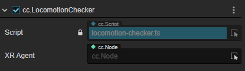
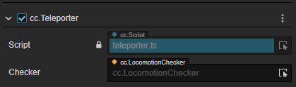
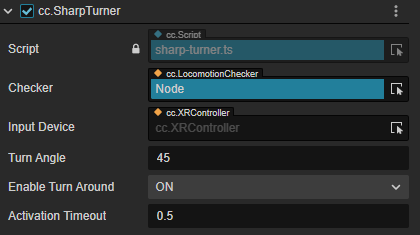
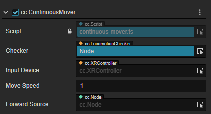

# 虚拟移动组件

在绝大多数的 VR 项目中，用户会用第一人称的角色视角在虚拟场景中进行移动。这种移动行为一般不会依赖于用户在真实空间的移动反馈，因为位姿的追踪会受到现实世界物理空间的限制。因此我们需要一种类似传统 3D 游戏中那种利用接受控制器输入信号的方式来驱动移动行为的组件，称之为虚拟移动组件（Locomotion Component）。

## LocomotionChecker

运动检查器。

| 属性     | 说明 |
| :------- | :------- |
| XR Agent | 指定需要进行运动的XR Agent（或其他对象）。添加该组件时，默认绑定遍历当前场景得到的第一个挂载了TrackingOrigin的节点，通常是XR Agent；用户也可以自行指定需要进行locomotion操作的对象 |

## Teleporter

传送驱动组件。

| 属性    | 说明 |
| :------- | :------- |
| Checker | 添加该组件时，默认绑定遍历当前场景得到的第一个挂载Locomotion Checker组件的节点 用户也可以自己拖入需要指定的Locomotion Checker |

## SharpTurner

瞬间转向驱动。

| 属性 | 说明 |
| :------------ | :------------ |
| Checker           | 添加该组件时，默认绑定遍历当前场景得到的第一个挂载Locomotion Checker组件的节点 用户也可以自己拖入需要指定的Locomotion Checker |
| InputDevice       | 绑定挂载了XRController的控制器对象 |
| TurnAngle         | 转动角度 |
| EnableTurnAround  | 开启后按下摇杆允许旋转180°（点击摇杆的按钮） |
| ActivationTimeout | 执行连续的转弯时需要等待的时间 |

## ContinuousTurner

连续转弯驱动。

| 属性         | 说明 |
| :------------ | :------------ |
| Checker      | 添加该组件时，默认绑定遍历当前场景得到的第一个挂载Locomotion Checker组件的节点 用户也可以自己拖入需要指定的Locomotion Checker |
| InputDevice  | 绑定挂载了XRController的控制器对象 |
| InputControl | 绑定接受输入的摇杆 |
| TurnSpeed    | 转动的角速度 |

## ContinuousMover

平移运动驱动。

| 属性          | 说明 |
| :------------ | :------------ |
| Checker       | 添加该组件时，默认绑定遍历当前场景得到的第一个挂载Locomotion Checker组件的节点 用户也可以自己拖入需要指定的Locomotion Checker |
| InputDevice   | 绑定挂载了XRController的控制器对象 |
| InputControl  | 绑定接受输入的摇杆 |
| MoveSpeed     | 移动速度 |
| ForwardSource | 选择一个物体，用该物体节点的朝向作为移动的正方向 |
