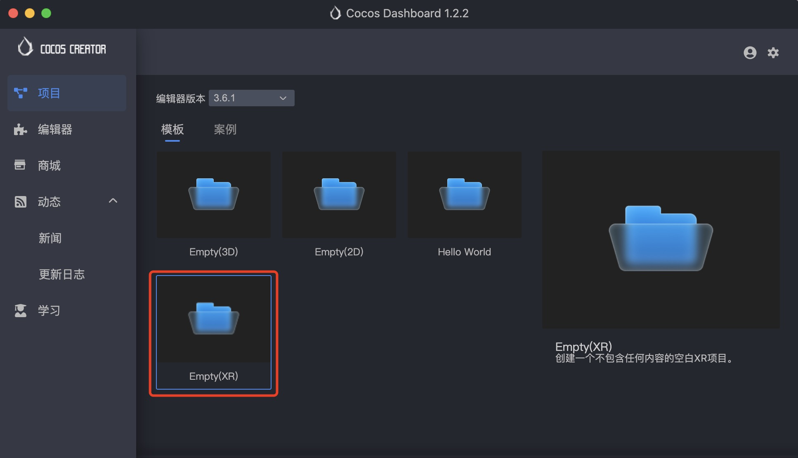
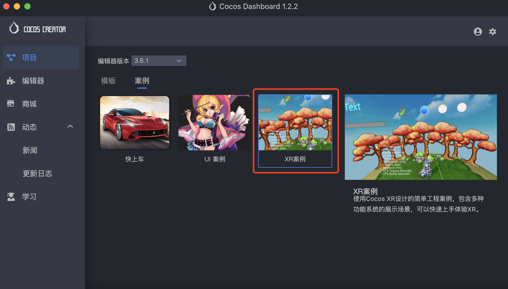

# XR项目创建

Cocos CreatorXR 支持用户使用一下几种方式快速创建 XR 项目。

> **注意**：创建 XR 项目时务必保证编辑器版本 >= 3.6.1。

- 使用模板新建 XR 项目：在 Cocos Dashboard 中新建项目时，选择 v3.6.1 及以上的编辑器，选择 Empty(XR) 模板创建。

  

- 使用案例体验学习创建 XR 项目：在 Cocos Dashboard 中新建项目，选择 v3.6.1 及以上的编辑器，选择 XRHelloWorld 案例创建。

  

- 基于空项目或已有项目添加 XR 扩展：在 Dashboard 中的商场页面搜索 xr-plugin 下载安装并应用至项目或在 Cocos Creator 中的 **扩展->商城** 中下载安装扩展至项目（不推荐安装到全局）。

