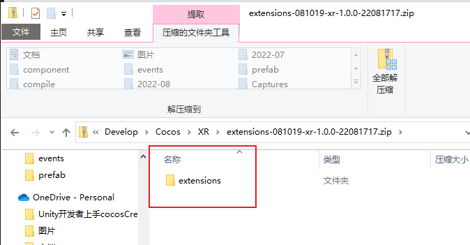
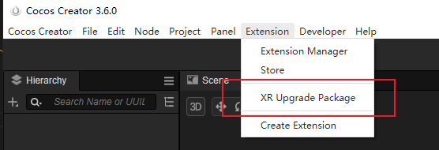
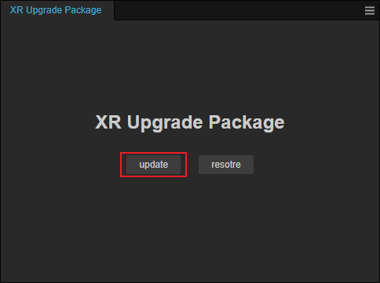
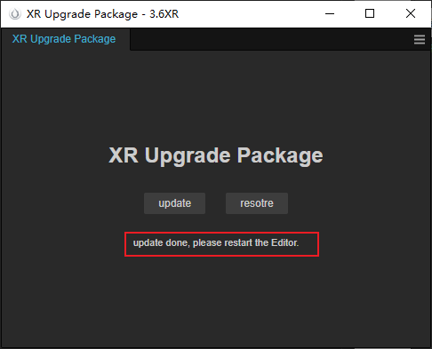

# XR 升级包

XR 升级时，需要获取到对应的升级包，可从 [联系开发人员](https://discuss.cocos2d-x.org/) 获取最新的升级包。为避免升级失败，请提前备份好项目。

## 升级步骤

- 将 XR 的升级包解压到对应的目录。

    

    如上图中是 extension 目录，则可以将其解压到项目的根目录。替换对应的文件后重启编辑器。

- 重启编辑器后，在 **扩展** 菜单的下拉框中选择 **XR 升级包** 进行升级：

    

- 系统会弹出下列页面，在弹出界面中选择 **升级**，请勿关闭该界面，等待 3 ~ 10 分钟后，会提示升级成功。

    

- 升级成功后，重启编辑器即可。

    
