# XR UI

传统的生成 UI 控件的方式都是把 UI 画在画布（Canvas）上，而画布本身不具有深度信息(位置属性不可更改)，导致了画布是贴在屏幕上的，只有与屏幕进行交互才能反馈作用于 UI 控件。由于 XR 设备的摄像头是两个目镜，不支持交互，这明显不满足于 XR 项目的需求。所以我们需要将 UI 的交互方式改为在空间中用交互器进行交互，因此需要将 UI 控件剥离出画布而能够单独存在于空间中，具有完整的位置属性并具有碰撞检测功能。

XR UI 是基于 2D UI 扩展而来，关于如何使用 2D/UI 组件可参考 [2D 对象概述](../../2d-object/index.md)。

## 新建 UI

在 **层级管理器** -> **创建** -> **XR** -> **XR UI** 可以添加 XRUI。

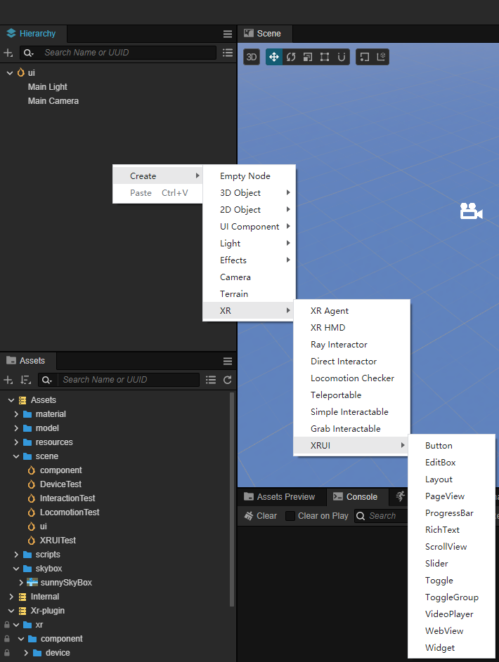

相比于传统的 UI 控件，XR UI 会新增一些组件用于计算碰撞检测以触发交互，如图示，RaycastChecker 和 BoxCollider 可使其能够接收 XR 输入：

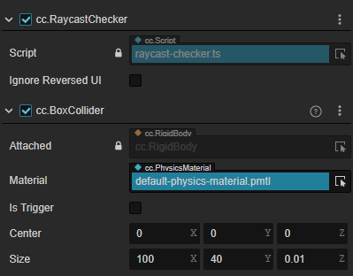

> **注意**：对于 3D 空间上的 UI，其根节点上需要 [RenderRoot2D 组件](../../2d-object/index.md) 才可以正常渲染。

## 存量 UI 转换

如 UI 已制作完成，也参考下面的步骤将原本的 2D Canvas 下的 UI，转化为 XR 的 UI。

- 在 **层级管理器** 右键创建一个空节点（如命名为 UIRoot，下文均使用 UIRoot），为节点添加组件 **RenderRoot2D** 组件，同时节点会自动添加 **UITransform** 组件：

    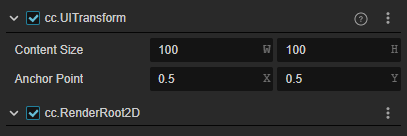

- 将原有的2D UI控件分离出Canvas，移动至UIRoot层级下。修改 **Button** 位置和 **Layer** 属性。同时将 **Button** 及其子节点的 **Layer** 属性，都修改为和 **Camera** 的 **Layer** 属性一致（此处均为DEFAULT）。

    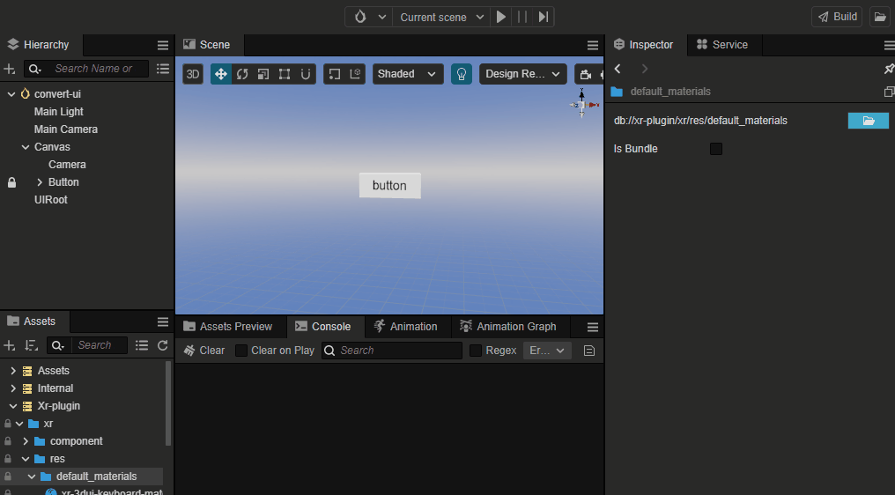

- 给 Button 及其子节点添加材质。在 **资源管理器** 中点击 **xr-plugin** -> **xr** -> **res** -> **default_materials**，选择  **xr-3dui-sprite-material** 拖拽至 **Sprite** 组件的 **CustomMaterial** 属性中。

    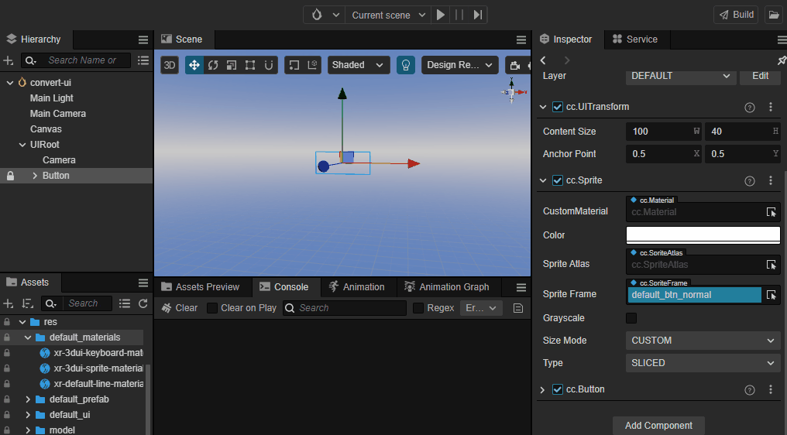

- 给 Button 添加射线交互组件 RaycastChecker。点击 Button 节点，在 **属性检查器** 下方，点击 **添加组件** 按钮，选择 **XR** -> **UI** -> **RaycastChecker**。

    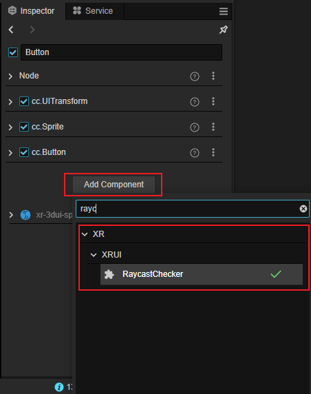

    在 **属性检查器** 中出现 **RaycastChecker** 组件和 **BoxCollider** 组件，且 **BoxCollider** 组件的 **Size** 属性的 **xy** 值与节点的 **UITransfrom** 的 **Content Size** 值一致，如下图：（此处可以将 **BoxCollider** 替换为其他所需 3D 碰撞体，能够贴合 UI 组件即可）。

    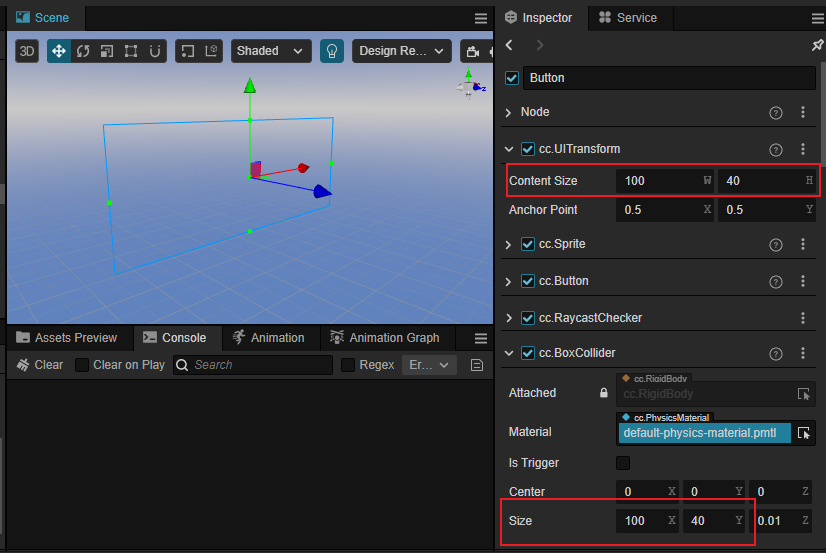

- 移动 Button 节点至场景中指定位置，调整 Rotation 和 Scale 的值以满足设计需求。

- 添加完所有 UI 组件后，删除旧有的 Canvas 节点。

到此为止，存量 UI 到 XR UI 的转化就完成了。

## 虚拟键盘（XR Keyborad）

添加一个 EditBox 的 XR UI，同时给 EditBox 添加一个子节点，命名为 KeyboardRoot （命名随意），同时调整 KeyboardRoot 的位置信息（根据需求进行调整即可，可将 XR Keyboard 临时放在节点下进行调整）。

创建XR Keyboard对象：在资源管理器中点击 **xr-plugin**-> **xr** -> **res** -> **default_prefab**，选择 **XR Keyboard** 拖拽至场景中。

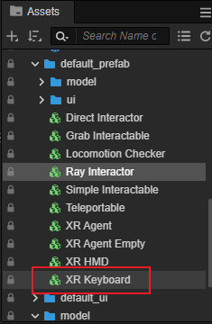

为 EditBox 节点添加 **XRKeyboardInputField** 组件，同时绑定 **SuspendTransform** 和 **XRKeyboard**，将节点拖拽进去。

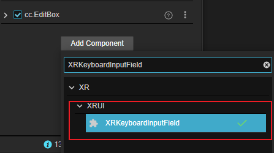

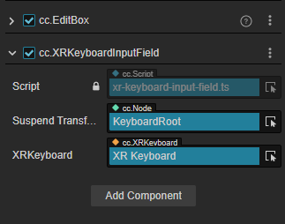

## 射线材质

使用射线与 XR UI 进行交互时，需要给射线绑定材质 **xr-default-line-material**。位置在 **资源管理器**->**xr-plugin** -> **xr** -> **res** -> **default_materials**。

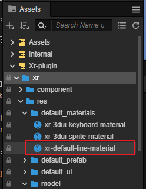
